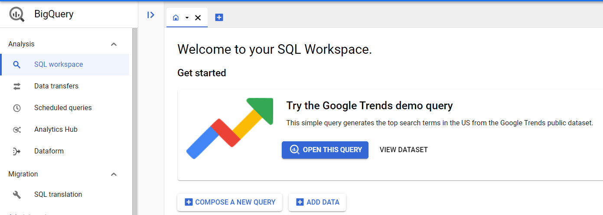
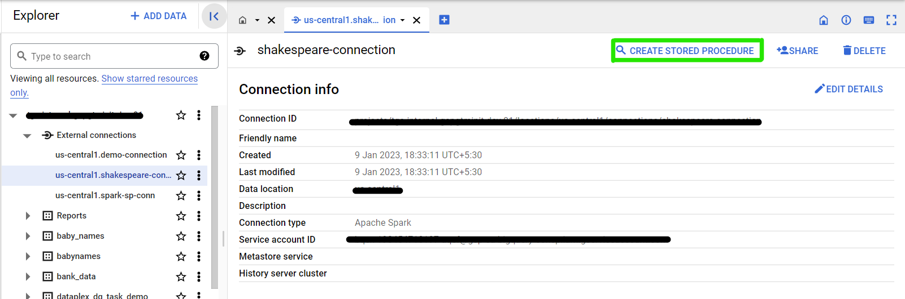
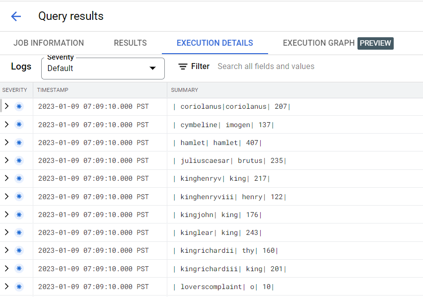

## 1. Create the Store Procedure

* Go to the [BigQuery console](https://console.cloud.google.com/bigquery)

 

* Open the external connection that has been created and then click on 'Create Store Procedure'
* Edit the query that appears in the Editor as follows:
* 

```
CREATE PROCEDURE `<Insert_Project_ID>.<insert_bq_dataset_name>.<insert_user_name>_shakespeare_proc`()
WITH CONNECTION `<Insert_Project_ID>.<insert_location_used_in_dataset>.shakespeare-connection`
OPTIONS(engine="SPARK")
LANGUAGE PYTHON AS R"""
<insert Spark Code Here>
"""
```
The Spark Code is located [here](../00-scripts-and-config/wordcount-calculation-bigquery.py)

* Click 'Run'

## 2. Calling the Store Procedure

* To call a stored procedure, use the CALL PROCEDURE statement:

- In the Google Cloud console, go to the [BigQuery Console](https://console.cloud.google.com/bigquery)


* In the query editor, enter the following statement:

```
CALL `<insert_PROJECT_ID>`.<insert_bq_dataset_name>.<insert_user_name>_shakespeare_proc()
```
* Click Run

### 3. Results

* Results can be viewed by clicking on 'View Results' > 'Execution Details'
 
