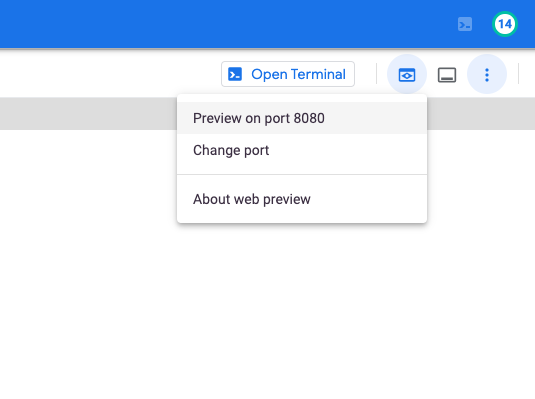
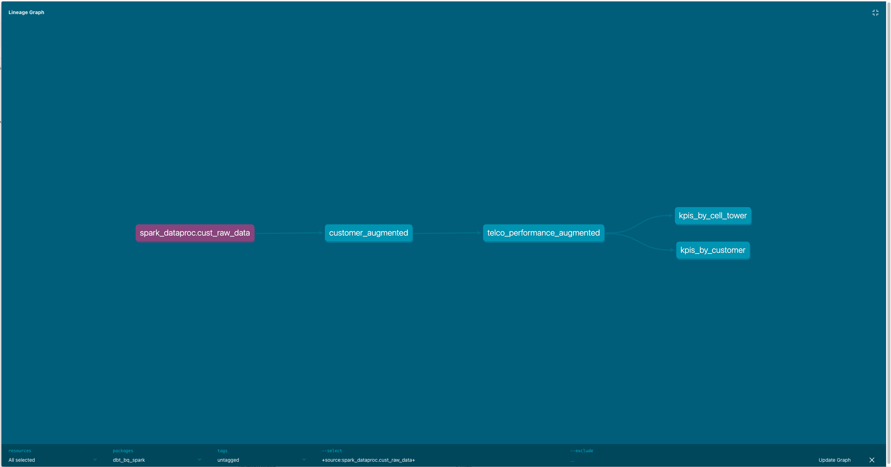

# Lab 1: Cell Tower Anomaly Detection with dbt

This lab is an adaptation of [Lab 1: Cell Tower Anomaly Detection.](https://github.com/GoogleCloudPlatform/serverless-spark-workshop/tree/main/cell-tower-anomaly-detection)
It includes/changes:
- Use [BigLake](https://cloud.google.com/biglake) to create GCS external tables in PARQUET and CSV files formats.
- Refactor pySpark scripts into SQL (initial data cleaning scripts)
- Use Open Source tool [dbt](https://www.getdbt.com/) to implement a data pipeline (DAG) including  the logic for both SQL jobs and pySpark scripts.
- Adds a bootstrap script to deploy required cloud infrastructure (GCS bucket, BQ datasets, Service Accounts .) using Terraform.

## 2. Lab overview and architecture

The lab includes studying and running a data pipeline (DAG) via dbt:
1. Curate Customer Master Data (defined using BigQuery SQL)
2. Curate Telco Customer Churn Data (defined using BigQuery SQL)
3. Calculate Cell Tower KPIs by Customer (defined using pySpark)
4. Calculate KPIs by cell tower (defined using pySpark)

**Lab architecture:**

The following diagram ilustrates the GCP architecture


## 3. Lab execution
Pre-requistes :
- A working Google Cloud Project with billing enabled
- Enough permissions (e.g. project owner role)
- Access to Cloud Shell

**1) Open a Cloud Terminal and clone the repository**

```bash 
git clone https://github.com/GoogleCloudPlatform/serverless-spark-workshop.git
```


**2) Edit the`variables.json` file with your own values:**
```bash 
cd serverless-spark-workshop/cell-tower-anomaly-detection-dbt/cell-tower-anomaly-detection-dbt/02-config
vi variables.json  
```

For instance:
```json 
{
    "project_id": "velascoluis-dev-sandbox",
    "spark_serverless" : "false",
    "dataproc_cluster_name" : "spark-dataproc",
    "region": "us-central1",
    "bucket_name": "spark-dataproc-velascoluis-dev-sandbox",
    "bq_dataset_name": "spark_dataproc",
    "dbt_sa_name": "dbt-sa-account",
    "dbt_sa_key_location" : "dbt-sa.json"
}

```

If there are timeouts errors, re-execute the script.

**_NOTE 1:_** dbt Core v1.3, currently in beta, adds Python models to dbt. For more information check [this](https://docs.getdbt.com/docs/building-a-dbt-project/building-models/python-models) 

**_NOTE 2:_** Serverless spark support in dbt is experimental, please see this [issue](https://github.com/dbt-labs/dbt-bigquery/pull/259 ) 
.The current adapter implementation uses the default network as the VPC subnetwork that executes Serverless Spark workloads.

**_NOTE 3:_** Do configure the default VPC network as indicated in [here](https://cloud.google.com/dataproc-serverless/docs/concepts/network)

**3) Launch the infrastructure bootstrap script:**
```bash 
$> ./setup_infra.sh variables.json deploy  
```

This script reads the config file and :
* Checks and install binaries/packages if needed
* Use Terraform to enable GCP APIs
* Use Terraform to create Service Account (SA) and key for dbt
* Use Terraform to grant roles to the dbt SA
* Use Terraform to deploy infrastructure, including a single node dataproc cluster, a GCS bucket and a BigQuery dataset
* Stages data in GCS
* Use Terraform to deploy data infrastructure, including a BQ external connection, a couple of BigLake tables
* Generates DBT config files (profile and config)

**4) Launch `dbt`:**
```bash 
cd serverless-spark-workshop/cell-tower-anomaly-detection-dbt/cell-tower-anomaly-detection-dbt/00-scripts
$> ./run_dbt.sh
```
Depending on the spark_serverless flag, the pySpark code will be submitted via API using either `create_batch` (serverless) or `submit_job_as_operation` (classic)


**5) Generate and browse `dbt`docs:**
```bash 
cd serverless-spark-workshop/cell-tower-anomaly-detection-dbt/cell-tower-anomaly-detection-dbt/00-scripts
$> ./gen_docs.sh
```
Preview on default port 8080:



Browse documentation:



**6) Destroy all resources created:**
```bash 
cd serverless-spark-workshop/cell-tower-anomaly-detection-dbt/cell-tower-anomaly-detection-dbt/02-config
$>  ./setup_infra.sh variables.json destroy
```

