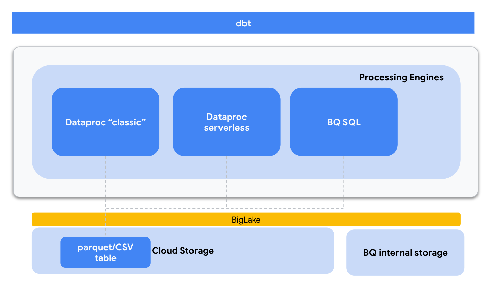

# Lab 1: Cell Tower Anomaly Detection with dbt

This lab is an adaptation of Lab 1 : Cell Tower Anomaly Detection.
It includes/changes:
- Use BigLake to create GCS external tables in for parquet and CSV files formats.
- Port some pySpark logic to SQL (initial scripts)
- Use dbt to orchestrate the logic for both SQL jobs and pySpark scripts accessing data in BQ
- Adds a bootstrap script to deploy required cloud infrastructure (GCS bucket, BQ datasets, Service Accounts .)
It is self-contained and fully scripted to follow along at your own pace.<br>


## 2. Lab overview and architecure

The lab includes studying and running a series of data engineering jobs via dbt:
1. Curate Customer Master Data (BQ SQL)
2. Curate Telco Customer Churn Data (BQ SQL)
3. Calculate Cell Tower KPIs by Customer (pySpark)
4. Calculate KPIs by cell tower (pySpark)


Lab architecture:




## 3. Lab execution
Pre-requistes : A working Google Cloud Project

**1) Open a Cloud Terminal and clone the repository**

```bash 
git clone https://github.com/GoogleCloudPlatform/serverless-spark-workshop.git
```


**2) Edit the`variables.json` file with your own values:**
```bash 
cd serverless-spark-workshop/cell-tower-anomaly-detection-dbt/cell-tower-anomaly-detection-dbt/02-config
vi variables.json  
```

For instance:
```json 
{
    "project_id": "velascoluis-dev-sandbox",
    "spark_serverless" : "false",
    "dataproc_cluster_name" : "spark-dataproc",
    "region": "us-central1",
    "bucket_name": "spark-dataproc-velascoluis-dev-sandbox",
    "bq_dataset_name": "spark_dataproc",
    "dbt_sa_name": "dbt-sa-account",
    "dbt_sa_key_location" : "dbt-sa.json"
}

```
**_NOTE:_** Serverless spark support in dbt is experimental, please see this [issue](https://github.com/dbt-labs/dbt-bigquery/pull/259 ) 
.The current adapter implementation uses the default network as the VPC subnetwork that executes Serverless Spark workloads. Do configure the network as indicated in [here](https://cloud.google.com/dataproc-serverless/docs/concepts/network)

**3) Launch the infrastructure bootstrap script:**
```bash 
$> ./setup_infra.sh variables.json deploy  
```

This script reads the config file and :
* Checks and install binaries/packages if needed
* Use Terraform to enables GCP APIs
* Use Terraform to create Service Account (SA) and key for DBT
* Use Terraform to grant roles to the DBT SA
* Use Terraform to deploy infrastructure, including a single node dataproc cluster, a GCS bucket and a BigQuery dataset
* Stages data in GCS
* Use Terraform to deploy data infrastructure, inlcuding a BQ external connection, a couple of BigLake tables
* Generates DBT config files (profile and config)

**4) Launch `dbt`:**
```bash 
cd serverless-spark-workshop/cell-tower-anomaly-detection-dbt/cell-tower-anomaly-detection-dbt/00-scripts
$> ./run_dbt.sh
```
Depending on the spark_serverless flag, the pySpark will be submitted via API using either `create_batch` (serverless) or `submit_job_as_operation (classic)


**5) Generate and browse `dbt`docs:**
```bash 
cd serverless-spark-workshop/cell-tower-anomaly-detection-dbt/cell-tower-anomaly-detection-dbt/00-scripts
$> ./gen_docs.sh
```
Preview on default port 8080:


Brose documentation:


**6) Destroy all resources created:**
```bash 
cd serverless-spark-workshop/cell-tower-anomaly-detection-dbt/cell-tower-anomaly-detection-dbt/02-config
$>  ./setup_infra.sh variables.json destroy
```

