# Chicago Crimes Analysis with Dataproc Serverless Spark Interactive Sessions on Vertex AI Managed Notebooks

Lab contributed by: [Anagha Khanolkar](https://github.com/anagha-google)

In this lab, you will create a Vertex AI managed notebook environment, launch JupyterLab, create a Dataproc Serverless Spark Interactive Session and  authoring and run Spark code for interactive, exploratory analytics with Spark.

## 1. Prerequisite
See [this lab for an example prerequisite set up](https://github.com/GoogleCloudPlatform/serverless-spark-workshop/blob/main/covid-economic-impact-vertex-ai/instructions/01-gcp-prerequisites.md) or [these Terraform modules to provision and configure a Serverless Spark environment](https://github.com/anagha-google/ts22-just-enough-terraform-for-da).

## 2. Enable APIs

From the Cloud Console, enable the following APIs-
1. Notebook API
2. Vertex AI API

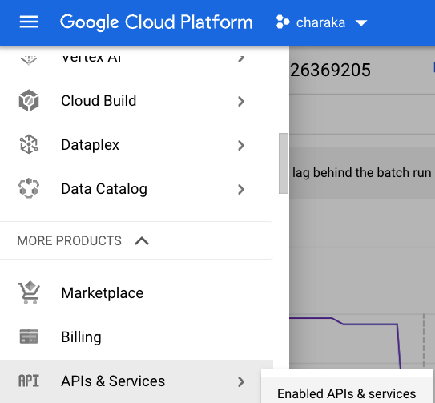  
<br>

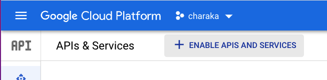  
<br>

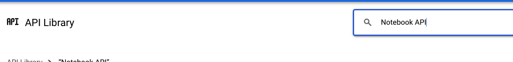  
<br>

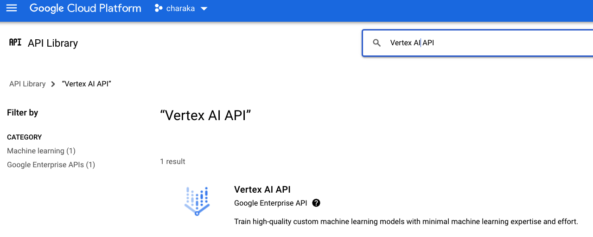  
<br>

## 3. IAM permissions

### 3.1. Permissions for the User Managed Service Account
From the Cloud Console, navigate to IAM and grant the UMSA the following permissions-
1. Notebook Admin
2. Notebook Runner
3. BigQuery Admin

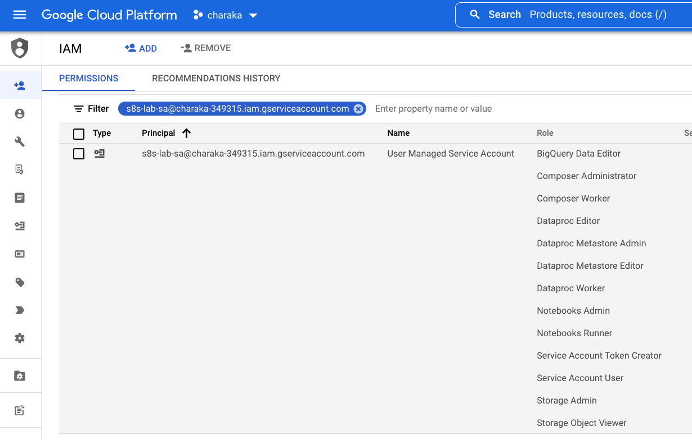  
<br>


### 3.2. Permissions for yourself
From the Cloud Console, navigate to IAM and grant yourself the following permissions-
1. Notebook Runner

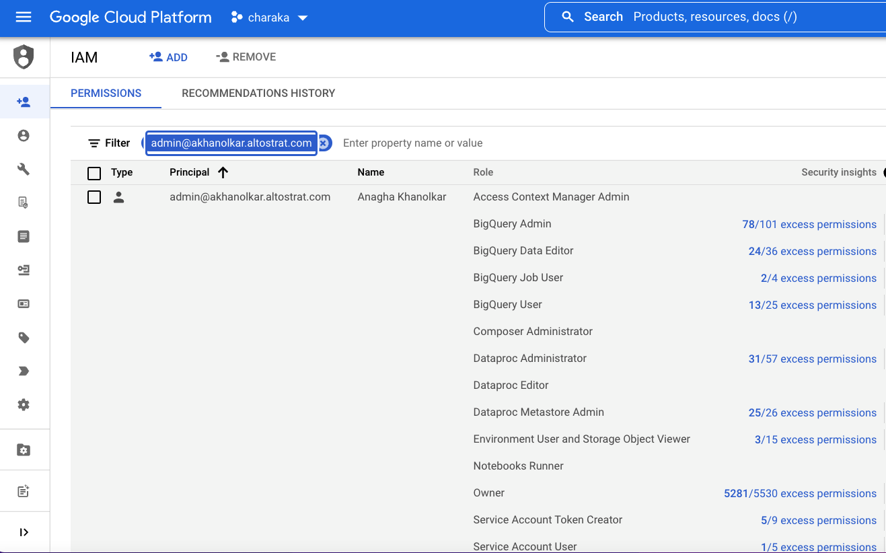  
<br>

## 4. In Vertex AI, create a managed notebook environment

### 4.1. Navigate to Vertex AI workbench

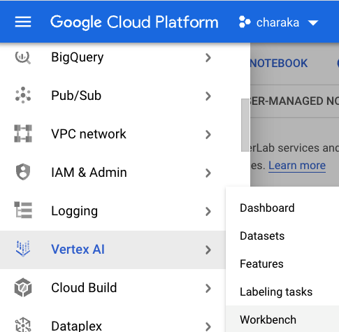  
<br>

### 4.2. Click on "Managed Notebook.."

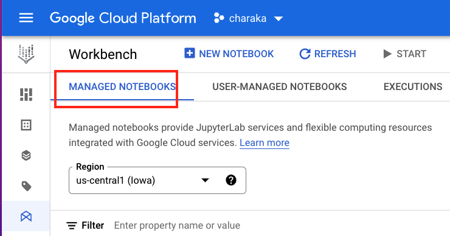  
<br>

### 4.3. Create a mannaged notebook environment as shown below

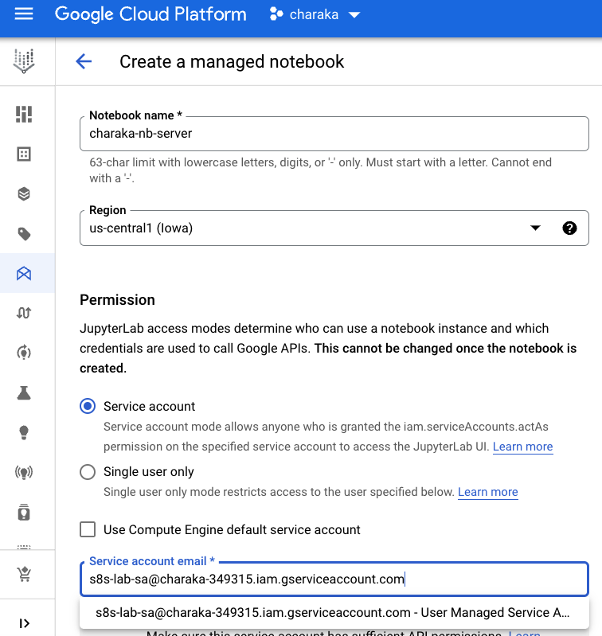  
<br>

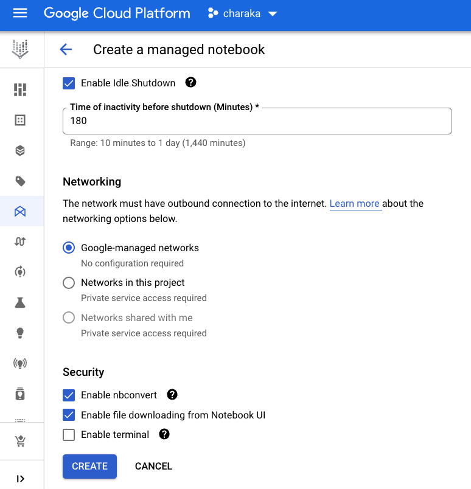  
<br>

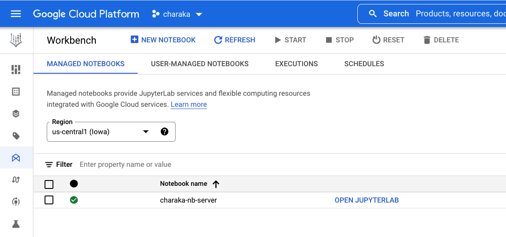  
<br>

### 4.4. Launch a serverless Spark interactive session as shown below and click submit

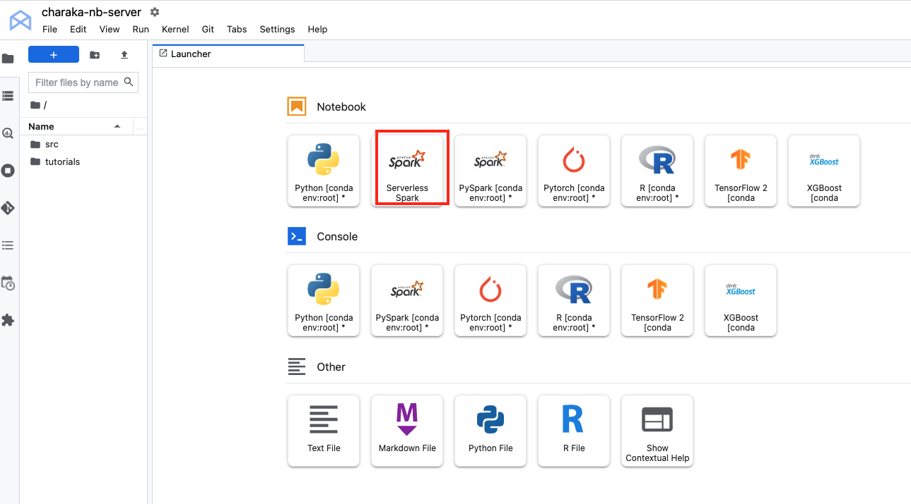  
<br>

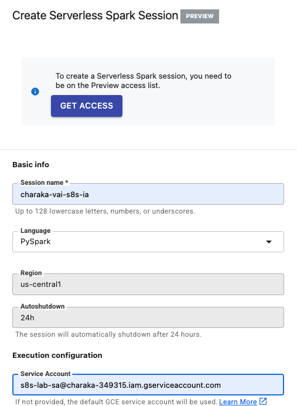  
<br>

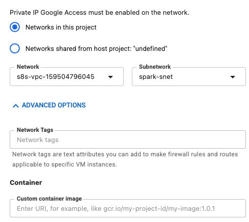  
<br>
<br>
Be sure to include the BigQuery connector jar-

```
spark.jars.packages=com.google.cloud.spark:spark-bigquery-with-dependencies_2.12:0.25.2
```

<br>

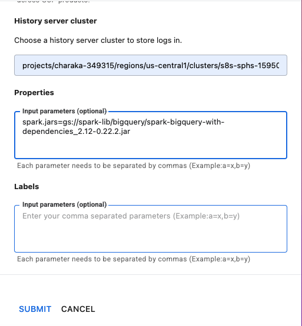  
<br>

### 4.5. Once the session is available, a notebook opens up
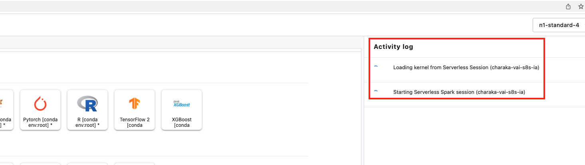  
<br>

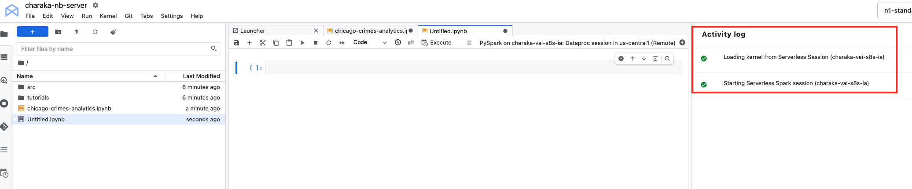  
<br>

### 4.6. Shut down the kernel of the untitled notebook, we will use a precreated notebook

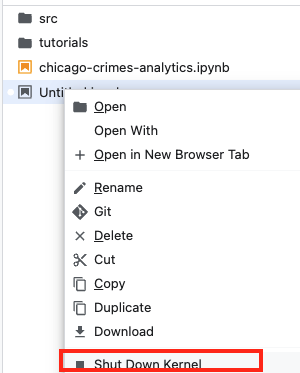  
<br>

## 5. Clone this git repo

```
cd ~
rm -rf serverless-spark-workshop
git clone https://googlecloudplatform/serverless-spark-workshop.git
```

## 6. Download the Chicago Crimes Analytics notebook from the Cloud Shell

Click on the ellipsis (3 dots) and click on download, and select the location of the notebook.
<br>
```
It's here-
~/serverless-spark-workshop/chicago-crimes-analysis/
```

## 7. Upload the same into the Managed Notebook environment

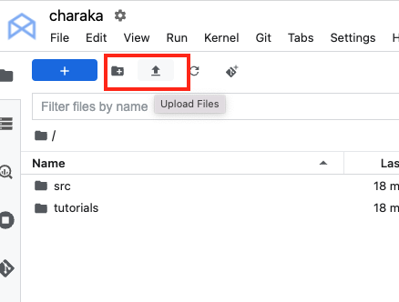  
<br>

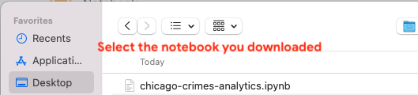  
<br>

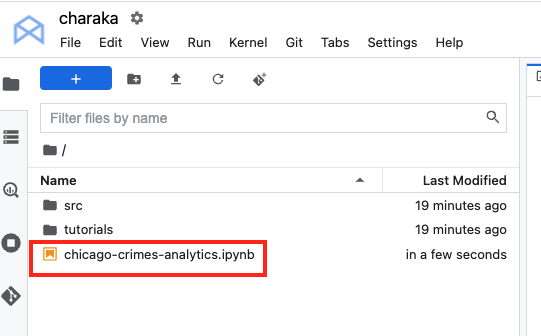  
<br>


## 8. Now open the Chicago Crimes Notebook

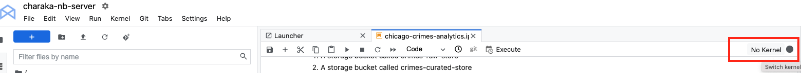  
<br>

## 9. Select the interactive session created in the kernel picker


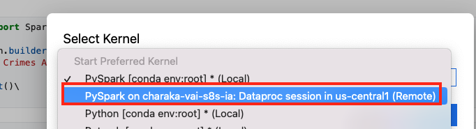  
<br>

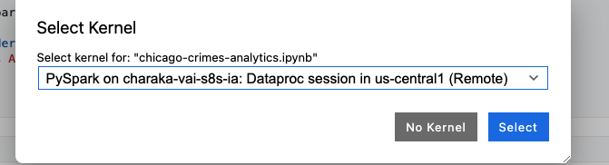  
<br>

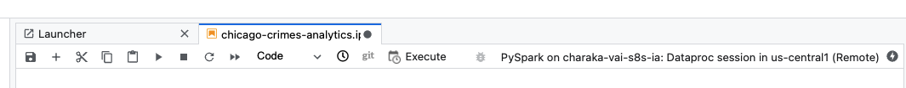  
<br>

## 10. Now run your analysis on the data

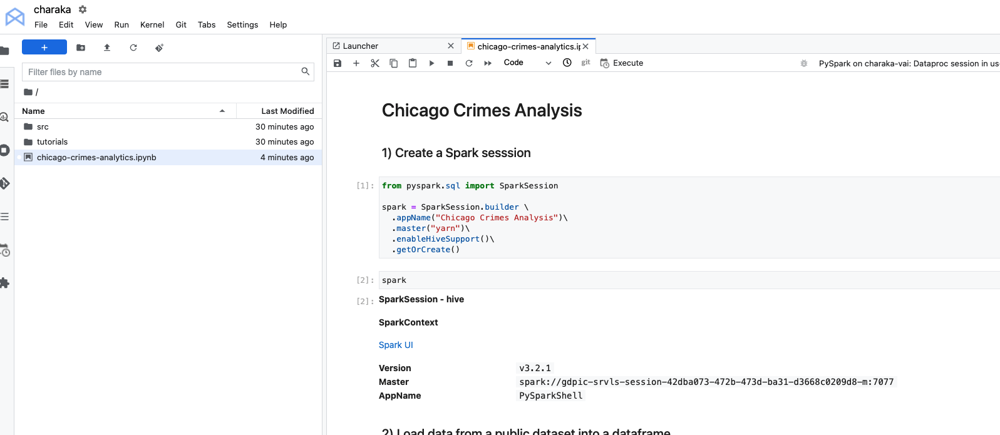  
<br>

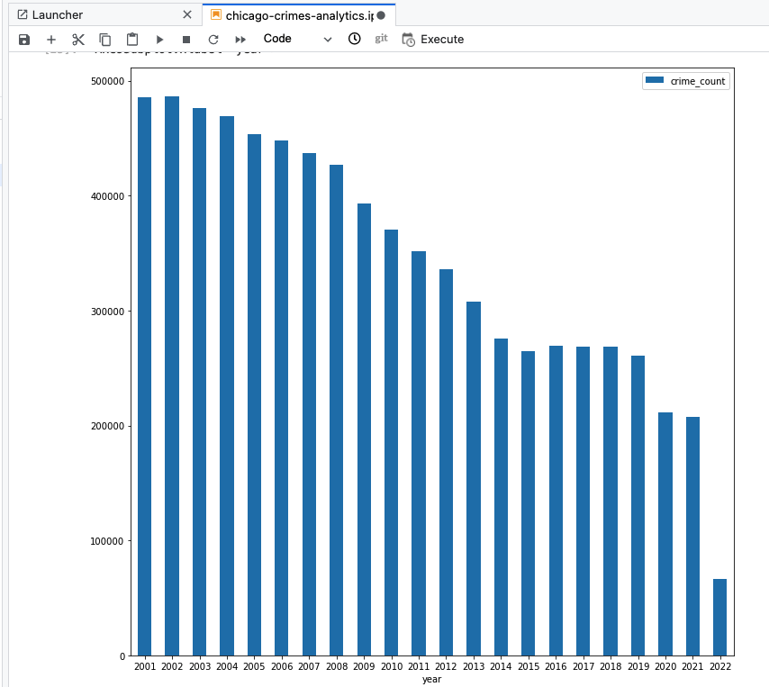  
<br>

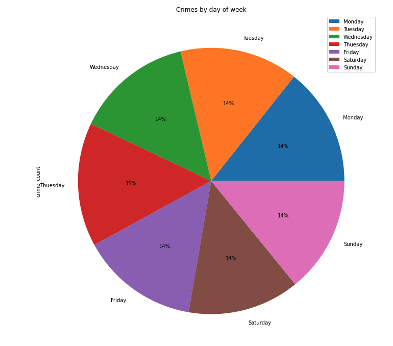  
<br>

##### =====================================================================================================
##### THIS CONCLUDES THIS LAB 
##### PROGRESS TO ANOTHER LAB, OR SHUT DOWN RESOURCES
##### =====================================================================================================
