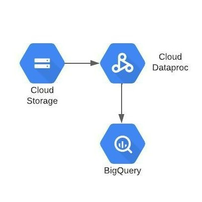

# Covid Economic Impact using Serverless Spark through Google Cloud Shell

**Goal** - Data Preparation and Model Training for Detecting Malware in Network.

Following are the lob modules:

[1. Understanding Data](05b_covid_economic_impact_console_execution.md#1-understanding-data)<br>
[2. Solution Architecture](05b_covid_economic_impact_console_execution.md#2-solution-architecture)<br>
[3. Declaring Variables](05b_covid_economic_impact_console_execution.md#3-declaring-variables)<br>
[4. Execution](05b_covid_economic_impact_console_execution.md#4-execution)<br>
[5. Logging](05b_covid_economic_impact_console_execution.md#5-logging)<br>

<br>

## 1. Understanding Data

## Data Files
The datasets used for this project are:
- stringency.csv: This file contains the Stringency Index of each country regarding the measures taken to fight covid-19.
- stock.csv: This file comtains the stock market values of various companies from different countries.


 
The ETL flow processes the source data to generate multiple fact and dim tables:

- Fact table:
- Economic_status_table [ec_status_id, Date, country_code, stringency_index, stock_id, value_type, value]
- The fact table is created by joining the source stringency and stock table.
 
- Dimension tables:
- Time_table [Date, day, month, year, week_day]
- This dim table is created by extracting the time details from the stringency table
- Country_table [country_code, country_name]
- This table is created by extracting distinct country details from the stock table
- Company_table [stock_Id, company_name, sector]
- This table is created by extracting the stock and company details from the stock table
 
 
The data warehouse star schema would look like below:
 


<br>

## 2. Solution Architecture
 


<br>

## 3. Declaring Variables

Keep the following details handy for configuring the serverless batch jobs:

```
PROJECT_ID=$(gcloud config get-value project)       #current GCP project where we are building our use case
REGION=                                             #GCP region where all our resources will be created
SUBNET=                                             #subnet which has private google access enabled
BUCKET_CODE=                                        #GCP bucket where our code, data and model files will be stored
BUCKET_PHS=                                         #bucket where our application logs created in the history server will be stored
HISTORY_SERVER_NAME=                                #name of the history server which will store our application logs
BQ_DATASET_NAME=                                    #BigQuery dataset where all the tables will be stored
UMSA=serverless-spark                               #name of the user managed service account required for the PySpark job executions
SERVICE_ACCOUNT=$UMSA@$PROJECT_ID.iam.gserviceaccount.com
NAME=                                               #Your unique identifier
```
**Note:** The values for all the above parameters will be provided by the admin team.

<br>

## 4. Execution 

### 4.1. Create a new batch
Navigate to Dataproc > Serverless > Batches and click on **+CREATE**

<kbd>

</kbd>

### 4.2. Provide the details for the batch

Next, fill in the following values in the batch creation window as shown in the images below:

- **Batch ID**   - A unique identifier for your batch
- **Region**     - The region name provided by the Admin team
- **Batch Type**    - PySpark
- **Main Python File** - gs://<your_code_bucket_name>/covid-economic-impact/00-scripts/covid_economic_impact_etl.py
- **JAR Files** - gs://spark-lib/bigquery/spark-bigquery-with-dependencies_2.12-0.22.2.jar
- **Arguments** - <br>
  Four Arguments needs to be provided. <br>
    * <your_project_id>
    * <your_dataset_name>
    * <your_code_bucket_name>
    * <your_name>

<br>

  **Note:** Press RETURN after each argument

- **Service Account** - <UMSA_NAME>@<PROJECT_ID>.iam.gserviceaccount.com
- **Network Configuration** - select the network and subnetwork with Private Google Access Enabled
Run PySpark Serverless Batch for Data Preparation
- **History Server Cluster** - <your_phs_cluster_name>

<kbd>

</kbd>

<hr>

<br> 

<kbd>

</kbd>

  <kbd>
  
  </kbd>

<br>

### 4.3. Submit the Serverless batch
Once all the details are in, you can submit the batch. As the batch starts, you can see the execution details and logs on the console.

### 4.4. Check the output table in BQ

Navigate to BigQuery Console, and check the **covid_economic_impact** dataset. <br>
Once the data preparation batch is completed, four new tables '<your_name_here>_ec_status', '<your_name_here>_countries', '<your_name_here>_stocks' and '<your_name_here>_times' will be created :

To query the data to find the list of stocks with highest stringency Index, run the following query - 
```
  select * from `<GCP-PROJECT-NAME>.<BQ-DATASET-NAME>.<user_name>_ec_status` EC inner join `<GCP-PROJECT-NAME>.<BQ-DATASET-NAME>.<user_name>_stocks` S on EC.stock_id=S.stock_id where stringency_index=(select max(stringency_index) from `<GCP-PROJECT-NAME>.<BQ-DATASET-NAME>.<user_name>_ec_status`)
  
```

**Note:** Edit all occurrences of <GCP-PROJECT-NAME> and <BQ-DATASET-NAME> to match the values of the variables PROJECT_ID,user_name and BQ_DATASET_NAME respectively

<kbd>

</kbd>

<br>

<br>

<br>

## 5. Logging

### 5.1 Serverless Batch logs

Logs associated with the application can be found in the logging console under 
**Dataproc > Serverless > Batches > <batch_name>**. 
<br> You can also click on “View Logs” button on the Dataproc batches monitoring page to get to the logging page for the specific Spark job.

<kbd>

</kbd>

<kbd>

</kbd>

<br>

### 5.2 Persistent History Server logs

To view the Persistent History server logs, click the 'View History Server' button on the Dataproc batches monitoring page and the logs will be shown as below:

<br>

<kbd>

</kbd>

<kbd>

</kbd>

<br>
