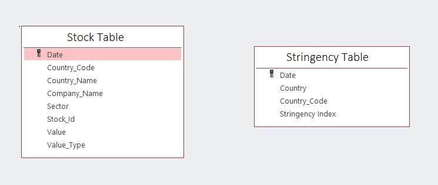
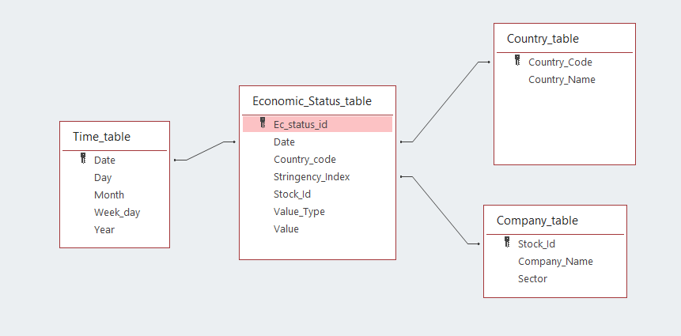

# Covid Economic Impact using Serverless Spark through Google Cloud Shell

Following are the lab modules:

[1. Understanding Data](05a_covid_economic_impact_gcloud_execution.md#1-understanding-data)<br>
[2. Solution Architecture](05a_covid_economic_impact_gcloud_execution.md#2-solution-architecture)<br>
[3. Declaring Variables](05a_covid_economic_impact_gcloud_execution.md#3-declaring-cloud-shell-variables)<br>
[4. Execution](05a_covid_economic_impact_gcloud_execution.md#4-execution)<br>
[5. Logging](05a_covid_economic_impact_gcloud_execution.md#5-logging)<br>

<br>

## 1. Understanding Data

## Data Files
The datasets used for this project are:
- stringency.csv: This file contains the Stringency Index of each country regarding the measures taken to fight covid-19.
- stock.csv: This file contains the stock market values of various companies from different countries.



The ETL flow processes the source data to generate multiple fact and dim tables:

- Fact table:
- Economic_status_table [ec_status_id, Date, country_code, stringency_index, stock_id, value_type, value]
- The fact table is created by joining the source stringency and stock table.


- Dimension tables:
- Time_table [Date, day, month, year, week_day]
- This dim table is created by extracting the time details from the stringency table
- Country_table [country_code, country_name]
- This table is created by extracting distinct country details from the stock table
- Company_table [stock_Id, company_name, sector]
- This table is created by extracting the stock and company details from the stock table


The data warehouse star schema would look like below:



<br>

## 2. Solution Architecture


## 3. Declaring cloud shell variables

#### 3.1 Set the PROJECT_ID in Cloud Shell

Open Cloud shell or navigate to [shell.cloud.google.com](https://shell.cloud.google.com)<br>
Run the below
```
gcloud config set project $PROJECT_ID

```

#### 3.2 Verify the PROJECT_ID in Cloud Shell

Next, run the following command in cloud shell to ensure that the current project is set correctly:

```
gcloud config get-value project
```

#### 3.3 Declare the variables

Based on the prereqs and checklist, declare the following variables in cloud shell by replacing with your values:


```
PROJECT_ID=$(gcloud config get-value project)       #current GCP project where we are building our use case
REGION=                                             #GCP region where all our resources will be created
SUBNET=                                             #subnet which has private google access enabled
BUCKET_CODE=                                        #GCP bucket where our code, data and model files will be stored
BUCKET_PHS=                                         #bucket where our application logs created in the history server will be stored
HISTORY_SERVER_NAME=                                #name of the history server which will store our application logs
BQ_DATASET_NAME=                                    #BigQuery dataset where all the tables will be stored
UMSA=                                               #name of the user managed service account required for the Spark job executions
SERVICE_ACCOUNT=$UMSA@$PROJECT_ID.iam.gserviceaccount.com
NAME=                                               #Your unique identifier
```

**Note:** For all the variables except 'NAME', please ensure to use the values provided by the admin team.

<br>

### 3.4 Update Cloud Shell SDK version

Run the below on cloud shell-

```
gcloud components update

```

## 4. Execution

### 4.2. Run Spark Serverless Batch

Run the below on cloud shell -

```
gcloud dataproc batches submit \
  --project $PROJECT_ID \
  --region $REGION \
  spark --batch $NAME-covid-impact-scala-${RANDOM} \
  --class org.teksystems.covideconomicimpact \
  --jars gs://$BUCKET_CODE/covid-economic-impact-scala/00-scripts/covid-economic-impact-assessment_2.12-1.0.jar,gs://spark-lib/bigquery/spark-bigquery-with-dependencies_2.12-0.22.2.jar \
  --subnet $SUBNET \
  --service-account $SERVICE_ACCOUNT \
  --history-server-cluster projects/$PROJECT_ID/regions/$REGION/clusters/$HISTORY_SERVER_NAME \
  -- $PROJECT_ID $BQ_DATASET_NAME $BUCKET_CODE $NAME
```


### 4.3. Check the output table in BigQuery

Navigate to BigQuery Console, and check the **covid_economic_impact** dataset. <br>
Once the data preparation batch is completed, four new tables '<your_name_here>_ec_status', '<your_name_here>_countries', '<your_name_here>_stocks' and '<your_name_here>_times' will be created :

To query the data to find the list of stocks with highest stringency Index, run the following query -
```
  select * from `<GCP-PROJECT-NAME>.<BQ-DATASET-NAME>.<user_name>_ec_status` EC inner join `<GCP-PROJECT-NAME>.<BQ-DATASET-NAME>.<user_name>_stocks` S on EC.stock_id=S.stock_id where stringency_index=(select max(stringency_index) from `<GCP-PROJECT-NAME>.<BQ-DATASET-NAME>.<user_name>_ec_status`)

```

**Note:** Edit all occurrences of <GCP-PROJECT-NAME> and <BQ-DATASET-NAME> to match the values of the variables PROJECT_ID,user_name and BQ_DATASET_NAME respectively

<kbd>

</kbd>

<br>

<br>

<br>

## 5. Logging

### 5.1 Serverless Batch logs

Logs associated with the application can be found in the logging console under
**Dataproc > Serverless > Batches > <batch_name>**.
<br> You can also click on “View Logs” button on the Dataproc batches monitoring page to get to the logging page for the specific Spark job.

<kbd>

</kbd>

<kbd>

</kbd>

<br>

### 5.2 Persistent History Server logs

To view the Persistent History server logs, click the 'View History Server' button on the Dataproc batches monitoring page and the logs will be shown as below:

<br>

<kbd>

</kbd>

<kbd>

</kbd>

<br>
