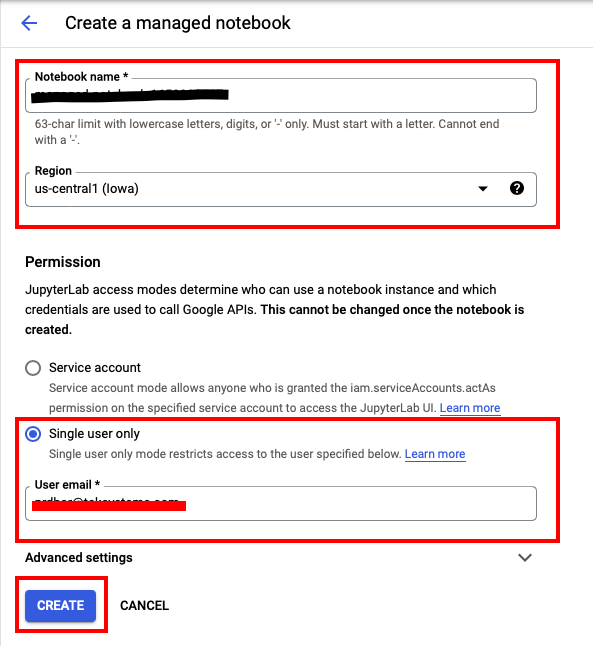

# Covid Economic Impact using sessions in Serverless Spark through Vertex AI


Following are the lab modules:

[1. Understanding Data](05a_covid_economic_impact_vertex_ai_notebook_execution.md#1-understanding-data)<br>
[2. Solution Architecture](05a_covid_economic_impact_vertex_ai_notebook_execution.md#2-solution-architecture)<br>
[3. Execution](05a_covid_economic_impact_vertex_ai_notebook_execution.md#3-execution)<br>
[4. Logging](05a_covid_economic_impact_vertex_ai_notebook_execution.md#4-logging)<br>

<br>

## 1. Understanding Data

## Data Files
The datasets used for this project are:
- stringency.csv: This file contains the Stringency Index of each country regarding the measures taken to fight covid-19.
- stock.csv: This file contains the stock market values of various companies from different countries.


The ETL flow processes the source data to generate multiple fact and dim tables:


- Fact table:
- Economic_status_table [ec_status_id, Date, country_code, stringency_index, stock_id, value_type, value]
- The fact table is created by joining the source stringency and stock table.


- Dimension tables:
- Time_table [Date, day, month, year, week_day]
- This dim table is created by extracting the time details from the stringency table
- Country_table [country_code, country_name]
- This table is created by extracting distinct country details from the stock table
- Company_table [stock_Id, company_name, sector]
- This table is created by extracting the stock and company details from the stock table


The data warehouse star schema would look like below:


<br>

## 2. Solution Architecture


<br>

## 3. Execution

### 3.1. Run the Batch by creating session.

#### Creating Notebook in Vertex AI
Select Workbench from the left scroll bar of the Vertex AI main page.
Select the Managed Notebooks tab.
In the Managed Notebooks tab , click the New Notebook icon.


#### Next, fill in the following values in the Notebook creation window as shown in the images below:

- **Notebook Name**   - A unique identifier for your Notebook
- **Region**     - The region name provided by the Admin team
- **Permission Type**    - Single User Only (Single user only mode restricts access to the specified user)

 * Provide a name and region to the notebook and select 'Single User Only' and click 'Create'. We will let the 'Advanced Settings' remain as the default values.




 * Once the notebook is running, click the 'OPEN JUPYTERLAB' option next to the Notebook name as shown below

 

* Follow the on screen instructions to launch the JupyterLab session

#### Create Serverless Spark Session

* Click on the File and the New launcher and select Serverless Spark

<br>
<kbd>

</kbd>
<br>

<br>
<kbd>

</kbd>
<br>


##  Follow the on screen instructions to create Session

### 3.2. Provide the details for the Session

Next, fill in the following values in the session creation window as shown in the images below:

- **Session Name**   - A unique identifier for your session
- **Region**     - The region name provided by the Admin team
- **Language**    - Pyspark
- **Autoshutdown** - 24 hours
- **Service Account** - <UMSA_NAME>@<PROJECT_ID>.iam.gserviceaccount.com
- **Network Configuration** - Select the network and subnetwork provided by the Admin team
- **History Server Cluster** - projects/<PROJECT_ID>/regions/<REGION_NAME>/clusters/<HISTORY_SERVER_NAME>
- **Properties** - spark.jars=gs://spark-lib/bigquery/spark-bigquery-with-dependencies_2.12-0.22.2.jar

* Click the **SUBMIT** button to create the session.

<br>
<kbd>

</kbd><br>

<br>
<kbd>

</kbd><br>

<br>
<kbd>

</kbd><br>


* Once the Session is created select 'No Kernel' from the kernel dropdown list and then delete the notebook

<kbd>

</kbd>

<br>

* Next, using the browser option from JupyterLab, navigate to the Notebook file located at: <br>
    <bucket_name> > 'covid_economic_impact_vertex_ai' > 00-scripts > covid_economic_impact_etl.ipynb
* From the kernel dropdown list, select the kernel for the session created in section 3.2
* Pass the values to the variables project_name, dataset_name, bucket_name as provided by the Admin and replace user_name by your username
* Next, hit the **Execute** button as shown below to run the code in the notebook.

<br>

<kbd>

</kbd>

### 3.3. Check the output table in BigQuery

Navigate to BigQuery Console, and check the **covid_economic_impact** dataset. <br>
Once the code has successfully executed, four new tables '<your_name_here>_ec_status', '<your_name_here>_countries', '<your_name_here>_stocks' and '<your_name_here>_times' will be created :

To query the data to find the list of stocks with highest stringency Index, run the following query -

```
  select * from `<GCP-PROJECT-NAME>.<BQ-DATASET-NAME>.<user_name>_ec_status` EC inner join `<GCP-PROJECT-NAME>.<BQ-DATASET-NAME>.<user_name>_stocks` S on EC.stock_id=S.stock_id where stringency_index=(select max(stringency_index) from `<GCP-PROJECT-NAME>.<BQ-DATASET-NAME>.<user_name>_ec_status`)

```

**Note:** Edit all occurrences of <GCP-PROJECT-NAME> and <BQ-DATASET-NAME> to match the values of the variables PROJECT_ID,user_name and BQ_DATASET_NAME respectively

<kbd>

</kbd>

<br>

<br>

<br>

## 4. Logging


### 4.1 Persistent History Server logs

To view the Persistent History server logs, click the 'View History Server' button on the Sessions monitoring page and the logs will be shown as below:

As the session is still in active state , we will be able to find the logs in show incomplete applications.

<br>

<kbd>

</kbd>

<kbd>

</kbd>

<kbd>

</kbd>

<br>
