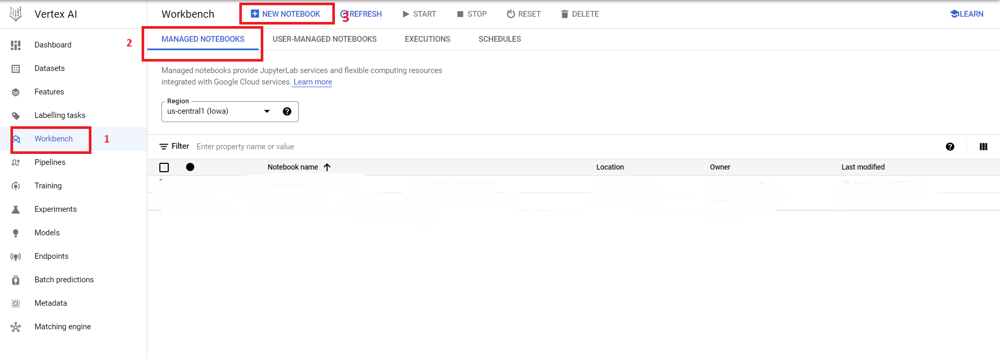
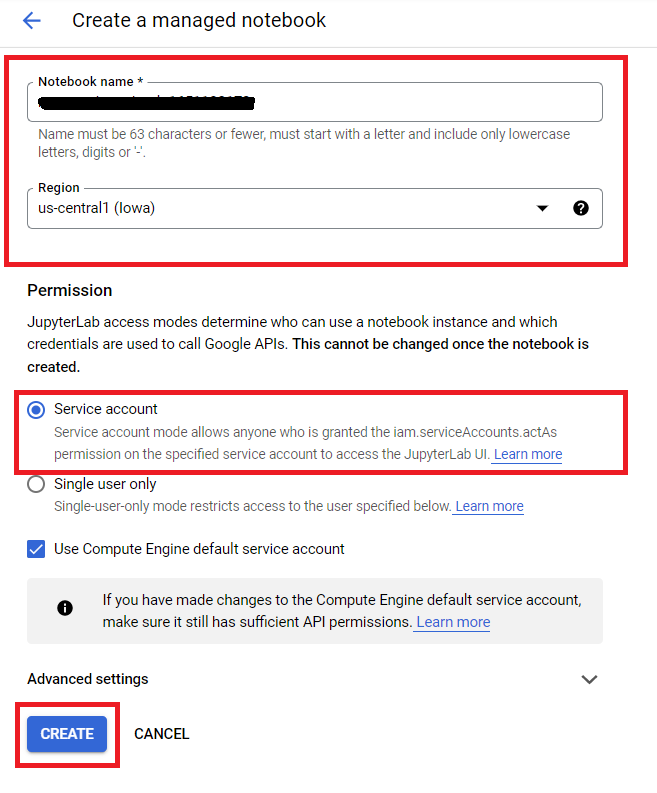

<!---->
  Copyright 2022 Google LLC
 
  Licensed under the Apache License, Version 2.0 (the "License");
  you may not use this file except in compliance with the License.
  You may obtain a copy of the License at
 
       http://www.apache.org/licenses/LICENSE-2.0
 
  Unless required by applicable law or agreed to in writing, software
  distributed under the License is distributed on an "AS IS" BASIS,
  WITHOUT WARRANTIES OR CONDITIONS OF ANY KIND, either express or implied.
  See the License for the specific language governing permissions and
  limitations under the License.
 <!---->

# Customer Churn using Vertex AI

**Goal** -  Data Preparation and Model Training for Detecting Customer Churn.

Following are the lab modules:

[1. Understanding Data](instructions/05a_customer_churn_vertex_ai_notebook_execution.md#1-understanding-data)<br>
[2. Solution Architecture](instructions/05a_customer_churn_vertex_ai_notebook_execution.md#2-solution-architecture)<br>
[3. Execution](instructions/05a_customer_churn_vertex_ai_notebook_execution.md#3-execution)<br>
[4. Check the output table in BQ](instructions/05a_customer_churn_vertex_ai_notebook_execution.md#4-check-the-output-table-in-bq)<br>
[5. Logging](instructions/05a_customer_churn_vertex_ai_notebook_execution.md#5-logging)<br>

<br>

## 1. Understanding Data

The dataset used for this project is [customer churn data](01-datasets/customer_churn_train_data.csv) and [customer test data](01-datasets/customer_churn_test_data.csv).. <br>

The dataset contains the following features:

- Churn - Binary field which represents customers who left/were retained within the last month
- Services that each customer has signed up for – phone, multiple lines, internet, online security, online backup, device protection, tech support, and streaming TV and movies
- Customer account information – how long they’ve been a customer, contract, payment method, paperless billing, monthly charges, and total charges
- Demographic info about customers – gender, age range, and if they have partners and dependents

**Note:** The following features refer to these same-host connections.

- serror_rate
- rerror_rate
- same_srv_rate
- diff_srv_rate
- srv_count

**Note:** The following features refer to these same-service connections.
- srv_serror_rate
- srv_rerror_rate
- srv_diff_host_rate

<br>

## 2. Solution Architecture

<kbd>

</kbd>

<br>
<br>

**Model Pipeline**

The model pipeline involves the following steps:
 - Data cleanup and preparation
 - Building and training a Machine Learning Model (Random Forest Classifier) before saving it into a GCS bucket
 - Using the model built in above step to evaluate test data

<br>

## 3. Execution

### 3.1. Run the Batch by creating session.

#### Creating Notebook in Vertex AI
Select Workbench from the left scroll bar of the Vertex AI main page.
Select the Managed Notebooks tab.
In the Managed Notebooks tab , click the New Notebook icon.



#### Next, fill in the following values in the Notebook creation window as shown in the images below:

- **Notebook Name**   - A unique identifier for your Notebook
- **Region**     - The region name provided by the Admin team
- **Permission Type**    - Service Account

 * Provide a name and region to the notebook and select 'Service Account' and click 'Create'. We will let the 'Advanced Settings' remain as the default values.




 * Once the notebook is running, click the 'OPEN JUPYTERLAB' option next to the Notebook name as shown below

 

* Follow the on screen instructions to launch the JupyterLab session

#### Create Serverless Spark Session

* Click on the File and the New launcher and select Serverless Spark

<br>
<kbd>

</kbd>
<br>

<br>
<kbd>

</kbd>
<br>


##  Follow the on screen instructions to create Session

### 3.2. Provide the details for the Session

Next, fill in the following values in the session creation window as shown in the images below:

- **Session Name**   - A unique identifier for your session
- **Region**     - The region name provided by the Admin team
- **Language**    - Pyspark
- **Autoshutdown** - 24 hours
- **Service Account** - <UMSA_NAME>@<PROJECT_ID>.iam.gserviceaccount.com
- **Network Configuration** - Select the network and subnetwork provided by the Admin team
- **History Server Cluster** - projects/<PROJECT_ID>/regions/<REGION_NAME>/clusters/<HISTORY_SERVER_NAME>
- **Properties** - spark.jars=gs://spark-lib/bigquery/spark-bigquery-with-dependencies_2.12-0.22.2.jar

* Click the **SUBMIT** button to create the session.

<br>
<kbd>

</kbd><br>

<br>
<kbd>

</kbd><br>

<br>
<kbd>

</kbd><br>


* Once the Session is created select 'No Kernel' from the kernel dropdown list and then delete the notebook

<kbd>

</kbd>

<br>

* Next, using the browser option from JupyterLab, navigate to the Notebook file located at: <br>
    <bucket_name> > 'customer-churn-prediction-vertex-ai' > 00-scripts > customer_churn.ipynb
* From the kernel dropdown list, select the kernel for the session created in section 3.2
* Pass the values to the variables project_name, dataset_name, bucket_name as provided by the Admin and replace user_name by your username
* Next, hit the **Execute** button as shown below to run the code in the notebook.

<br>

<kbd>

</kbd>


### 4. Check the output table in BQ

Navigate to BigQuery Console, and check the **customer_churn** dataset. <br>
Once the code execution is completed, four new tables '<your_name_here>_train_data', '<your_name_here>_test_data', '<your_name_here>_predictions_data' and '<your_name_here>_test_output' will be created as shown below :

To view the data in these tables -

* Select the table from BigQuery Explorer by navigating 'project_id' **>** 'dataset' **>** 'table_name'
* Click on the **Preview** button to see the data in the table

<br>

<kbd>

</kbd>

<br>

**Note:** If the **Preview** button is not visible, run the below queries to view the data. However, these queries will be charged for the full table scan.

```
  SELECT * FROM `<project_name>.<dataset_name>.<your_name_here>_train_data` LIMIT 1000
  SELECT * FROM `<project_name>.<dataset_name>.<your_name_here>_test_data` LIMIT 1000
  SELECT * FROM `<project_name>.<dataset_name>.<your_name_here>_predictions_data` LIMIT 1000
  SELECT * FROM `<project_name>.<dataset_name>.<your_name_here>_test_output` LIMIT 1000
```

**Note:** Edit all occurrences of <project_name> and <dataset_name> to match the values of the variables PROJECT_ID, and BQ_DATASET_NAME respectively

<kbd>

</kbd>

<br>

## 5. Logging


### 5.1 Persistent History Server logs

To view the Persistent History server logs, click the 'View History Server' button on the Sessions monitoring page and the logs will be shown as below:

As the session is still in active state , we will be able to find the logs in show incomplete applications.

<br>

<kbd>

</kbd>

<kbd>

</kbd>

<kbd>

</kbd>

<br>
