# Lab 2: Wikipedia Page Views Analysis from the BigQuery UI powered by Dataproc Serverless Spark

This lab demonstrates how to use the BigQuery UI for running Dataproc Serverless Spark jobs for data analytics.

## 1. Prerequisite
The setup detailed in the environment provisioning instructions in go/scw-tf

## 2. Variables

Paste this into gcloud CLI in CLoud Shell after replacing with your values-
```
PROJECT_ID=YOUR_PROJECT_ID
PROJECT_NBR=YOUR_PROJECT_NBR
BQ_UI_BUCKET_NM=gs://s8s-bigspark-$PROJECT_NBR
LOCATION=us-central1
```

## 3. Storage Bucket

A storage bucket is needed, for Serverless Spark. Lets create one-
```
gsutil mb -p $PROJECT_ID -c STANDARD -l $LOCATION -b on $BQ_UI_BUCKET_NM
```

## 4. Needed in the UI

Just the storage bucket created above.
Note: You will run the lab as your own identity.

## 5. Wikipedia Page Views Analysis - code

```
from pyspark.sql import SparkSession
from pyspark.ml.feature import StopWordsRemover
from pyspark.sql import functions as F

spark = SparkSession.builder \
.appName('Wikipedia-Analytics')\
.getOrCreate()

# Base dataset in BQ
bqTableFQN = "bigquery-public-data.wikipedia.pageviews_2019"

# Read base dataset with filters
wikiPageviewsDF = spark.read \
.format("bigquery") \
.option("table", bqTableFQN) \
.option("filter", "datehour >= '2019-01-01' ") \
.load()

# Subset the columns
pageViewsSubsetDF = wikiPageviewsDF \
.select("title", "wiki", "views") \
.where("views > 5")

# Cache
pageViewsSubsetDF.cache()

# Filter to just english
pageViewsSubsetEnglishDF = pageViewsSubsetDF \
.where("wiki in ('en', 'en.m')")

# Aggregate by title
pageViewsSubsetEnglishByTitleDF = pageViewsSubsetEnglishDF \
.groupBy("title") \
.agg(F.sum('views').alias('total_views'))

# Order by and print
pageViewsSubsetEnglishByTitleDF.orderBy('total_views', ascending=False).show(20) 
```

## 6. Lets get started

### 6.1. Navigate to the BQ UI from Cloud Console

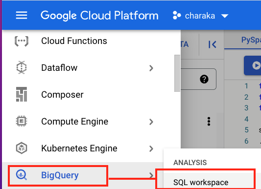 
<br>

### 6.2. Click on create

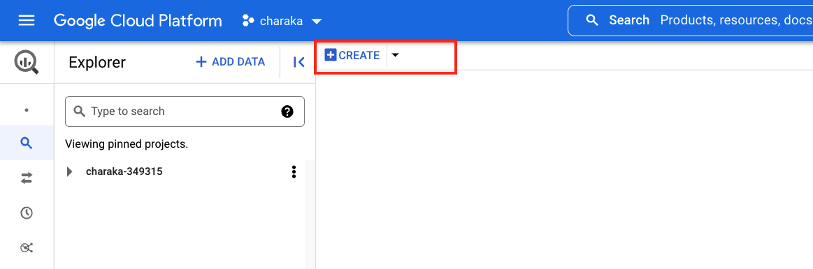  
<br>

### 6.3. Click on "Compose new PySpark"

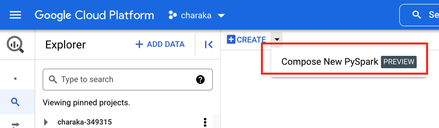 
<br>

### 6.4. Click on "More -> PySpark Options"

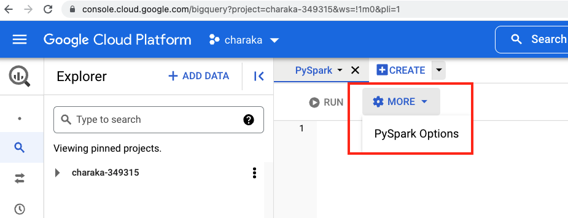 
<br>

### 6.5. Click on "Browse and select staging folder"

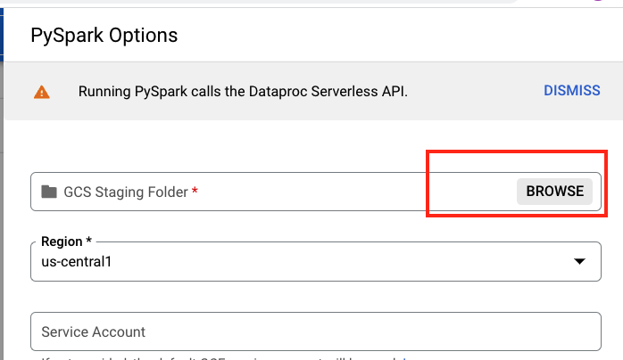  
<br>

### 6.6. Click on "s8s bigSpark bucket"

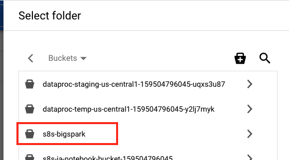  
<br>

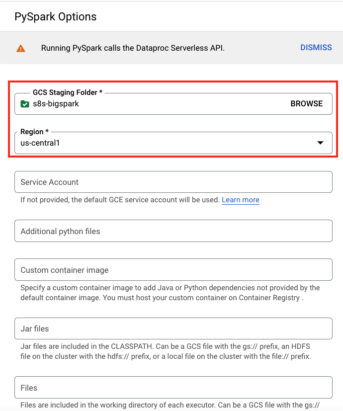  
<br>

### 6.7. Select your network and subnet

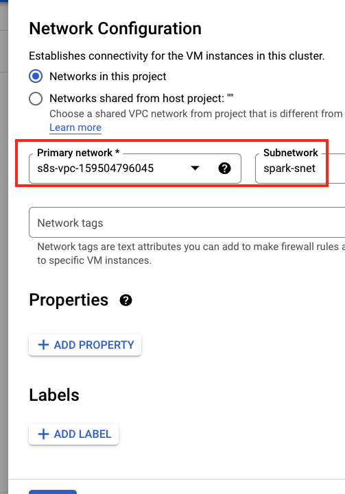
<br>

### 6.8. Click "Save"
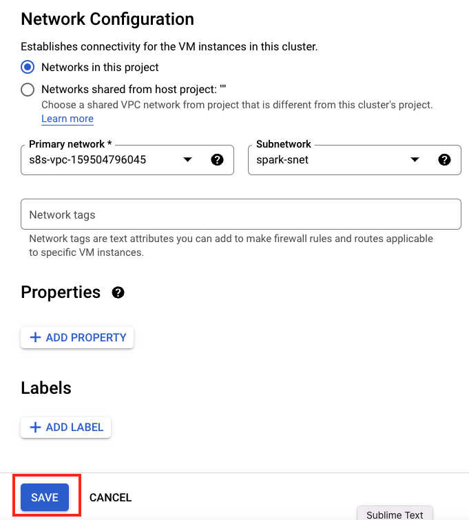  
<br>

### 6.9. Paste the code snippet above, into the UI text area and click "Run"
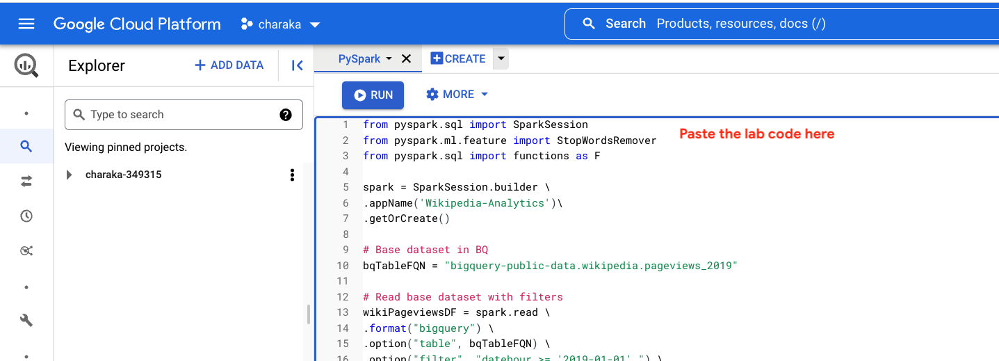
<br>

### 6.10. Switch to Dataproc UI "Batches" view

You should see a new batch job-

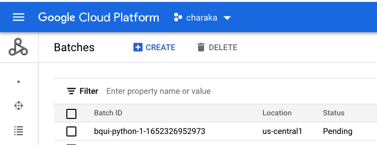 
<br>

### 6.11. Switch back to the BQ UI to view the results

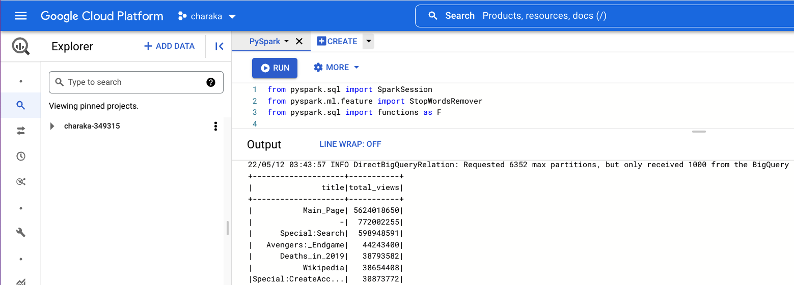
<br>
<br>
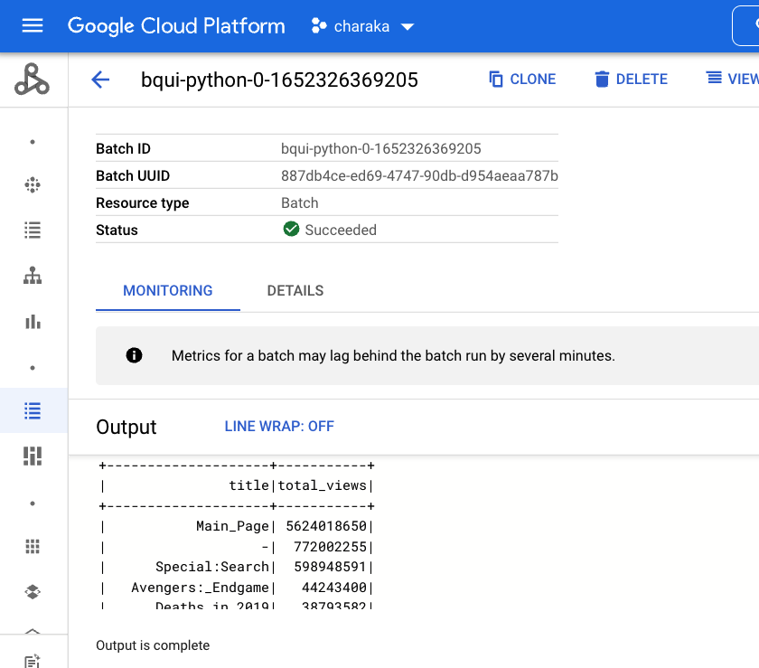  

### 6.12. Switch to Dataproc UI "Batches" view to look at the monitoring tile
You should see the autoscale kick in after 2 minutes
<br>
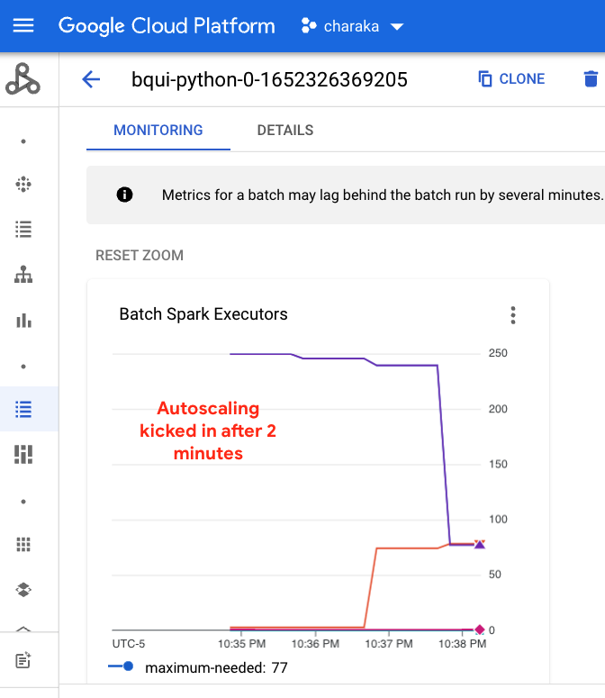  
<br>


##### =====================================================================================================
##### THIS CONCLUDES THIS LAB 
##### PROGRESS TO NEXT LAB, OR SHUT DOWN RESOURCES
##### =====================================================================================================

