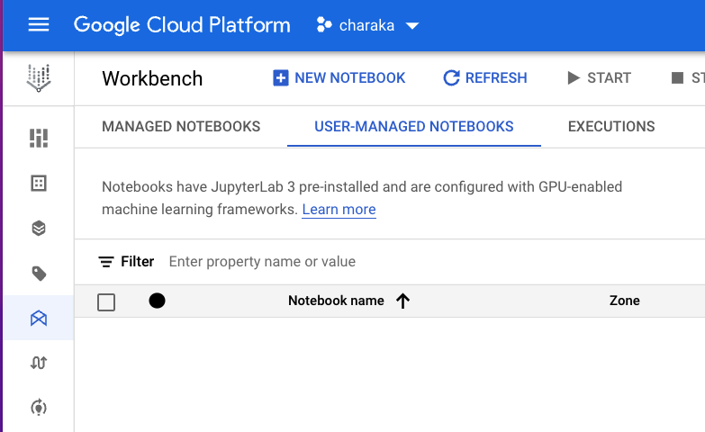

# Lab 3: Chicago Crimes Analysis with Dataproc Serverless Spark Interactive Sessions on Vertex AI Managed Notebooks

In this lab, you will create a Vertex AI managed notebook environment, launch JupyterLab, create a Dataproc Serverless Spark Interactive Session and  authoring and run Spark code for interactive, exploratory analytics with Spark.

## 1. Prerequisite
The setup detailed in the environment provisioning instructions in go/scw-tf

## 2. Enable APIs

From the Cloud Console, enable the following APIs-
1. Notebook API
2. Vertex AI API

  
<br>

  
<br>

  
<br>

  
<br>

## 3. IAM permissions

### 3.1. Permissions for the User Managed Service Account
From the Cloud Console, navigate to IAM and grant the UMSA the following permissions-
1. Notebook Admin
2. Notebook Runner
3. BigQuery Admin

  
<br>

### 3.2. Permissions for yourself
From the Cloud Console, navigate to IAM and grant yourself the following permissions-
1. Notebook Runner

  
<br>

## 4. In Vertex AI, create a managed notebook environment

  
<br>

  
<br>

  
<br>

  
<br>

  
<br>

  
<br>

  
<br>

  
<br>

  
<br>

  
<br>


## 5. Clone this git repo

```
cd ~
rm -rf s8s-spark-ce-workshop
git clone https://github.com/anagha-google/s8s-spark-ce-workshop.git
```

## 6. Download the Chicago Crimes Analytics notebook from the Cloud Shell


## 7. Upload the same into the Managed Notebook environment


## 8. Click on "Launcher"

## 9. Launch an interactive session

## 10.Shut down the kernel of the Untitled.ipynb and close it

Ensure that it is fully shutdown

## 11. Now open the Chicago Crimes Notebook

## 12. Select the interactive session created in the kernel picker

## 13. Now run your analysis on the data

