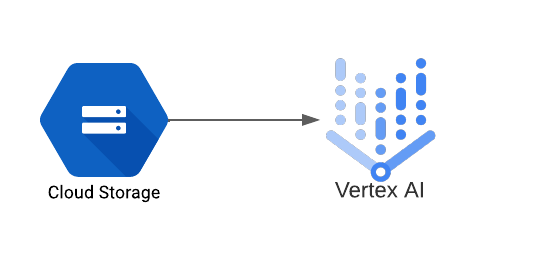
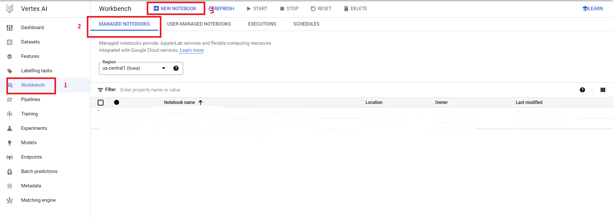
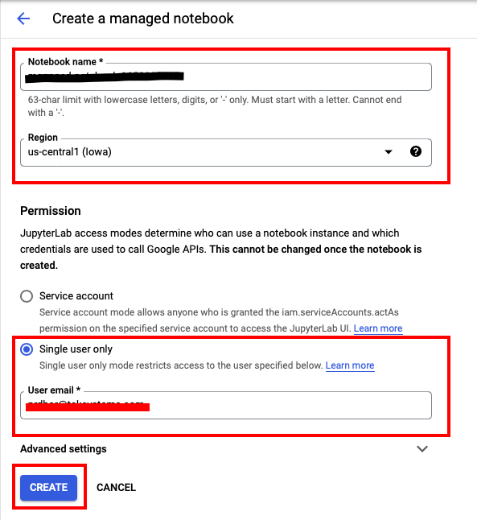
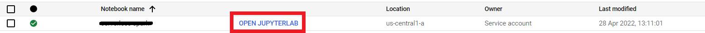

# Social Media Data Analytics using sessions in Serverless Spark through Vertex AI

Following are the lab modules:

[1. Understanding Data](05-social-media-data-analytics-vertex-ai-notebook-execution.md#1-understanding-data) 
[2. Solution Architecture](05-social-media-data-analytics-vertex-ai-notebook-execution.md#2-solution-architecture) 
[3. Execution](05-social-media-data-analytics-vertex-ai-notebook-execution.md#3-execution) 
[4. Logging](05-social-media-data-analytics-vertex-ai-notebook-execution.md#4-logging) 
 

## 1. Understanding Data

## Data Files
The datasets used for this project are:
- location_.csv's: This file contains the location details of the tweets from where they are tweeted.
- tweets_with_latitude_longitude_.csv's: This file contains the tweets and the location details

 

## 2. Solution Architecture

 

## 3. Execution

### 3.1. Run the Batch by creating session.

#### Creating Notebook in Vertex AI
Select Workbench from the left scroll bar of the Vertex AI main page.
Select the Managed Notebooks tab.
In the Managed Notebooks tab , click the New Notebook icon.

#### Next, fill in the following values in the Notebook creation window as shown in the images below:

- **Notebook Name**   - A unique identifier for your Notebook
- **Region**     - The region name provided by the Admin team
- **Permission Type**    - Single User Only (Single user only mode restricts access to the specified user)

  * Provide a name and region to the notebook and select 'Single User Only' and click 'Create'. We will let the 'Advanced Settings' remain as the default values.

 * Once the notebook is running, click the 'OPEN JUPYTERLAB' option next to the Notebook name as shown below

 

* Follow the on screen instructions to launch the JupyterLab session

#### Create Serverless Spark Session

* Click on the File and the New launcher and select Serverless Spark

 
<kbd>

</kbd>
 

 
<kbd>

</kbd>
 

##  Follow the on screen instructions to create Session

### 3.2. Provide the details for the Session

Next, fill in the following values in the session creation window as shown in the images below:

- **Session Name**   - A unique identifier for your session
- **Region**     - The region name provided by the Admin team
- **Language**    - Pyspark
- **Autoshutdown** - 24 hours
- **Network Configuration** - Select the network and subnetwork provided by the Admin team
- **History Server Cluster** - projects/<PROJECT_ID>/regions/<REGION_NAME>/clusters/<HISTORY_SERVER_NAME>
- **Custom Container** -gcr.io/<PROJECT_ID>/<CONTAINER_NAME>

* Click the **SUBMIT** button to create the session.

 
<kbd>

</kbd> 

 
<kbd>

</kbd> 

* Once the Session is created select 'No Kernel' from the kernel dropdown list and then delete the notebook

<kbd>

</kbd>

 

* Next, using the browser option from JupyterLab, navigate to the Notebook file located at:  
    <bucket_name> > 'social_media_data_analytics' > 00-scripts > social_media_data_analytics.ipynb
* From the kernel dropdown list, select the kernel for the session created in section 3.2
* Pass the values to the variable bucket_name as provided by the Admin.
* Next, hit the **Execute** button as shown below to run the code in the notebook.

 

<kbd>

</kbd>

### 3.3. Check the output table in Vertex AI

Navigate to VertexAI Console and check the output,
Once the code has successfully executed.
 

**Most popular trending #tags** 
<kbd>

</kbd>

 

<kbd>

</kbd>

 
 

**The types of tweets and their followers count**
<kbd>

</kbd>

 

**The origin of the tweets**
<kbd>

</kbd>

 

## 4. Logging

### 4.1 Persistent History Server logs

To view the Persistent History server logs, click the 'View History Server' button on the Sessions monitoring page and the logs will be shown as below:

As the session is still in active state , we will be able to find the logs in show incomplete applications.

 

<kbd>

</kbd>

<kbd>

</kbd>

<kbd>

</kbd>

 
