# About Module

This module covers environment validation for the Serverless Spark labs.

## Note:

1. Validation steps 1 and 2 should be performed by the Admin who set up the GCP project resources. The user should have the following IAM roles:

```
Security Admin
Project IAM Admin
Service Usage Admin
Service Account Admin
Role Administrator
```

2. Validations steps 3,4 and 5 should be performed by an attendee and not the Admin who set up the environment. The user should have the following IAM roles:

```
Viewer
Dataproc Editor
BigQuery Data Editor
Service Account User
Storage Admin
Environment User and Storage Object Viewer
Notebooks Runner
```

3. Use the 'resource-list.txt' file provided by the Admin to populate all resources and variable names.

## Validation Step 1

- Navigate to IAM & Admin > Quotas and filter for 'Compute Engine API'.
- Ensure the vCPU quota in the selected region is sufficient. Per person requirement ~16-20 vCPUs.

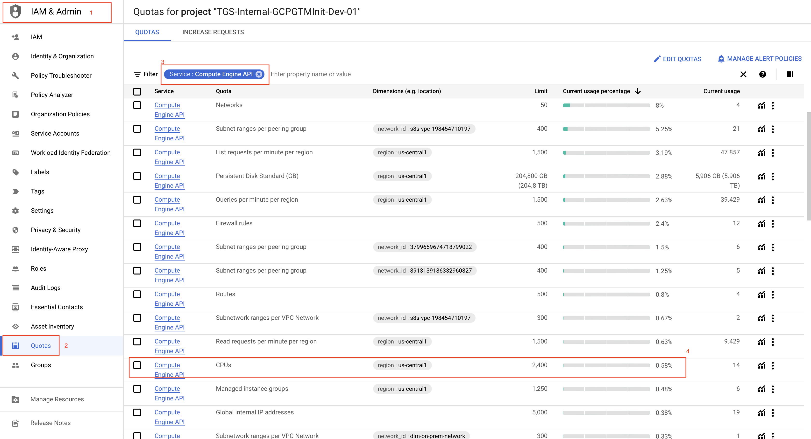

## Validation Step 2

* Navigate to BigQuery and click on '+ ADD DATA'.

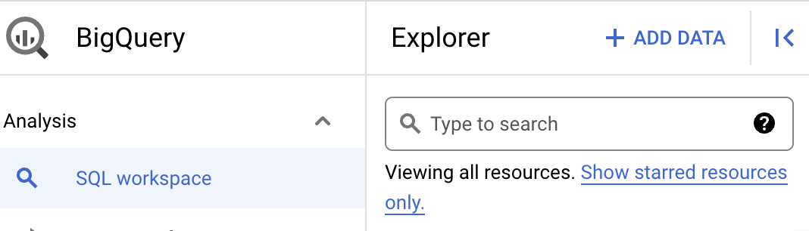

* Select Connections to external data sources.

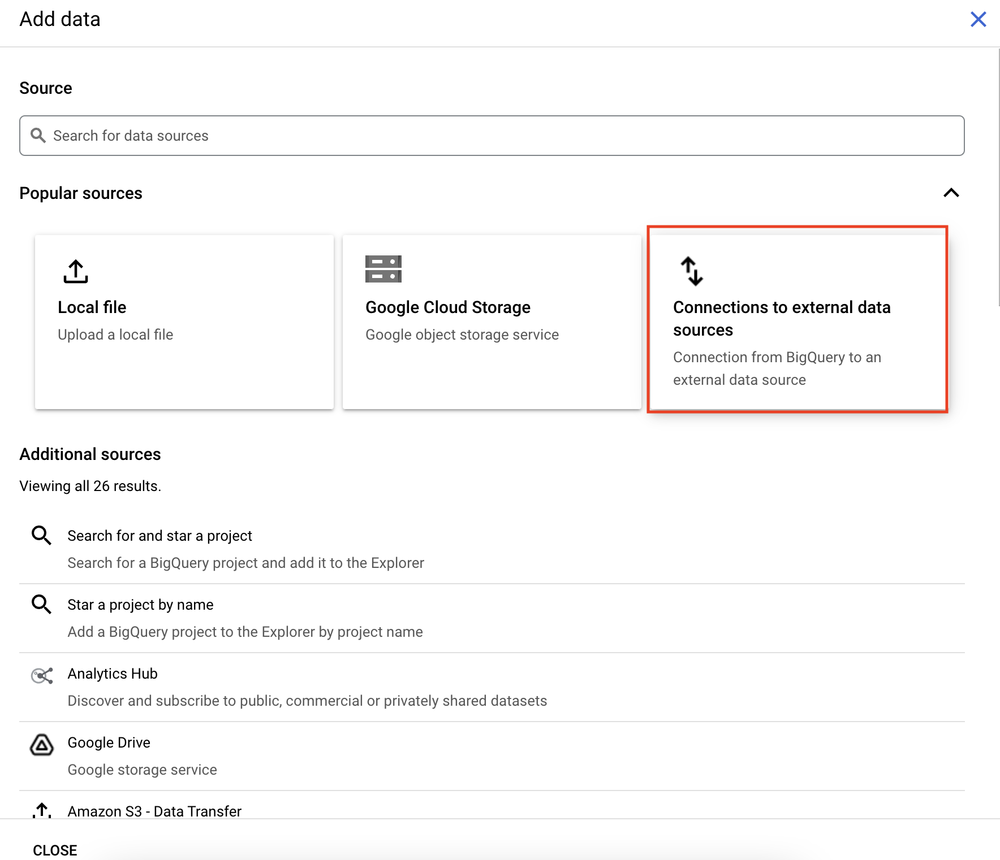

* Select 'Apache Spark' and provide a name for 'Connection ID'. Make sure that  the location match the value in the 'resource-list.txt' file.

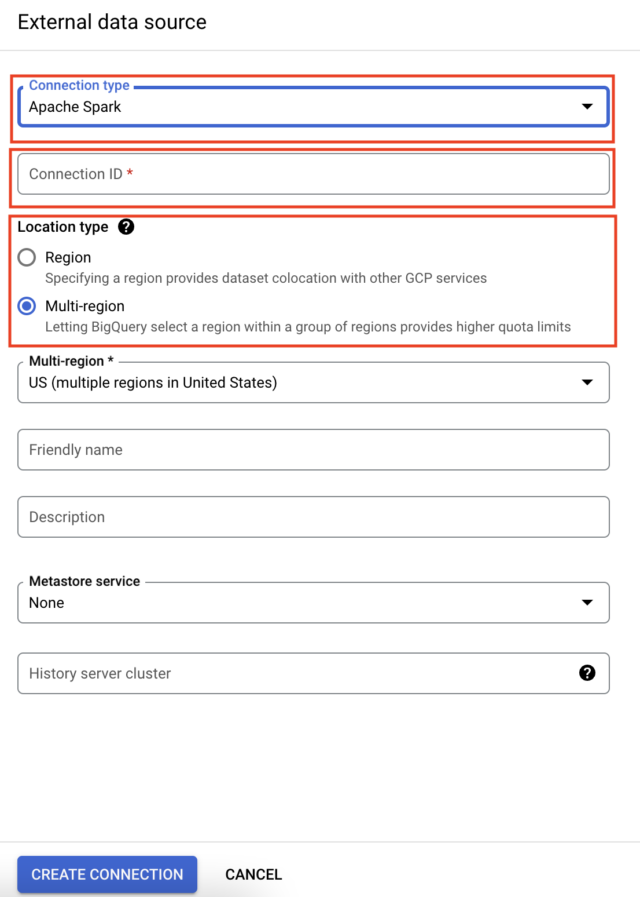

* Click on 'Create Connection'

* You should be able to see your new connection as shown below.

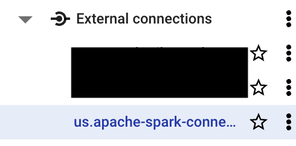

### Grand IAM roles to the connection

* Select your connection created in the previous step. Make anote of the 'Service account id'. We will be adding IAM roles to this service account.

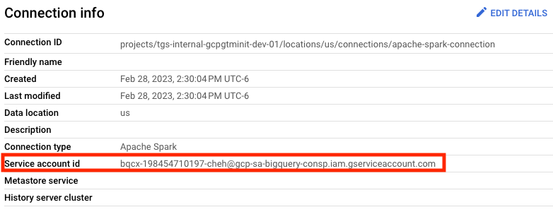

* Go to IAM & Admin and click 'Grant Access'

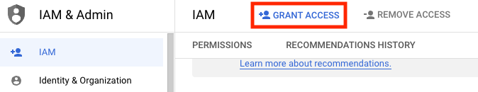

* Add the 'Service accound id' to the 'New principals' box and assign the following three roles to it.

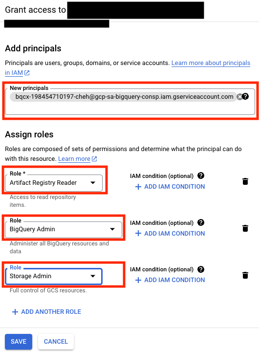

* Click 'Save'

**This confirms that the allowlisting for BigSpark is complete.**

## Validation Step 3

Declare the following variables in Cloud Shell:

```
PROJECT_ID=<YOUR_PROJECT_ID_HERE>
REGION=<YOUR_GCP_REGION_HERE>
SUBNET=<YOUR_SUBNET_NAME_HERE>
HISTORY_SERVER_NAME=<YOUR_HISTORY_SERVER_NAME_HERE>
UMSA=<YOUR_UMSA_NAME_HERE>
```

Run the following command in Cloud Shell:

```
gcloud dataproc batches submit \
--project $PROJECT_ID \
--region $REGION \
spark --batch sparkpi-${RANDOM} \
--class org.apache.spark.examples.SparkPi \
--jars file:///usr/lib/spark/examples/jars/spark-examples.jar \
--service-account $UMSA@$PROJECT_ID.iam.gserviceaccount.com \
--subnet $SUBNET \
--history-server-cluster=projects/$PROJECT_ID/regions/$REGION/clusters/$HISTORY_SERVER_NAME
```

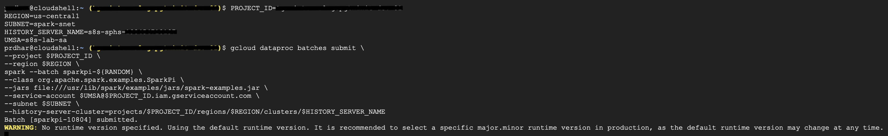   

In ~90 to 120 seconds, you should see the following output on your screen.

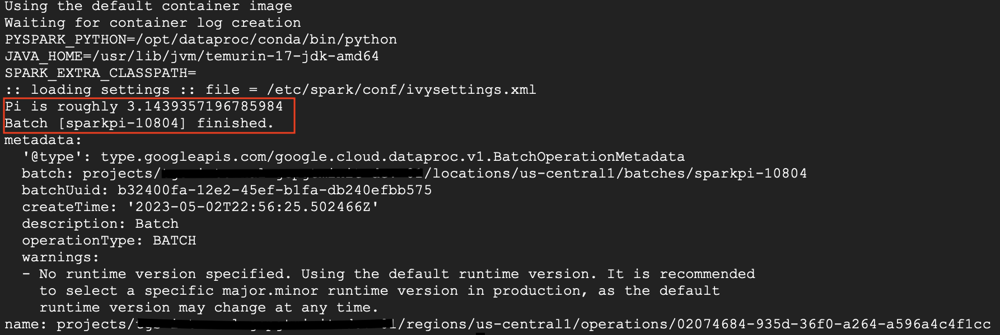  

To view the Persistent History server logs, click the 'View History Server' button on the Dataproc batches monitoring page and the logs will be shown as below:

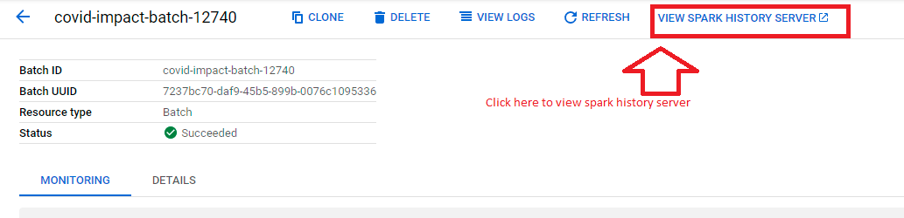

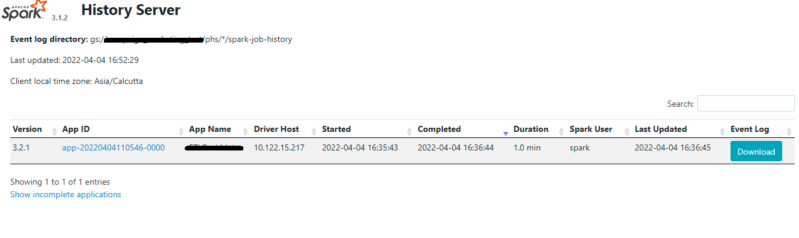

**This confirms that the Networking components, User Managed Service Account and Persistent History Server are configured correctly**

## Validation Step 4

- Navigate to Vertex AI service on the GCP console.
- Select Workbench from the left scroll bar of the Vertex AI main page.
- Select the Managed Notebooks tab.
- In the Managed Notebooks tab , click the New Notebook icon.


* Next, fill in the following values in the Notebook creation window as shown in the images below:

- **Notebook Name**   - A unique identifier for your Notebook
- **Region**     - The region name provided by the Admin team
- **Permission Type**    - Service Account

 * Provide a name and region to the notebook and select 'Service Account' and click 'Create'. We will let the 'Advanced Settings' remain as the default values.

 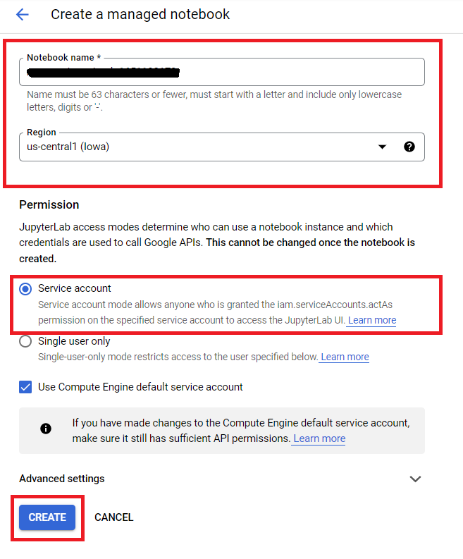

 * Once the notebook is running, click the 'OPEN JUPYTERLAB' option next to the Notebook name as shown below

 

* Follow the on screen instructions to launch the JupyterLab session

* Click on 'File' and then New launcher and select Serverless Spark

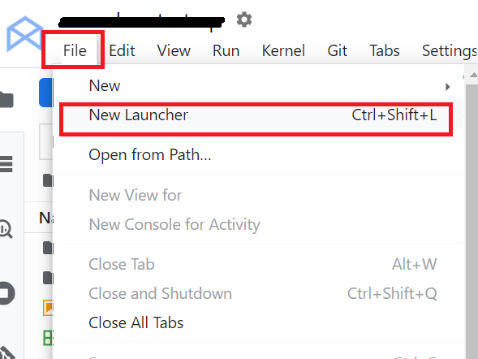

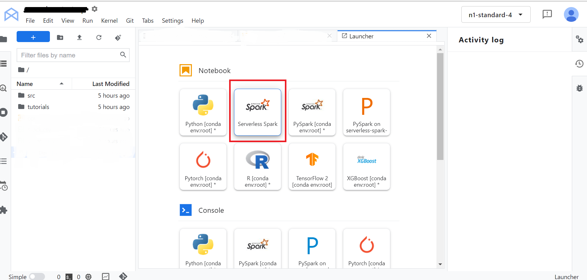

### Follow the on screen instructions to create Session by providing the following details for the session

- **Session Name**   - A unique identifier for your session
- **Region**     - The region name provided by the Admin team
- **Language**    - Pyspark
- **Version** - 1.1
- **Autoshutdown** - 24 hours
- **Service Account** - <UMSA_NAME>@<PROJECT_ID>.iam.gserviceaccount.com
- **Network Configuration** - Select the network and subnetwork provided by the Admin team
- **History Server Cluster** - projects/<PROJECT_ID>/regions/<REGION_NAME>/clusters/<HISTORY_SERVER_NAME>

* Click the **SUBMIT** button to create the session.

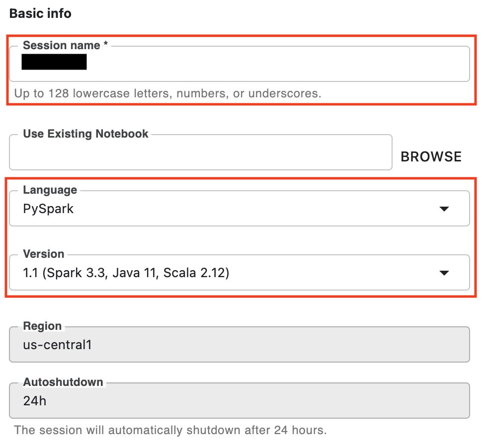

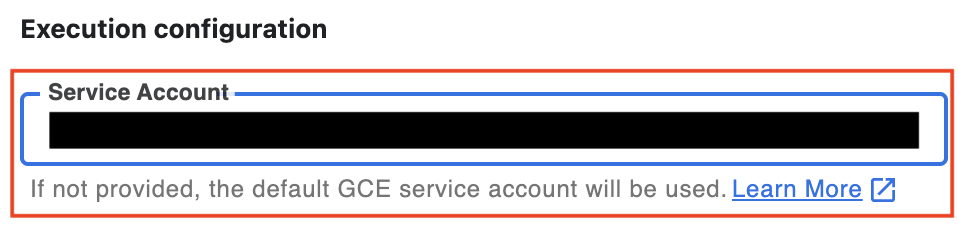

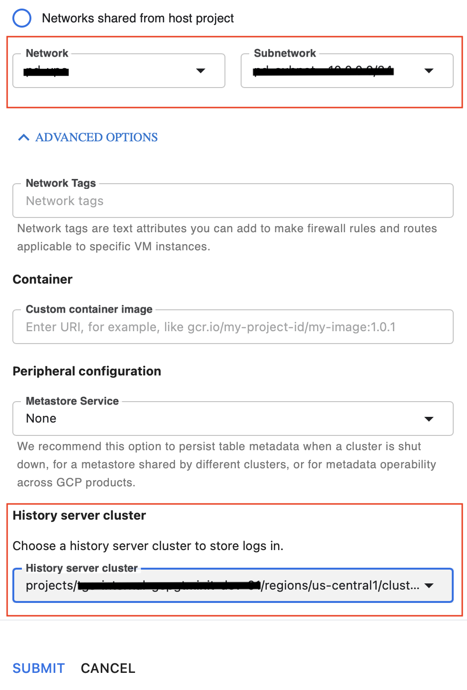

Once the session is created, you should see a new notebook created with a kernel name matching the name of the session you created as shown below. **This confirms that the allowlisting for the Vertex AI-Serverless Spark Interactive sessions is complete.**

## Validation Step 5

Navigate to 'Composer' service from the GCP Console and confirm that you are able to see a Composer Environment in the Running State (denoted by a green check mark) with a name matching what is available in the 'resource-list.txt' file. Next, navigate to the 'Airflow UI' by clicking on the 'Airflow' button as shown below.

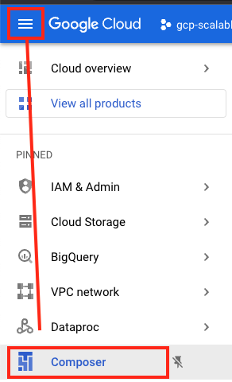

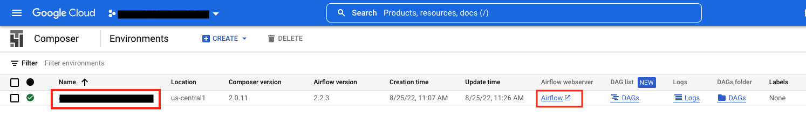

**This confirms that the Cloud Composer Environment has been configured successfully.**
