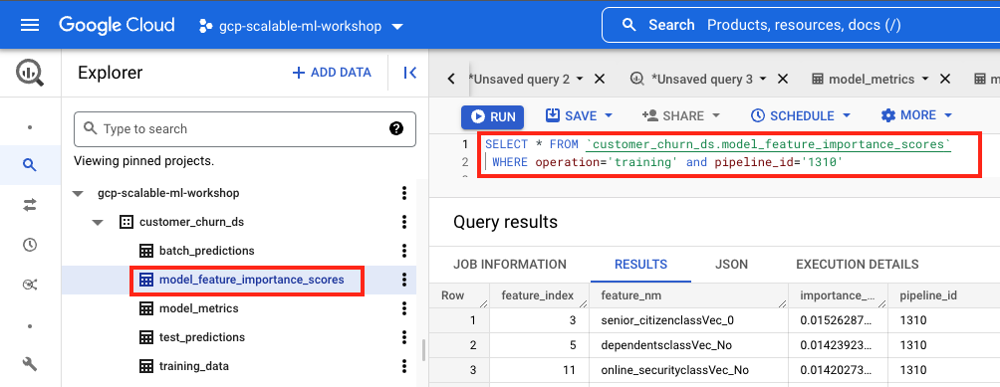
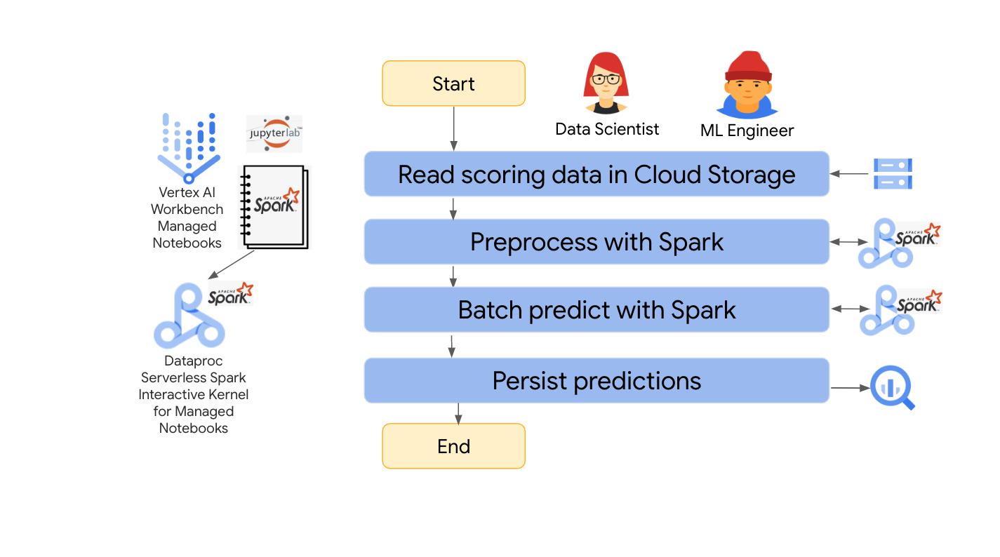

<!---->
  Copyright 2022 Google LLC
 
  Licensed under the Apache License, Version 2.0 (the "License");
  you may not use this file except in compliance with the License.
  You may obtain a copy of the License at
 
       http://www.apache.org/licenses/LICENSE-2.0
 
  Unless required by applicable law or agreed to in writing, software
  distributed under the License is distributed on an "AS IS" BASIS,
  WITHOUT WARRANTIES OR CONDITIONS OF ANY KIND, either express or implied.
  See the License for the specific language governing permissions and
  limitations under the License.
 <!---->

# About Module 3
The recommended GCP solution for scalable Spark based ML code interactive authoring is Serverless Spark notebooks on Vertex AI Workbench, Managed Notebooks. In this lab module, we will go through the typical data science/ML engineering work - preprocess data, train & test model, tune model, and do some scoring. Since this lab is focused on demystifying the integration, the notebooks are pre-created for you, so you can quickly understand the integration.

<hr>

## 1. Use case recap
Telco Customer Churn Prediction with a [Kaggle dataset](https://www.kaggle.com/datasets/blastchar/telco-customer-churn) and [Spark MLLib, Random Forest Classifer](https://spark.apache.org/docs/latest/ml-classification-regression.html#random-forest-classifier)<br>

<hr>

## 2. The environment & exercises in the module
The environment for the module is Vertex AI Workbench, Managed notebook instance, custom container image for serverless Spark - pre-created as part of the Terraform deployent. We will reuse kernel created in the prior module. The following are the four exercises in the module.

   
<br><br>

<hr>

## 3. Where we are in the model development lifecycle

   
<br><br>

## 4. The data used in the experiment
Training and scoring data are available in GCS in the data bucket and the data is in CSV format.

   
<br><br>

   
<br><br>

<hr>

## 5. Step 1: Preprocessing

### 5.1. The exercise
We will read customer churn raw source data for model training, in GCS, cleanse/transform and persist to BigQuery for use in the model training step.

   
<br><br>

### 5.2. Switch the spark interactive kernel to the pre-processing notebook
Lets ensure we have the Serverless Spark kernel created in the prior module attached to the pre-processing notebook. Follow the screenshots below-

   
<br><br>

   
<br><br>

   
<br><br>

### 5.3. Review the code in the pre-processing notebook and run the notebook

   
<br><br>

### 5.4. Review the pre-processed data in BigQuery

Navigate to BigQuery, and run the following query-
```
SELECT * FROM `USER_ID_customer_churn_ds.training_data` LIMIT 1000
```
The following is the author's results-

   
<br><br>


### 5.5. Visit the Dataproc UI for the session

   
<br><br>

### 5.6. Visit the Spark History Server UI for the session

   
<br><br>

### 5.7. Review the notebook equivalent PySpark script in GCS for this step
For each notebook, there is complementary code in a PySpark script that will be used for operationalizing the model training Vertex AI pipeline.

   
<br><br>

   
<br><br>
<hr>

## 6. Step 2: Model Training

Now that we have preprocessed data, lets create a model model.

### 6.1. The exercise

   
<br><br>

### 6.2. Run the model training notebook
1. Close the preprocessing notebook
2. Shutdown kernel, leave spark interactive session active.
3. Open the model training notebook
4. Review the code, run all cells as showin section 4.3 above

   
<br><br>

   
<br><br>

### 6.3. Review the model persisted in GCS

   
<br><br>

### 6.4. Review the model metrics persisted in GCS

   
<br><br>

   
<br><br>

This JSON is persisted so it can be visualized in Vertex AI pipeline. For queryability, we also persist to BigQuery.

   
<br><br>

### 6.5. The tables created in BigQuery for the experiment
The following tables are created and written to in append mode.

   
<br><br>

**Notice the columns for the tables. There is a pipeline_id column and a pipeline_execution_dt for traceability/lineage tracking.**

### 6.6. Review the model feature importance scores persisted in BigQuery
Run the below query in BigQuery. Be sure to add pipeline_id to the where clause if you are running the experiments multiple times.
```
SELECT * FROM `USER_ID_customer_churn_ds.model_feature_importance_scores`
 WHERE operation='training'  
```
The following is the author's output-

   
<br><br>

### 6.7. Review the model metrics persisted in BigQuery
Run the below query in BigQuery. Be sure to add pipeline_id to the where clause if you are running the experiments multiple times.
```
SELECT * FROM `USER_ID_customer_churn_ds.model_metrics`
 WHERE operation='training'  
```
The following is the author's output-

   
<br><br>

### 6.8. Review the model test results in BigQuery
Run the below queries in BigQuery. Be sure to add pipeline_id to the where clause if you are running the experiments multiple times.

Just the predictions-
```
SELECT churn, prediction, *
 FROM `USER_ID_customer_churn_ds.test_predictions`
 WHERE operation='training'
```
Confusion matrix-
```
SELECT churn, prediction, count(*) as count
 FROM `USER_ID_customer_churn_ds.test_predictions`
 WHERE operation='training'
GROUP BY churn, prediction ORDER BY churn
```

The following is the author's output-

   
<br><br>

The confusion matrix-

   
<br><br>

### 6.9. Review the notebook equivalent PySpark script in GCS for this step

   
<br><br>

   
<br><br>

<hr>

## 7. Step 3: Hyperparameter Tuning

### 7.1. The exercise

This sub-module demonstrates hyperparameter tuning with Spark MLLib in an effort to improve model performance.

   
<br><br>

### 7.2. Run the model tuning notebook
Switch the serverless Spark interactive kernel to this notebook and run the entire notebok. It takes ~30 minutes to complete. If it fails midway, rerun the entire notebook.

   
<br><br>

### 7.3. Review the model persisted in GCS
Notice that Spark Mllib creates a bestModel directory and persists the tuned model there. We will use the model in the bestModel directory for batch scoring.

   
<br><br>

### 7.4. Review the model metrics persisted in GCS
Again, this for the Vertex AI pipeline which we will cover in the module after the next.

   
<br><br>

### 7.5. Review the model metrics persisted in BigQuery

Run the below query in BigQuery. Be sure to add pipeline_id to the where clause if you are running the experiments multiple times.
```
SELECT * FROM `USER_ID_customer_churn_ds.model_metrics`
 WHERE operation='hyperparameter-tuning'
```
The following is the author's output-

   
<br><br>


### 7.6. Review the model test results in BigQuery

Run the below queries in BigQuery. Be sure to add pipeline_id to the where clause if you are running the experiments multiple times.
```
SELECT churn, prediction, *
 FROM `USER_ID_customer_churn_ds.test_predictions`
 WHERE operation='hyperparameter-tuning'
```

```
SELECT churn, prediction, count(*) as count
 FROM `USER_ID_customer_churn_ds.test_predictions`
 WHERE operation='hyperparameter-tuning'
GROUP BY churn, prediction ORDER BY churn
```

The following is the author's output-

   
<br><br>


<hr>

## 8. Step 4: Batch Scoring

### 8.1. The exercise
In this sub-module, we will use the best model from the hyperparameter tuning exercise and complete batch scoring. The source is in GCS. We will transform, run predictions and persist results to BigQuery.

   
<br><br>

### 8.2. Run the batch scoring notebook
Switch the serverless Spark interactive kernel to this notebook and run the entire notebok. It takes <5 minutes to complete.

#### Note
You need to get the model version from the hyperparameter tuning step and replace the modelVersion assignment (modelVersion = YOUR_MODEL_VERSION_HERE - 3rd code cell, line 5). You can do so by running this query in BigQuery-
```
SELECT DISTINCT pipeline_id
 FROM `USER_ID_customer_churn_ds.model_metrics`
 WHERE operation='hyperparameter-tuning'
 AND pipeline_execution_dt=(SELECT max(pipeline_execution_dt) FROM `USER_ID_customer_churn_ds.model_metrics`
 WHERE operation='hyperparameter-tuning')
```

   
<br><br>

   
<br><br>


### 8.3. Review the batch scoring results in BigQuery
Switch the serverless Spark interactive kernel to this notebook and run the entire notebok. It takes <5 minutes to complete.

Run the below queries in BigQuery. Be sure to add pipeline_id to the where clause if you are running the experiments multiple times.
```
SELECT *
 FROM `USER_ID_customer_churn_ds.batch_predictions`
```

The following is the author's output-

   
<br><br>

<hr>

## 9. Lineage/Traceability

The author has created a pipeline ID and model version for tracking and the same attributes are added to all datasets, directories in GCS and wherever else applicable for traceability.


<hr>

This concludes the lab module where you learned to author ML experiments on interactive Spark notebooks. Proceed to the [next module](../05-lab-guide/Module-04-Author-ML-PySpark-Scripts.md) where you will learn to execute equivalent Spark ML PySpark scripts via command line powered by Dataproc Serverless Spark batches.
