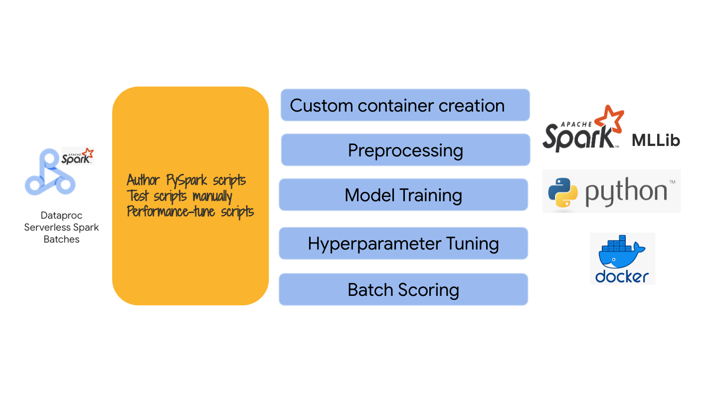
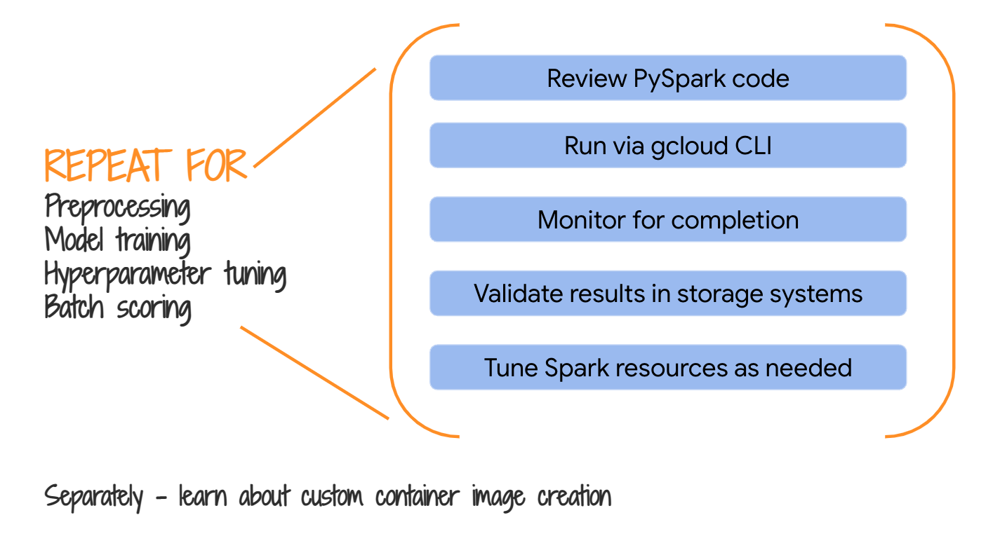

<!---->
  Copyright 2022 Google LLC
 
  Licensed under the Apache License, Version 2.0 (the "License");
  you may not use this file except in compliance with the License.
  You may obtain a copy of the License at
 
       http://www.apache.org/licenses/LICENSE-2.0
 
  Unless required by applicable law or agreed to in writing, software
  distributed under the License is distributed on an "AS IS" BASIS,
  WITHOUT WARRANTIES OR CONDITIONS OF ANY KIND, either express or implied.
  See the License for the specific language governing permissions and
  limitations under the License.
 <!---->

# About Module 4

In Module 3, we authored Spark ML code in interactive Spark notebooks. Vertex AI Workbench with Dataproc Serverless Spark interactive sessions does not support notebook scheduling. We therefore need to create PySpark scripts and test them out, before orchestrating into a Vertex AI pipeline. In this module, we will test pre-created PySpark scripts that are more or less a replica of the notebooks from Module 3.

<hr>

## 1. Where we are in the model development lifecycle

   
<br><br>

<hr>

## 2. The lab environment

   
<br><br>

<hr>

## 3. The exercise, at a high level
In this module we will test PySpark scripts provided as part of the lab; We will test each script individually, in preparation of authoring a Vertex AI pipeline that chains/orchestrates the ML experiment steps into a DAG, in the next module.

   
<br><br>

<hr>

## 4. The exercise, in detail

   
<br><br>

<hr>

## 5. The code

   
<br><br>

<hr>

## 6. The variables

The follow are variables for running via CLI on cloud shell. Paste the same into Cloud Shell authorized for your identity and scoped to the project we deployed resources into in module 1.<br>

**Note:**
1. Ensure you are in the **right project** and your cloud shell is configured to execute against the project.
2. Be sure to modify location (region) variable (last variable) after ensuring all services are available in **your region**.

```
NAME=USER_ID
PROJECT_ID=`gcloud config list --format "value(core.project)" 2>/dev/null`
PROJECT_NBR=`gcloud projects describe $PROJECT_ID | grep projectNumber | cut -d':' -f2 |  tr -d "'" | xargs`
PROJECT_NAME=`gcloud projects describe ${PROJECT_ID} | grep name | cut -d':' -f2 | xargs`
GCP_ACCOUNT_NAME=`gcloud auth list --filter=status:ACTIVE --format="value(account)"`
ORG_ID=`gcloud organizations list --format="value(name)"`
VPC_NM=s8s-vpc-$PROJECT_NBR
SPARK_SERVERLESS_SUBNET=spark-snet
PERSISTENT_HISTORY_SERVER_NM=s8s-sphs-${PROJECT_NBR}
UMSA_FQN=s8s-lab-sa@$PROJECT_ID.iam.gserviceaccount.com
DATA_BUCKET=USER_ID-s8s_data_bucket-${PROJECT_NBR}
CODE_BUCKET=USER_ID-s8s_code_bucket-${PROJECT_NBR}
MODEL_BUCKET=USER_ID-s8s_model_bucket-${PROJECT_NBR}
CONTAINER_IMAGE_URI="gcr.io/$PROJECT_ID/customer_churn_image:1.0.0"
BQ_CONNECTOR_JAR_GS_URI="gs://spark-lib/bigquery/spark-bigquery-with-dependencies_2.12-0.22.2.jar"
BQ_CONNECTOR_PACKAGES="com.google.cloud.spark:spark-bigquery-with-dependencies_2.12:0.25.2"
PIPELINE_ID=$RANDOM
LOCATION=us-central1
```

The PIPELINE_ID is particularly important as we will use it for traceablity/lineage.
```
echo $PIPELINE_ID
```

<hr>

## 7. Preprocessing

### 7.1. Execute the command in cloud shell
```
gcloud dataproc batches submit pyspark \
gs://$CODE_BUCKET/pyspark/preprocessing.py \
--py-files="gs://$CODE_BUCKET/pyspark/common_utils.py" \
--deps-bucket="gs://$CODE_BUCKET/pyspark/" \
--project $PROJECT_ID \
--region $LOCATION  \
--batch $NAME-customer-churn-preprocessing-$RANDOM \
--subnet projects/$PROJECT_ID/regions/$LOCATION/subnetworks/$SPARK_SERVERLESS_SUBNET \
--history-server-cluster=projects/$PROJECT_ID/regions/$LOCATION/clusters/$PERSISTENT_HISTORY_SERVER_NM \
--service-account $UMSA_FQN \
--properties "spark.jars.packages=${BQ_CONNECTOR_PACKAGES}" \
--container-image=${CONTAINER_IMAGE_URI} \
-- --pipelineID=${PIPELINE_ID} --projectNbr=$PROJECT_NBR --projectID=$PROJECT_ID --displayPrintStatements=True
```

You should see an output like this-
```
Batch [customer-churn-preprocessing-10179] submitted.
```
As the job progresses, the output is printed to the terminal.

### 7.2. Validate completion in the Dataproc UI

   
<br><br>

   
<br><br>

   
<br><br>

   
<br><br>

   
<br><br>

   
<br><br>


### 7.3. Validate creation of the training data table in BigQuery

Navigate to BigQuery, and run the following query-
```
SELECT * FROM `USER_ID_customer_churn_ds.training_data` LIMIT 1000
```

Even better, find the SQL from the output and run it.

   
<br><br>

   
<br><br>

<hr>

## 8. Model training

### 8.1. Execute the command in cloud shell
```
gcloud dataproc batches submit pyspark \
gs://$CODE_BUCKET/pyspark/model_training.py \
--py-files="gs://$CODE_BUCKET/pyspark/common_utils.py" \
--deps-bucket="gs://$CODE_BUCKET/pyspark/" \
--project $PROJECT_ID \
--region $LOCATION  \
--batch $NAME-customer-churn-model-training-$RANDOM \
--subnet projects/$PROJECT_ID/regions/$LOCATION/subnetworks/$SPARK_SERVERLESS_SUBNET \
--history-server-cluster=projects/$PROJECT_ID/regions/$LOCATION/clusters/$PERSISTENT_HISTORY_SERVER_NM \
--service-account $UMSA_FQN \
--properties "spark.jars.packages=${BQ_CONNECTOR_PACKAGES}" \
--container-image=${CONTAINER_IMAGE_URI} \
-- --pipelineID=${PIPELINE_ID} --projectNbr=$PROJECT_NBR --projectID=$PROJECT_ID --displayPrintStatements=True
```

You should see an output like this-
```
Batch [customer-churn-preprocessing-10179] submitted.
```
As the job progresses, the output is printed to the terminal.

### 8.2. Validate completion in the Dataproc UI

   
<br><br>


### 8.3. Validate availabity of artifacts in Cloud Storage

The ID generated in the variables section for the author is 29657. You can locate artifacts by identifying your PIPELINE_ID.
```
echo $PIPELINE_ID
```

   
<br><br>

### 8.4. Review the model feature importance scores persisted in BigQuery

Run the below query in BigQuery. Be sure to add pipeline_id to the where clause.
```
SELECT * FROM `USER_ID_customer_churn_ds.model_feature_importance_scores`
 WHERE operation='training' AND PIPELINE_ID='REPLACE_WITH_YOUR_PIPELINE_ID'
```

### 8.5. Review the model metrics persisted in BigQuery
Run the below query in BigQuery. Be sure to add pipeline_id to the where clause.

```
SELECT * FROM `USER_ID_customer_churn_ds.model_metrics`
 WHERE operation='training' AND PIPELINE_ID='REPLACE_WITH_YOUR_PIPELINE_ID'
```

### 8.6. Review the model test results in BigQuery
Run the below queries in BigQuery. Be sure to add pipeline_id to the where clause.

Query the predictions-
```
SELECT churn, prediction, *
 FROM `USER_ID_customer_churn_ds.test_predictions`
 WHERE operation='training'
 AND PIPELINE_ID='REPLACE_WITH_YOUR_PIPELINE_ID'
```
<hr>

## 9. Hyperparameter tuning

### 9.1. Execute the command in cloud shell

Takes ~30 minutes to complete.
```
gcloud dataproc batches submit pyspark \
gs://$CODE_BUCKET/pyspark/hyperparameter_tuning.py \
--py-files="gs://$CODE_BUCKET/pyspark/common_utils.py" \
--deps-bucket="gs://$CODE_BUCKET/pyspark/" \
--project $PROJECT_ID \
--region $LOCATION  \
--batch $NAME-customer-churn-hyperparamter-tuning-$RANDOM \
--subnet projects/$PROJECT_ID/regions/$LOCATION/subnetworks/$SPARK_SERVERLESS_SUBNET \
--history-server-cluster=projects/$PROJECT_ID/regions/$LOCATION/clusters/$PERSISTENT_HISTORY_SERVER_NM \
--service-account $UMSA_FQN \
--properties "spark.jars.packages=${BQ_CONNECTOR_PACKAGES}" \
--container-image=${CONTAINER_IMAGE_URI} \
-- --pipelineID=${PIPELINE_ID} --projectNbr=$PROJECT_NBR --projectID=$PROJECT_ID --displayPrintStatements=True
```

### 9.2. Validate completion in the Dataproc UI

   
<br><br>


### 9.3. Validate availabity of artifacts in Cloud Storage

The ID generated in the variables section for the author is 29657. You can locate artifacts by identifying your PIPELINE_ID.
```
echo $PIPELINE_ID
```

   
<br><br>

### 9.4. Review the model metrics persisted in BigQuery
Run the below query in BigQuery. Be sure to add pipeline_id to the where clause.

```
SELECT * FROM `USER_ID_customer_churn_ds.model_metrics`
 WHERE operation='hyperparameter-tuning' AND PIPELINE_ID='REPLACE_WITH_YOUR_PIPELINE_ID'
```

### 9.5. Review the model test results in BigQuery
Run the below queries in BigQuery. Be sure to add pipeline_id to the where clause.

Query the predictions-
```
SELECT churn, prediction, *
 FROM `USER_ID_customer_churn_ds.test_predictions`
 WHERE operation='hyperparameter-tuning'
 AND PIPELINE_ID='REPLACE_WITH_YOUR_PIPELINE_ID'
```
<hr>

## 10. Batch scoring

### 10.1. Execute the command in cloud shell
```
gcloud dataproc batches submit pyspark \
gs://$CODE_BUCKET/pyspark/batch_scoring.py \
--py-files="gs://$CODE_BUCKET/pyspark/common_utils.py" \
--deps-bucket="gs://$CODE_BUCKET/pyspark/" \
--project $PROJECT_ID \
--region $LOCATION  \
--batch $NAME-customer-churn-batch-scoring-$RANDOM \
--subnet projects/$PROJECT_ID/regions/$LOCATION/subnetworks/$SPARK_SERVERLESS_SUBNET \
--history-server-cluster=projects/$PROJECT_ID/regions/$LOCATION/clusters/$PERSISTENT_HISTORY_SERVER_NM \
--service-account $UMSA_FQN \
--properties "spark.jars.packages=${BQ_CONNECTOR_PACKAGES}" \
--container-image=${CONTAINER_IMAGE_URI} \
-- --pipelineID=${PIPELINE_ID} --projectNbr=$PROJECT_NBR --projectID=$PROJECT_ID --displayPrintStatements=True --modelVersion=${PIPELINE_ID}
```

### 10.2. Review the batch predictions in BigQuery
Run the below queries in BigQuery. Be sure to add pipeline_id to the where clause.

Query the predictions-
```
SELECT *
 FROM `USER_ID_customer_churn_ds.batch_predictions`
 WHERE PIPELINE_ID='REPLACE_WITH_YOUR_PIPELINE_ID'
```
<hr>

## 11. Creating a custom container image

### 11.1. About the Dataproc Serverless Spark image
Dataproc Serverless Spark has a base container image it uses by default if you dont supply one. Apache Spark applications/jobs accept dependencies that can be supplied at submission time or can be packaged into the artifacts like jars.

### 11.2. When do you need a custom container image?
When you have a lot of dependencies that cant be supplied at runtime or have a company standard and governance on libraries/dependencies, you can use an image instead.

### 11.3. Dos and Donts, what's supported and what's coming
1. Spark and Java should not be included in the image
2. Push your custom container image into Google Container Registry
3. Support for Google Artifact Registry is in the roadmap

### 11.4. How to create a custom image
This is FYI only.<br>
Here is a script that creates a custom image-
```
#!/bin/bash

#........................................................................
# Purpose: Build custom container image for serverless spark
# Parameters: (1) Docker image tag (2) gs URI of BQ connector jar (3) GCP region
# e.g. ./build-container-image.sh 1.0.0 gs://spark-lib/bigquery/spark-bigquery-with-dependencies_2.12-0.22.2.jar us-central1
#........................................................................

# Variables
PROJECT_ID=`gcloud config list --format 'value(core.project)'`
LOCAL_SCRATCH_DIR=~/build
DOCKER_IMAGE_TAG=$1
DOCKER_IMAGE_NM="customer_churn_image"
DOCKER_IMAGE_FQN="gcr.io/$PROJECT_ID/$DOCKER_IMAGE_NM:$DOCKER_IMAGE_TAG"
BQ_CONNECTOR_JAR_URI=$2
GCP_REGION=$3

# Create local directory
cd ~
mkdir build
cd build
rm -rf *
echo "Created local directory for the Docker image building"

# Create Dockerfile in local directory
cd $LOCAL_SCRATCH_DIR

cat << 'EOF' > Dockerfile
# Debian 11 is recommended.
FROM debian:11-slim

# Suppress interactive prompts
ENV DEBIAN_FRONTEND=noninteractive

# (Required) Install utilities required by Spark scripts.
RUN apt update && apt install -y procps tini

# (Optional) Add extra jars.
# Debian 11 is recommended.
FROM debian:11-slim

# Suppress interactive prompts
ENV DEBIAN_FRONTEND=noninteractive

# (Required) Install utilities required by Spark scripts.
RUN apt update && apt install -y procps tini

# (Optional) Add extra jars.
ENV SPARK_EXTRA_JARS_DIR=/opt/spark/jars/
ENV SPARK_EXTRA_CLASSPATH='/opt/spark/jars/*'
RUN mkdir -p "${SPARK_EXTRA_JARS_DIR}"
COPY spark-bigquery-with-dependencies_2.12-0.22.2.jar "${SPARK_EXTRA_JARS_DIR}"

# (Optional) Install and configure Miniconda3.
ENV CONDA_HOME=/opt/miniconda3
ENV PYSPARK_PYTHON=${CONDA_HOME}/bin/python
ENV PATH=${CONDA_HOME}/bin:${PATH}
COPY Miniconda3-py39_4.10.3-Linux-x86_64.sh .
RUN bash Miniconda3-py39_4.10.3-Linux-x86_64.sh -b -p /opt/miniconda3 \
  && ${CONDA_HOME}/bin/conda config --system --set always_yes True \
  && ${CONDA_HOME}/bin/conda config --system --set auto_update_conda False \
  && ${CONDA_HOME}/bin/conda config --system --prepend channels conda-forge \
  && ${CONDA_HOME}/bin/conda config --system --set channel_priority strict

# (Optional) Install Conda packages.
#
# The following packages are installed in the default image, it is strongly
# recommended to include all of them.
#
# Use mamba to install packages quickly.
RUN ${CONDA_HOME}/bin/conda install mamba -n base -c conda-forge \
    && ${CONDA_HOME}/bin/mamba install \
      conda \
      cython \
      fastavro \
      fastparquet \
      gcsfs \
      google-cloud-bigquery-storage \
      google-cloud-bigquery[pandas] \
      google-cloud-bigtable \
      google-cloud-container \
      google-cloud-datacatalog \
      google-cloud-dataproc \
      google-cloud-datastore \
      google-cloud-language \
      google-cloud-logging \
      google-cloud-monitoring \
      google-cloud-pubsub \
      google-cloud-redis \
      google-cloud-spanner \
      google-cloud-speech \
      google-cloud-storage \
      google-cloud-texttospeech \
      google-cloud-translate \
      google-cloud-vision \
      koalas \
      matplotlib \
      mleap \
      nltk \
      numba \
      numpy \
      openblas \
      orc \
      pandas \
      pyarrow \
      pysal \
      pytables \
      python \
      regex \
      requests \
      rtree \
      scikit-image \
      scikit-learn \
      scipy \
      seaborn \
      sqlalchemy \
      sympy \
      virtualenv


# (Optional) Install R and R libraries.
RUN apt update \
  && apt install -y gnupg \
  && apt-key adv --no-tty \
      --keyserver "hkp://keyserver.ubuntu.com:80" \
      --recv-keys 95C0FAF38DB3CCAD0C080A7BDC78B2DDEABC47B7 \
  && echo "deb http://cloud.r-project.org/bin/linux/debian bullseye-cran40/" \
      >/etc/apt/sources.list.d/cran-r.list \
  && apt update \
  && apt install -y \
      libopenblas-base \
      libssl-dev \
      r-base \
      r-base-dev \
      r-recommended \
      r-cran-blob

ENV R_HOME=/usr/lib/R

# (Required) Create the 'spark' group/user.
# The GID and UID must be 1099. Home directory is required.
RUN groupadd -g 1099 spark
RUN useradd -u 1099 -g 1099 -d /home/spark -m spark
USER spark

EOF

echo "Completed Dockerfile creation"

# Download dependencies to be baked into image
cd $LOCAL_SCRATCH_DIR
gsutil cp $BQ_CONNECTOR_JAR_URI .
wget -P . https://repo.anaconda.com/miniconda/Miniconda3-py39_4.10.3-Linux-x86_64.sh
echo "Completed downloading dependencies"

# Authenticate
gcloud auth configure-docker ${GCP_REGION}-docker.pkg.dev -q

# Build image
docker build . --progress=tty -f Dockerfile -t $DOCKER_IMAGE_FQN
echo "Completed docker image build"

# Push to GCR
docker push $DOCKER_IMAGE_FQN
echo "Completed docker image push to GCR"
```

### 11.5. How to reference the image while submitting jobs?
Check the commands in this lab module. Review the next module for the same.

### 11.6. Resources about creating custom images
https://cloud.google.com/dataproc-serverless/docs/guides/custom-containers

<hr>

This concludes the module. Proceed to the [next module](../05-lab-guide/Module-05-Author-Vertex-AI-Pipeline.md) where we will operationalize the scripts we just tested into a Vertex AI pipeline.

<hr>
