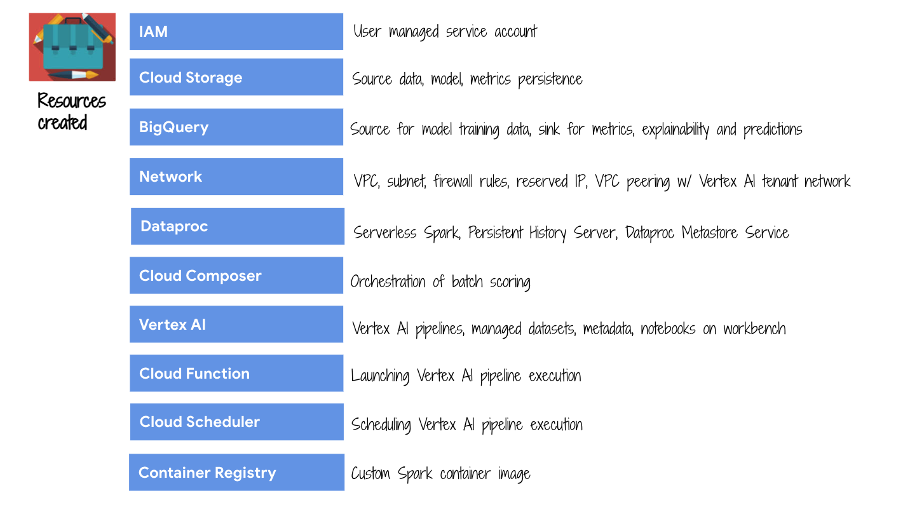
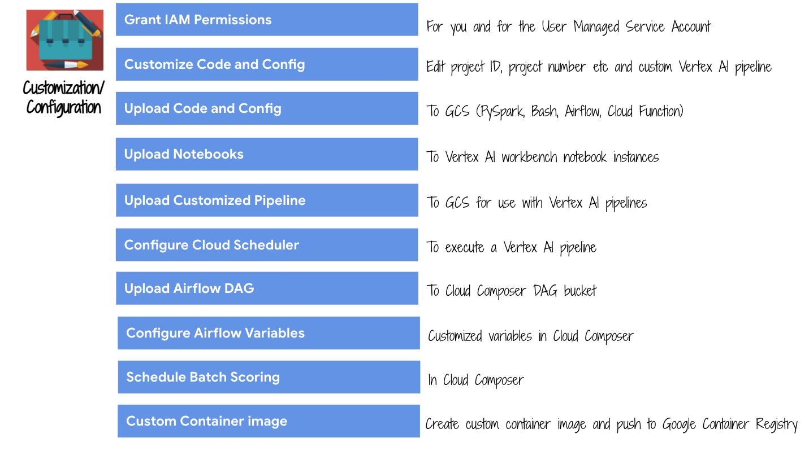

<!---->
  Copyright 2022 Google LLC
 
  Licensed under the Apache License, Version 2.0 (the "License");
  you may not use this file except in compliance with the License.
  You may obtain a copy of the License at
 
       http://www.apache.org/licenses/LICENSE-2.0
 
  Unless required by applicable law or agreed to in writing, software
  distributed under the License is distributed on an "AS IS" BASIS,
  WITHOUT WARRANTIES OR CONDITIONS OF ANY KIND, either express or implied.
  See the License for the specific language governing permissions and
  limitations under the License.
 <!---->

# About Module 1

This module covers environment provisioning for the workshop. This module takes ~10 minutes to complete.
<br><br>
## Note:
1. **Ensure services in use in the workshop are available in the location of your preference** and modify the variables in step 2.4.1 to reflect the same.
2. Get any preview services **allow-listed**
3. Some of the organization policies many not apply for your company, modify appropriately
4. Terraform state is deliberately local for simplicity
5. Be sure to check out section 5 for glitches/nuances and workarounds.

## 1. Details about the environment that is setup by this module

   
<br><br>

   
<br><br>

   
<br><br>

## Pictorial walkthrough of services provisioned & customization
The author's environment is showcased [here](../05-lab-guide/Services-Created.md)

<hr>

## 2. Create the environment

### 2.1. Create a directory in Cloud Shell for the workshop
```
cd ~
mkdir gcp-spark-mllib-workshop
```

### 2.2. Clone the workshop git repo
```
cd ~/gcp-spark-mllib-workshop
git clone https://github.com/GoogleCloudPlatform/serverless-spark-workshop
cd serverless-spark-workshop/
mv s8s-spark-mlops/ ~/gcp-spark-mllib-workshop/
```

### 2.3. Navigate to the Terraform provisioning directory
```
cd ~/gcp-spark-mllib-workshop/s8s-spark-mlops/00-env-setup-shared/terraform
```

### 2.4. Provision the environment

#### 2.4.1. Define variables for use
Modify the below as appropriate for your deployment..e.g. region, zone etc. Be sure to use the right case for GCP region & zone.<br>
Regions and zones listing can be found [here](https://cloud.google.com/compute/docs/regions-zones)(zone has a -a/b/c as suffix to region/location).<br>
For Cloud Scheduler timezone, use the Cloud Scheduler UI and see available options for you.<br>
```
COMPOSER_BUCKET=<your_composer_bucket>
PROJECT_ID=`gcloud config list --format "value(core.project)" 2>/dev/null`
PROJECT_NBR=`gcloud projects describe $PROJECT_ID | grep projectNumber | cut -d':' -f2 |  tr -d "'" | xargs`
PROJECT_NAME=`gcloud projects describe ${PROJECT_ID} | grep name | cut -d':' -f2 | xargs`
GCP_ACCOUNT_NAME=`gcloud auth list --filter=status:ACTIVE --format="value(account)"`
ORG_ID=`gcloud organizations list --format="value(name)"`
VPC_NM=s8s-vpc-$PROJECT_NBR
SPARK_SERVERLESS_SUBNET=spark-snet
PERSISTENT_HISTORY_SERVER_NM=s8s-sphs-${PROJECT_NBR}
UMSA_FQN=s8s-lab-sa@$PROJECT_ID.iam.gserviceaccount.com
BQ_CONNECTOR_JAR_GCS_URI="gs://spark-lib/bigquery/spark-bigquery-with-dependencies_2.12-0.22.2.jar"
CLOUD_COMPOSER_IMG_VERSION="composer-2.0.11-airflow-2.2.3"
SPARK_CUSTOM_CONTAINER_IMAGE_TAG="1.0.0"
YOUR_GCP_REGION="us-central1"
YOUR_GCP_ZONE="us-central1-a"
YOUR_GCP_MULTI_REGION="US"
CLOUD_SCHEDULER_TIME_ZONE="America/Chicago"

echo "PROJECT_ID=$PROJECT_ID"
echo "PROJECT_NBR=$PROJECT_NBR"
echo "PROJECT_NAME=$PROJECT_NAME"
echo "VPC_NM=$VPC_NM"
echo "PERSISTENT_HISTORY_SERVER_NM=$PERSISTENT_HISTORY_SERVER_NM"
echo "UMSA_FQN=$UMSA_FQN"
```

### 2.4.2. Initialize Terraform
Needs to run in cloud shell from ~/gcp-spark-mllib-workshop/s8s-spark-mlops/00-env-setup-shared/terraform
```
cd ~/gcp-spark-mllib-workshop/s8s-spark-mlops/00-env-setup-shared/terraform

terraform init
```

#### 2.4.3. Review the Terraform deployment plan
Needs to run in cloud shell from ~/gcp-spark-mllib-workshop/s8s-spark-mlops/00-env-setup-shared/terraform
```
cd ~/gcp-spark-mllib-workshop/s8s-spark-mlops/00-env-setup-shared/terraform

terraform plan \
  -var="project_id=${PROJECT_ID}" \
  -var="project_name=${PROJECT_NAME}" \
  -var="project_number=${PROJECT_NBR}" \
  -var="gcp_account_name=${GCP_ACCOUNT_NAME}" \
  -var="org_id=${ORG_ID}" \
  -var="cloud_composer_image_version=${CLOUD_COMPOSER_IMG_VERSION}" \
  -var="spark_container_image_tag=${SPARK_CUSTOM_CONTAINER_IMAGE_TAG}" \
  -var="gcp_region=${YOUR_GCP_REGION}" \
  -var="gcp_zone=${YOUR_GCP_ZONE}" \
  -var="gcp_multi_region=${YOUR_GCP_MULTI_REGION}" \
  -var="bq_connector_jar_gcs_uri=${BQ_CONNECTOR_JAR_GCS_URI}" \
  -var="cloud_scheduler_time_zone=${CLOUD_SCHEDULER_TIME_ZONE}" \
  -var="composer_bucket=${COMPOSER_BUCKET}"
```

#### 2.4.4. Provision the environment
Needs to run in cloud shell from ~/gcp-spark-mllib-workshop/s8s-spark-mlops/00-env-setup-shared/terraform
```
cd ~/gcp-spark-mllib-workshop/s8s-spark-mlops/00-env-setup-shared/terraform

terraform apply \
  -var="project_id=${PROJECT_ID}" \
  -var="project_name=${PROJECT_NAME}" \
  -var="project_number=${PROJECT_NBR}" \
  -var="gcp_account_name=${GCP_ACCOUNT_NAME}" \
  -var="org_id=${ORG_ID}"  \
  -var="cloud_composer_image_version=${CLOUD_COMPOSER_IMG_VERSION}" \
  -var="spark_container_image_tag=${SPARK_CUSTOM_CONTAINER_IMAGE_TAG}" \
  -var="gcp_region=${YOUR_GCP_REGION}" \
  -var="gcp_zone=${YOUR_GCP_ZONE}" \
  -var="gcp_multi_region=${YOUR_GCP_MULTI_REGION}" \
  -var="bq_connector_jar_gcs_uri=${BQ_CONNECTOR_JAR_GCS_URI}" \
  -var="cloud_scheduler_time_zone=${CLOUD_SCHEDULER_TIME_ZONE}" \
  -var="composer_bucket=${COMPOSER_BUCKET}" \
  --auto-approve
```

<hr>

## 3. Validate your Terraform deployment against a pictorial overview of services provisioned & customization
Available [here](../05-lab-guide/Services-Created.md)


<hr>

## 4. Glitches/nuances to be mindful of
**4.1. Cloud Composer 2**<br>
If you edit the Terraform and run apply, Cloud Composer2 attempts to update the network and fails the deployment. <br>
Workaround: Delete Cloud Composer manually and then rerun. 10+ minutes to delete, 20 minutes to recreate -> enough for a power nap. :)

**4.2. Managed Notebook Instance on Vertex AI Workbench**<br>
Changing ownership of notebooks (uploaded to /home/jupyter via Terrafrom) from owner root to jupyter:jupyter does not work currently as part of Terraform deployment.<br>
Workaround: Clone the notebook and save.

**4.3. Persistent Spark History Server (PHS)**<br>
If you edit the Terraform and run apply, PHS gets destroyed and recreated. <br>
Workaround: Not applicable. It just takes 90 seconds or less to destroy and 90 seconds to recreate.

<hr>

## 5. Terraform How-Tos [DO NOT RUN THIS, ITS JUST FYI]

### 5.1. For selective replacement of specific services/units of deployment [DO NOT RUN THIS, ITS JUST FYI]

This is not needed...and is informational only.<br>
Needs to run in cloud shell from ~/gcp-spark-mllib-workshop/s8s-spark-mlops/00-env-setup-shared/terraform<br>
If -target does not work, try -replace
```
#terraform apply -target=google_storage_bucket_object.upload_cc2_dag_to_airflow_dag_bucket \
-var="project_id=${PROJECT_ID}" \
  -var="project_name=${PROJECT_NAME}" \
  -var="project_number=${PROJECT_NBR}" \
  -var="gcp_account_name=${GCP_ACCOUNT_NAME}" \
  -var="org_id=${ORG_ID}"  \
  -var="cloud_composer_image_version=${CLOUD_COMPOSER_IMG_VERSION}" \
  -var="spark_container_image_tag=${SPARK_CUSTOM_CONTAINER_IMAGE_TAG}" \
  -var="gcp_region=${YOUR_GCP_REGION}" \
  -var="gcp_zone=${YOUR_GCP_ZONE}" \
  -var="gcp_multi_region=${YOUR_GCP_MULTI_REGION}" \
  -var="bq_connector_jar_gcs_uri=${BQ_CONNECTOR_JAR_GCS_URI}" \
  -var="cloud_scheduler_time_zone=${CLOUD_SCHEDULER_TIME_ZONE}" \
  -var="composer_bucket=${COMPOSER_BUCKET}" \
  --auto-approve
```

### 5.2. To destroy the deployment [DO NOT RUN THIS, ITS JUST FYI]

You can (a) shutdown the project altogether in GCP Cloud Console or (b) use Terraform to destroy. Use (b) at your own risk as its a little glitchy while (a) is guaranteed to stop the billing meter pronto.
<br>
Needs to run in cloud shell from ~/gcp-spark-mllib-workshop/s8s-spark-mlops/00-env-setup-shared/terraform
```
#terraform destroy \
  -var="project_id=${PROJECT_ID}" \
  -var="project_name=${PROJECT_NAME}" \
  -var="project_number=${PROJECT_NBR}" \
  -var="gcp_account_name=${GCP_ACCOUNT_NAME}" \
  -var="org_id=${ORG_ID}" \
  -var="cloud_composer_image_version=${CLOUD_COMPOSER_IMG_VERSION}" \
  -var="spark_container_image_tag=${SPARK_CUSTOM_CONTAINER_IMAGE_TAG}" \
  -var="gcp_region=${YOUR_GCP_REGION}" \
  -var="gcp_zone=${YOUR_GCP_ZONE}" \
  -var="gcp_multi_region=${YOUR_GCP_MULTI_REGION}" \
  -var="bq_connector_jar_gcs_uri=${BQ_CONNECTOR_JAR_GCS_URI}" \
  -var="cloud_scheduler_time_zone=${CLOUD_SCHEDULER_TIME_ZONE}" \
  -var="composer_bucket=${COMPOSER_BUCKET}" \
  --auto-approve
 ```

<hr>

## 6. What's in the next module
In the [next module](../05-lab-guide/Module-02-Spark-IDE-on-GCP.md), we will learn how to use Serverless Spark interactive notebooks for machine learning model development with Spark MLLib on Dataproc Serverless Spark.

<hr>
