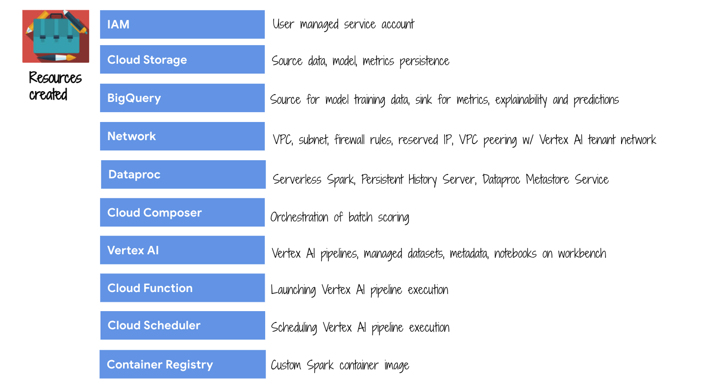
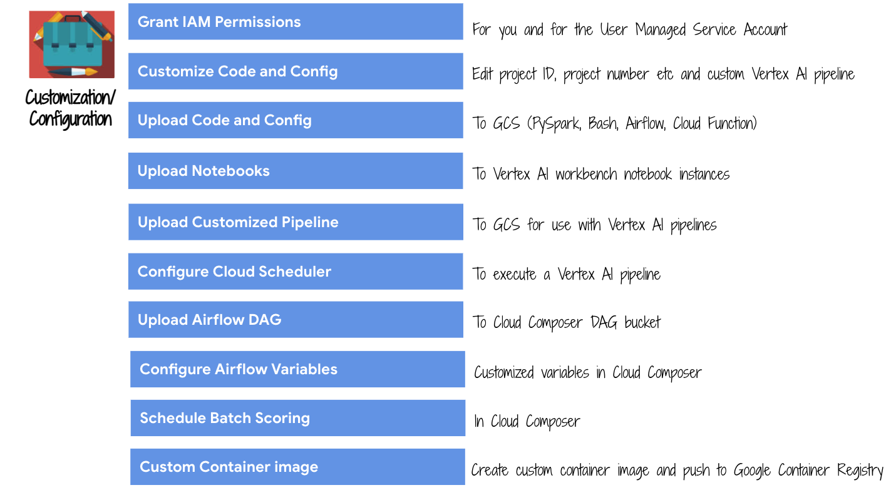

<!---->
  Copyright 2022 Google LLC
 
  Licensed under the Apache License, Version 2.0 (the "License");
  you may not use this file except in compliance with the License.
  You may obtain a copy of the License at
 
       http://www.apache.org/licenses/LICENSE-2.0
 
  Unless required by applicable law or agreed to in writing, software
  distributed under the License is distributed on an "AS IS" BASIS,
  WITHOUT WARRANTIES OR CONDITIONS OF ANY KIND, either express or implied.
  See the License for the specific language governing permissions and
  limitations under the License.
 <!---->

# About Module 1a

This module covers environment provisioning for the workshop. This module takes ~50-60 minutes to complete.
<br><br>
## Note:
1. **Ensure services in use in the workshop are available in the location of your preference** and modify the variables in step 2.4.1 to reflect the same.
2. Get any preview services **allow-listed**
3. Some of the organization policies many not apply for your company, modify appropriately
4. Be sure to check out section 5 for glitches/nuances and workarounds.

## 1. Details about the environment that is setup by this module


<br><br>


<br><br>


<br><br>

## Pictorial walkthrough of services provisioned & customization
The author's environment is showcased [here](../05-lab-guide/Services-Created.md)

<hr>

## 2. Create the environment

### 2.1. IAM Roles needed to execute the prereqs
Ensure that you have **Security Admin**, **Project IAM Admin**, **Service Usage Admin**, **Service Account Admin** and **Role Administrator** roles. This is needed for creating the GCP resources and granting access to attendees.


### 2.2. Create a directory in Cloud Shell for the workshop
```
cd ~
mkdir gcp-spark-mllib-workshop
```

### 2.3. Clone the workshop git repo
```
cd ~/gcp-spark-mllib-workshop
git clone https://github.com/GoogleCloudPlatform/serverless-spark-workshop
cd serverless-spark-workshop/
mv s8s-spark-mlops/ ~/gcp-spark-mllib-workshop/
```

### 2.4. Navigate to the Cloud Shell provisioning directory
```
cd ~/gcp-spark-mllib-workshop/s8s-spark-mlops/00-env-setup/cloud-shell
```

## 3. Running the Shell Script

Run the following command in cloud shell to execute the shell script: <br>

```
bash cloud-shell-resource-creation.sh
```

Once the shell script completes execution successfully, all resources mentioned in the script will be successfully created.

## 4. Roles required for the Hackfest Attendees

Please grant the following GCP roles to all attendees to execute the hands-on labs:<br>

```
Viewer
Storage Admin
BigQuery Data Editor
Notebooks Runner
Service Account User
Cloud Functions Developer
Cloud Scheduler Admin
Vertex AI User
Environment and Storage Object Admin
Dataproc Editor
```

<hr>
