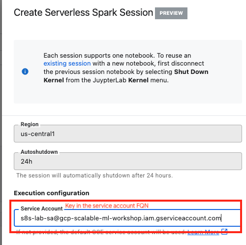
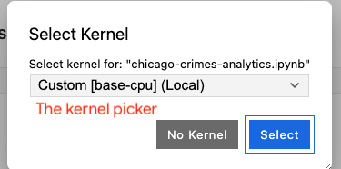

<!---->
  Copyright 2022 Google LLC
 
  Licensed under the Apache License, Version 2.0 (the "License");
  you may not use this file except in compliance with the License.
  You may obtain a copy of the License at
 
       http://www.apache.org/licenses/LICENSE-2.0
 
  Unless required by applicable law or agreed to in writing, software
  distributed under the License is distributed on an "AS IS" BASIS,
  WITHOUT WARRANTIES OR CONDITIONS OF ANY KIND, either express or implied.
  See the License for the specific language governing permissions and
  limitations under the License.
 <!---->

# About Module 2

This module covers how to use Vertex AI Workbench's "Managed Notebook Instance" for authoring Spark code in an interactive manner with Dataproc Serverless Spark interactive sessions. Understanding creation of serveless Spark interactive sessions and notebook nuances is crucial for the next module where you will run actual machine learning experiments.

<hr>

## 1. About Dataproc Serverless Spark Interactive
Dataproc Serverless Spark Interactive is serverless, Dataproc managed, autoscaling, private infrastructure for interactive Spark code authoring via a Jupyter notebook hosted on Vertex AI Managed Notebook instance. The following is an overview of what to expect. Further in this lab guide there is detailed instructions with a pictorial overview.

### 1a. Getting started - what's involved

   
<br><br>


### 1b. Creating and using an Serverless Spark Interactive session in a notebook - what's involved

   
<br><br>


### 1c. Switching notebooks and reusing the Serverless Spark Interactive session

   
<br><br>

<hr>

## 2. The exercise
We will analyze Chicago Crimes in BigQuery from a Jupyer Notebook on Vertex AI Workbench - Managed Notebook Instance using dataproc Serverless Spark interactive sessions.

   
<br><br>

**Goals:**
1. Understand how to create and attach a Dataproc Serverless Spark interactive session to your Jupyter notebook  
2. Learn how to switch the Dataproc Serverless Spark interactive session created, between notebooks
3. Learn to navigate Dataproc UI for the Serverless Spark interactive session 
4. Browse the Spark UI of the persistent Spark History Server, for the Serverless Spark interactive session 
5. Learn how to anayze data in BigQuery using the BigQuery Spark connector.

**Pre-requisite:**
1. Ensure that any preview features are allow-listed by product engineering, ahead of time
2. Provisioning from module 1 needs to be successfully completed

**Note:**
<br>If the notebook is not editable, make a copy and use the same.

<hr>

## 3. Varibles you will need for this module

Run the below in Cloud Shell scoped to your project. The values in these variables are needed to create the interactive Spark session - you will need to paste these into the User Interface.

```
PROJECT_ID=`gcloud config list --format "value(core.project)" 2>/dev/null`
PROJECT_NBR=`gcloud projects describe $PROJECT_ID | grep projectNumber | cut -d':' -f2 |  tr -d "'" | xargs`
UMSA_FQN=s8s-lab-sa@$PROJECT_ID.iam.gserviceaccount.com
SPARK_BQ_CONNECTOR_PACKAGES="com.google.cloud.spark:spark-bigquery-with-dependencies_2.12:0.25.2"
SPARK_CUSTOM_CONTAINER_IMAGE_URI="gcr.io/$PROJECT_ID/customer_churn_image:1.0.0"

echo "PROJECT_ID=$PROJECT_ID"
echo "PROJECT_NBR=$PROJECT_NBR"
echo "UMSA_FQN=$UMSA_FQN"
echo "SPARK_CUSTOM_CONTAINER_IMAGE_URI=$SPARK_CUSTOM_CONTAINER_IMAGE_URI"
echo "SPARK_BQ_CONNECTOR_PACKAGES=$SPARK_BQ_CONNECTOR_PACKAGES"
echo "spark.jars.packages=com.google.cloud.spark:spark-bigquery-with-dependencies_2.12:0.25.2"
echo " "
echo " "
```

Author's details:
```
PROJECT_ID=gcp-scalable-ml-workshop
PROJECT_NBR=xxx
UMSA_FQN=s8s-lab-sa@gcp-scalable-ml-workshop.iam.gserviceaccount.com
SPARK_CUSTOM_CONTAINER_IMAGE_URI=gcr.io/gcp-scalable-ml-workshop/customer_churn_image:1.0.0
SPARK_BQ_CONNECTOR_PACKAGES=com.google.cloud.spark:spark-bigquery-with-dependencies_2.12:0.25.2
spark.jars.packages=com.google.cloud.spark:spark-bigquery-with-dependencies_2.12:0.25.2
```

<hr>

## 4. Navigate on the Cloud Console to the Vertex AI Workbench, Managed Notebook Instance
Open JupyterLab as shown below

   
<br><br>

**Be sure to select the right region in the dropdown.**

   
<br><br>

<hr>


## 5. Open the Chicago Crimes notebook 

   
<br><br>

<hr>

## 6. Click on "Launcher" to create an interactive Spark session 

   
<br><br>

<hr>

## 7. Key in/select from dropdown, details required
Note that the varibles run in Cloud shell have all the values you need to create the session. Copy paste where needed.

   
<br><br>


   
<br><br>


   
<br><br>


   
<br><br>


Paste the value-
```
spark.jars.packages=com.google.cloud.spark:spark-bigquery-with-dependencies_2.12:0.25.2
```


   
<br><br>


   
<br><br>

Click on "submit". In less than 2 minutes, you should see a session created.


   
<br><br>

<hr>

## 8. Ensure you have the session you created, selected in the kernel picker dropdown

### 8.1. The kernel picker - where to find it

   
<br><br>

   
<br><br>

   
<br><br>

   
<br><br>

   
<br><br>


### 8.2. Choosing the interactive spark kernel

   
<br><br>


<hr>

## 9. Place your cursor in the first cell, then following the instructions below, run all cells or run each cell sequentially


   
<br><br>

   
<br><br>

<hr>

## 10. Close the notebook once the excerise is completed
Save or discard changes as needed. Be sure to "keep session" though when prompted as you close the notebook.

   
<br><br>

   
<br><br>


<hr>

This concludes the module. In the [next module](../05-lab-guide/Module-03-Author-ML-Experiments-With-Spark-Notebooks.md), you will run a complete model trainng exercise with notebooks - pre-processing, model training, hyperparameter tuning, batch scoring. 


