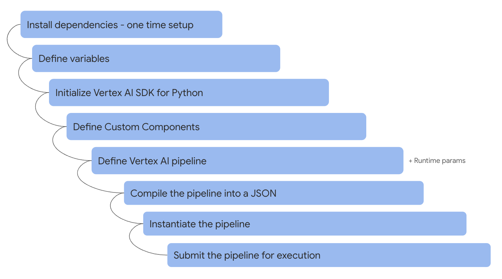
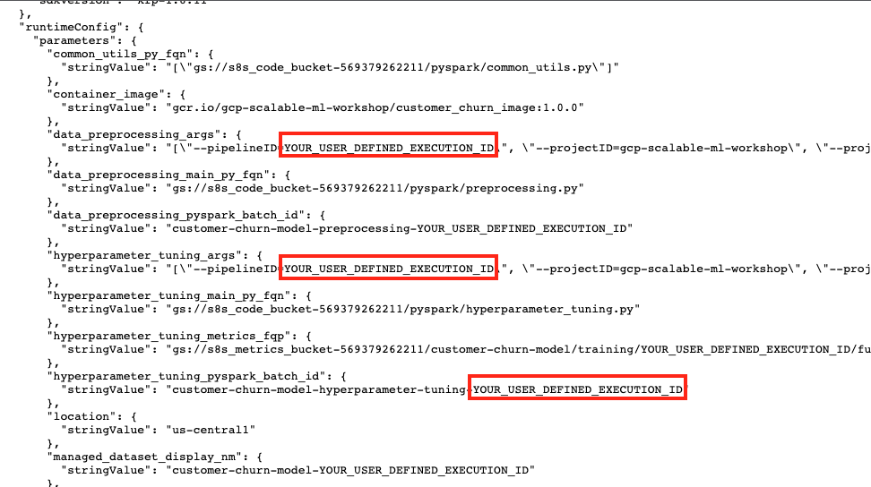

<!---->
  Copyright 2022 Google LLC
 
  Licensed under the Apache License, Version 2.0 (the "License");
  you may not use this file except in compliance with the License.
  You may obtain a copy of the License at
 
       http://www.apache.org/licenses/LICENSE-2.0
 
  Unless required by applicable law or agreed to in writing, software
  distributed under the License is distributed on an "AS IS" BASIS,
  WITHOUT WARRANTIES OR CONDITIONS OF ANY KIND, either express or implied.
  See the License for the specific language governing permissions and
  limitations under the License.
 <!---->

# About Module 5

In this module, we will author and test a Vertex AI pipeline to orchestrate the Spark ML model training and prepare for operationalizing the same. The module takes about two and half hours to complete, but you need to actually only spend about 40 minutes, the rest is execution time - waiting for completion.

## 1. Where we are in the model development lifecycle

   
  

## 2. The lab environment

   
  

## 3. The exercise

   
  

## 4. About Vertex AI pipelines & support for Spark ML Models in Vertex AI platform
We will use Vertex AI User Managed Notebook environment for this exercise and this is already created for you. When you open JupyterLab, you will also see a pre-created, customized notebook to get quick-started with learning pipeline authoring.

### 4.1. Vertex AI pipelines - basics

Vertex AI Pipelines helps you to automate, monitor, and govern your ML systems by orchestrating your ML workflow in a serverless manner, and storing your workflow's artifacts using Vertex ML Metadata. By storing the artifacts of your ML workflow in Vertex ML Metadata, you can analyze the lineage of your workflow's artifacts — for example, an ML model's lineage may include the training data, hyperparameters, and code that were used to create the model.

Vertex AI Pipelines let you automate, monitor, and experiment with interdependent parts of a ML workflow. Vertex AI ML Pipelines are portable, scalable, and based on containers. Each individual part of your pipeline workflow (for example, creating a dataset or training a model) is defined by code. This code is referred to as a component. Each instance of a component is called a step.

Watch this [short video on vertex AI pipelines](https://youtu.be/Jrh-QLrVCvM) and [read the documentation](https://cloud.google.com/vertex-ai/docs/pipelines/introduction).

### 4.2. What is supported/recommended for Spark ML models in Vertex AI from an MLOps perspective?

| # | Feature/Function | Supported? |  Recommended Product/Service | Workaround | Nuances/Comments | 
| -- | :--- | :--- |:--- |:--- |:--- |
| 1 | Development Environment for Model Training and corressponding Spark Infrastructure| Yes | Vertex AI Workbench Managed Notebook with Dataproc Serverless Spark Interactive Sessions | | Preview as of 8/22|
| 2 | Orchestration solution for Model Training | Yes | Vertex AI Managed Pipelines | | Preview as of 8/22|
| 3 | Development Environment for Model Training Orchestration | Yes | Vertex AI Workbench User-Managed Notebooks | | |
| 4 | Spark Infrastructure for Model Training Orchestration  | Yes | Dataproc Serverless Spark Batches | | |
| 5 | Scheduling solution for Model Training Pipeline  | Yes | Cloud Scheduler calling Cloud Function calling Vertex AI pipeline REST API | | |
| 6 | Model Registry  | No | | Persist to GCS | |
| 7 | Training Dataset  | Yes | Vertex AI managed datasets |  | No Spark reader support, therefore omitted |
| 8 | Feature Store  | Yes | Vertex AI feature store |  | |
| 9 | Model Metadata  | Yes | Vertex AI metadata |  | |
| 10 | Solution for Batch Scoring  | Yes | Dataproc Serverless Spark Batches  |  | Vertex AI batches can be used but requires MLEAP package which does not support recent versions of Spark |
| 11 | Solution for (near) Real Time/Stream Scoring  | Yes | Dataproc Spark on GCE  |  |  |
| 12 | Solution for Online/On-demand Scoring  | Yes | Vertex AI online serving  |  | Requires MLEAP package which does not support recent versions of Spark |
| 13 | Explainability | Yes | with Vertex AI online/batch serving  |  | Requires MLEAP package which does not support recent versions of Spark |
| 14 | Model Monitoring | Yes | with Vertex AI online/batch serving  |  | Requires MLEAP package which does not support recent versions of Spark |

## 5. Authoring and operationalizing Vertex AI pipelines

### 5.1. Authoring a pipeline in a notebook - what's involved

   
  

### 5.2. Taking a pipeline developed in a notebook to production - steps involved

   
  

## 6. Review and execute the pre-authored Vertex AI pipeline from the Jupyter notebook

### 6.1. Open the pipeline notebook

   
  

   
  

### 6.2. Install dependencies

Be sure to uncomment the cell that installs dependencies and restarts kernel, once and comment it back.

   
  

### 6.3. Study the notebook
Read through the notebook before you run it.

- Note how it calls all the PySpark batch jobs we tested in module 3
- Note how it uses your network (instead of Vertex AI network)
- Note how it does not use caching at a task/component/step level and at a pipeline job level
- Note how it uses a custom pipeline name

### 6.4. Run the pipeline notebook in entirety

In section 7, a URL is output, click on it.

   
  

### 6.5. Study and monitor the pipeline execution between Vertex AI pipeline step and Dataproc Batches UI

Takes about ~an hour to complete. Toggle between the Vertex AI pipeline UI and Dataproc Batches UI to monitor to completion.

   
  

## 7. Preprocessing

   
  

   
  

## 8. Managed Dataset registration in Vertex AI

   
  

   
  

## 9. Model training

   
  

   
  

## 10. Model evaluation 

   
  

### 10.1. Metrics

Click on the metrics artifact icon on the canvas and review the metrics on the right side of the canvas.

   
  

### 10.2. Plots

Click on the plots artifact icon on the canvas and review the Confusion Matrix on the right side of the canvas.

   
  

Scroll to see the RoC curve below the Confusion Matrix

   
  

## 11. Conditional hyperparameter tuning

Review the notebook code for the AUPR threshold set and observe the hyperparameter tuning conditional execution

   
  

   
  

Observe that the best model is persisted in GCS. We will use this for batch scoring.

   
  

## 12. Pipeline completion

   
  

   
  

## 13. Study the pipeline JSON 

   
  

   
  

Open the JSON and review all the nodes and elements in it. The runtime parameters at the very end of the JSON are most critical.

## 14. Test the JSON via Vertex AI pipeline UI

- All the 3 PySpark jobs expect a pipeline ID parameter
- The pipeline ID is intended to be the same for lineage/traceability/versioning
- Notice that the pipeline JSON has the pipeline ID hardcoded from the execution via the notebook
- Download the JSON to your machine
- Lets upload it to the UI
- We will have to modify all the parameters where there is an existing pipeline ID. Lets replace with 123456 as the pipeline ID and run it
- Submit the pipeline via the UI after the notebook submission completes - you may not have enough compute cores for parallel runs although they wont clash whatsoever

   
  

   
  

   
  

   
  

   
  

   
  

   
  

   
  

   
  

   
  

## 15. Edit the JSON for on-demand REST calls & persist in GCS

- This step has been completed for you.
- The author has essentially replaced hard-coded values of pipeline ID from the authroing & execution via the notebook with a keyword that will be replaced with a runtime generated pipeline ID in the Cloud function
- The updated JSON for use with the Cloud Function is in your pipeline bucket inside the templates directory
- Note that your version of the pipeline JSON template has your project details - ID, number, your service account - completely customized

   
  

   
  

This concludes the module. In the [next module](../05-lab-guide/Module-06-Author-CloudFunction-For-Vertex-AI-Pipeline.md) you will create a Cloud Function to execute the Vertex AI Spark ML pipeline.

