<!---->
  Copyright 2022 Google LLC
 
  Licensed under the Apache License, Version 2.0 (the "License");
  you may not use this file except in compliance with the License.
  You may obtain a copy of the License at
 
       http://www.apache.org/licenses/LICENSE-2.0
 
  Unless required by applicable law or agreed to in writing, software
  distributed under the License is distributed on an "AS IS" BASIS,
  WITHOUT WARRANTIES OR CONDITIONS OF ANY KIND, either express or implied.
  See the License for the specific language governing permissions and
  limitations under the License.
 <!---->

# About Module 6

In this module we will create a Cloud Function that executes a Vertex AI pipeline on-demand based off of a pipeline JSON in GCS. This module takes 15 minutes to review, and almost an hour to run.

## 1. Where we are in the model training lifecycle

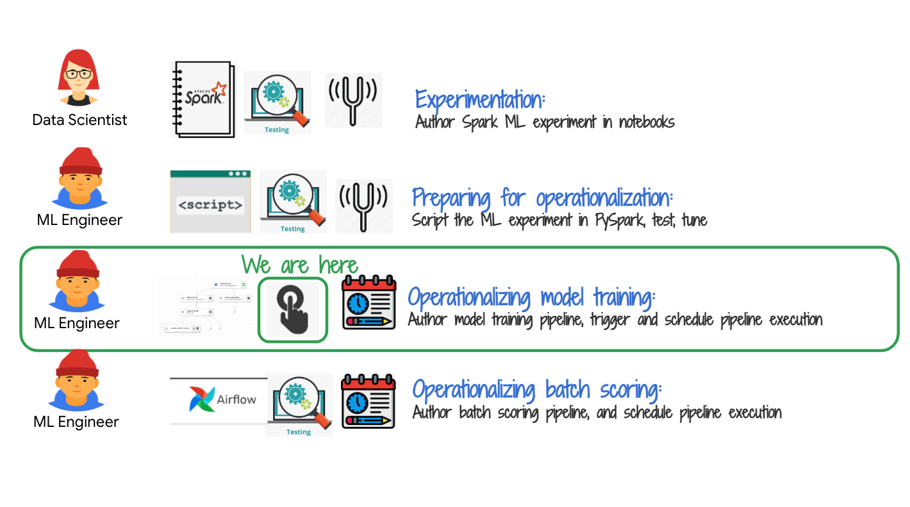   

## 2. The lab environment

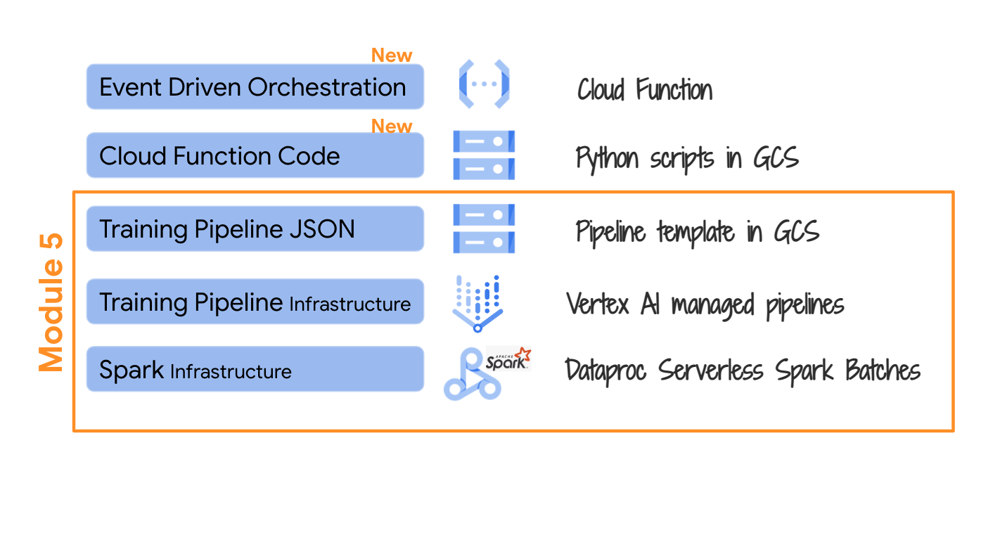   

## 3. The exercise

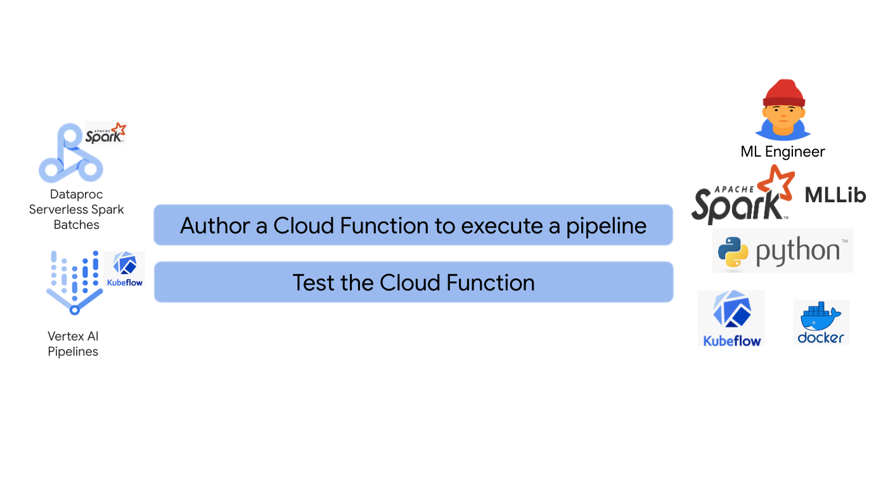   

## 4. Dependencies

1. Successful testing of pipeline template JSON
2. Customized Vertex AI Spark ML model training template JSON in GCS

We completed #1 in the prior module. #2 is already available for you in GCS.

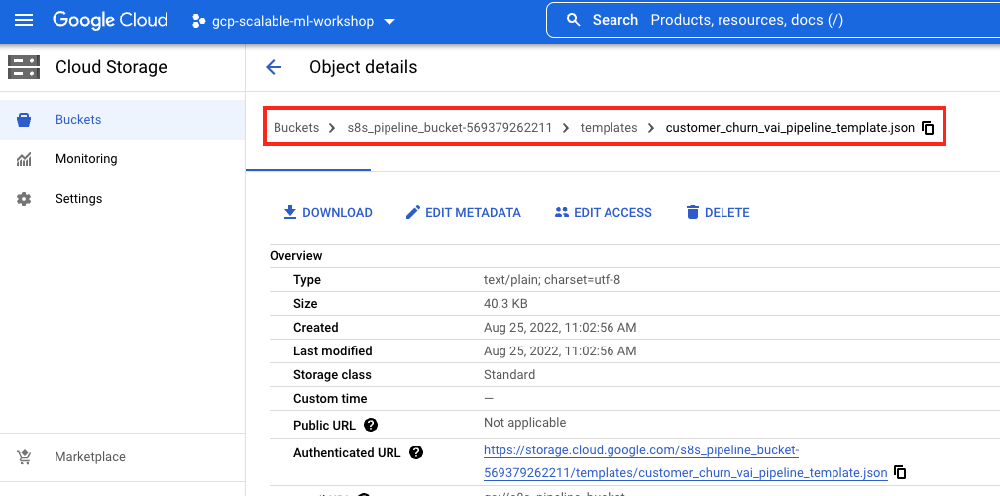   

## 5. Documentation for scheduling Vertex AI pipelines

Read the documentation for scheduling Vertex AI pipelines ahead of working on the next step to better understand on-demand execution through a simpler example than the one in the lab. 
https://cloud.google.com/vertex-ai/docs/pipelines/schedule-cloud-scheduler

## 6. Cloud Function deployment pictorial overview

The Cloud Function is already deployed in your environment. The folowing is the author's deployment from the Terraform script. Yours should be identical.

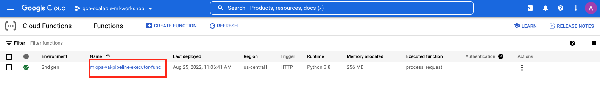   
  

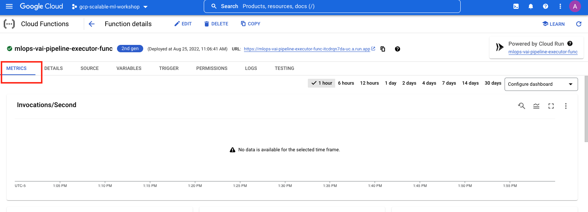   
  

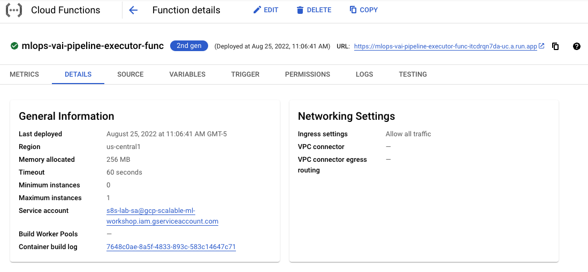   
  

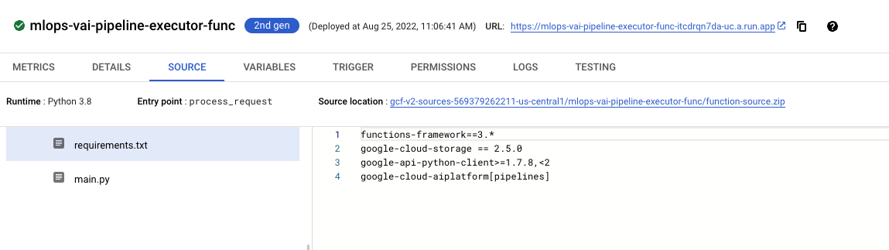   
  

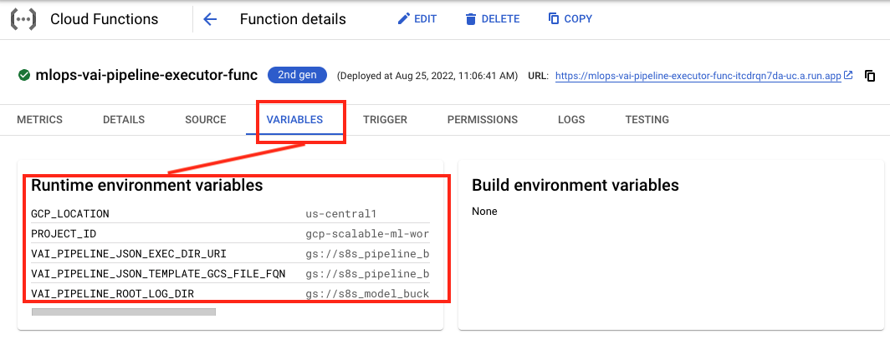   
  

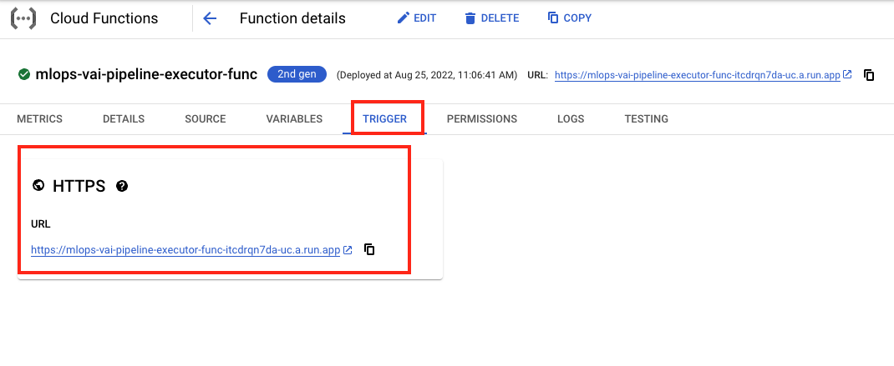   
  

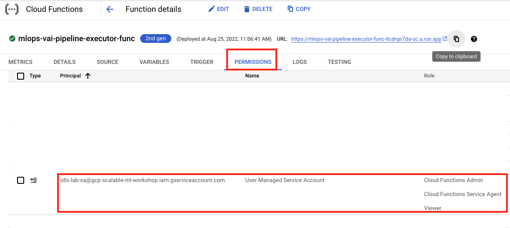   
  

## 7. Review of the Cloud Function code for executing the Vertex AI Spark ML Model Training Pipeline

### 7.1. What is happening inside the function?

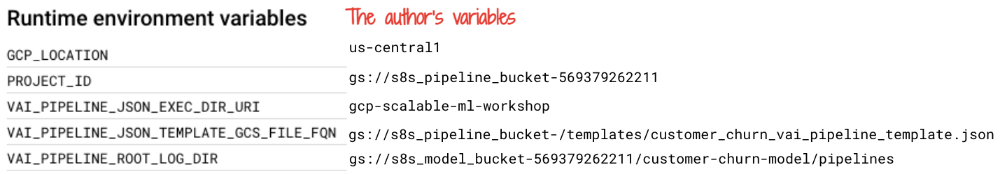   
  

### 7.2. Runtime variables

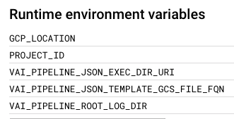   
  

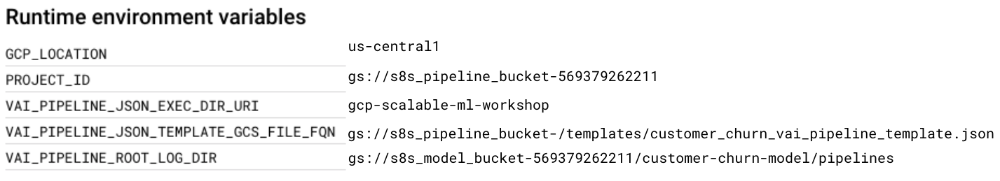   
  

### 7.3. Source code - requirements.txt

The latest requirements.txt is avialable here- 
https://github.com/anagha-google/s8s-spark-mlops/blob/main/02-scripts/cloud-functions/requirements.txt

### 7.4. Source code - main.py
The latest source code is avialable here- 
https://github.com/anagha-google/s8s-spark-mlops/blob/main/02-scripts/cloud-functions/main.py

## 8. Execute the Cloud Function and monitor for pipeline execution through completion
The Cloud Function is generation 2 and does not have a "click to test" button feature yet. We need to grab the command line execution from the UI and run it in Cloud Shell.

### 8.1. Grab the command for executing the Cloud Function
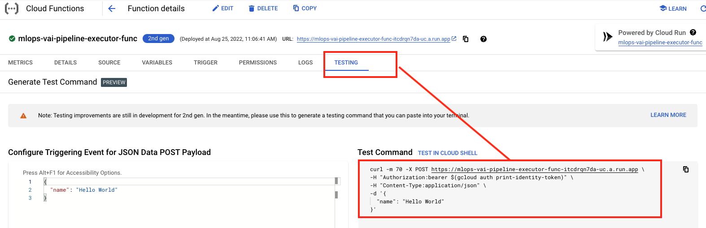   
  

### 8.2. Run the command in Cloud Shell
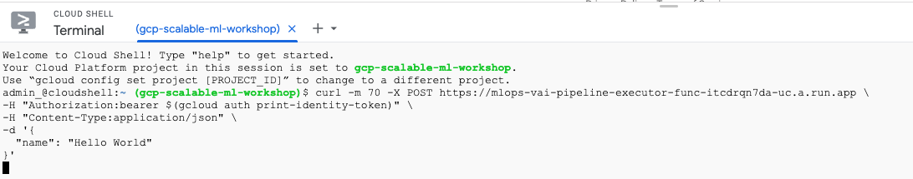   
  

### 8.3. Monitor the Vertex AI pipeline for any errors
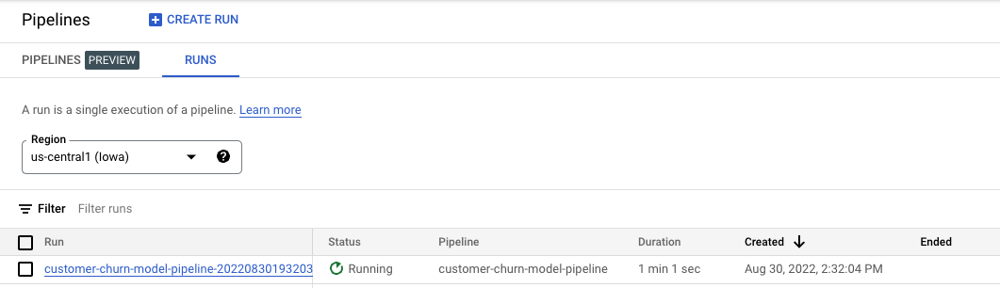   
  

### 8.4. Monitor the Dataproc Batches UI for new jobs
Follow at least a couple steps through completion.

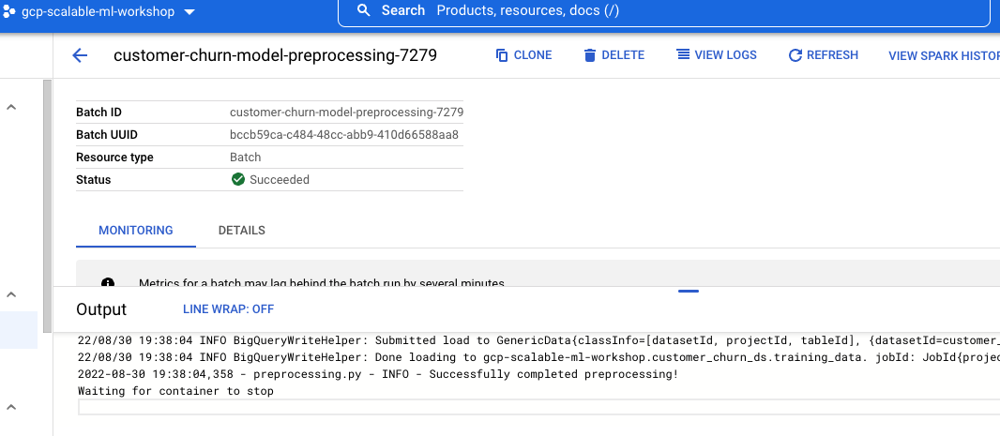   
  

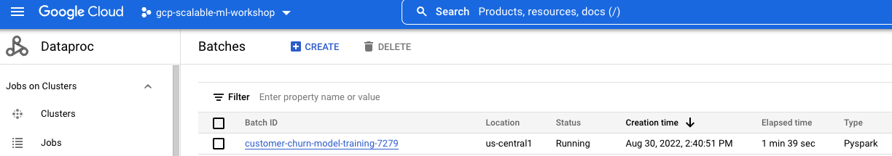   
  

### 8.5. Monitor the overall completion of the pipeline execution
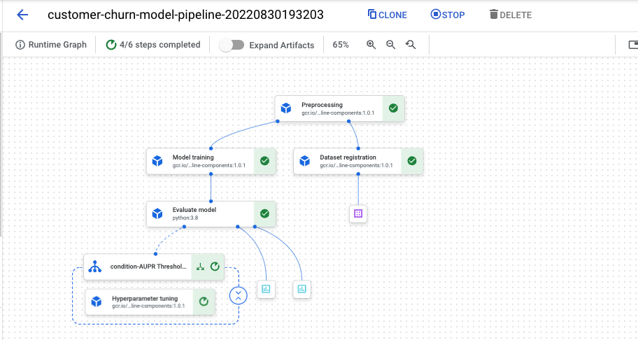   
  

This concludes the module. In the [next module](../05-lab-guide/Module-07-Schedule-VertexAI-Pipeline.md), we will create a Cloud Scheduler job for time based execution of the model training pipeline.

