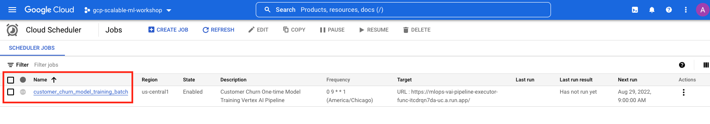

<!---->
  Copyright 2022 Google LLC
 
  Licensed under the Apache License, Version 2.0 (the "License");
  you may not use this file except in compliance with the License.
  You may obtain a copy of the License at
 
       http://www.apache.org/licenses/LICENSE-2.0
 
  Unless required by applicable law or agreed to in writing, software
  distributed under the License is distributed on an "AS IS" BASIS,
  WITHOUT WARRANTIES OR CONDITIONS OF ANY KIND, either express or implied.
  See the License for the specific language governing permissions and
  limitations under the License.
 <!---->

# About Module 7

This module covers creating a Cloud Scheduler job to trigger the Vertex AI Spark ML model training pipeline via the Cloud Function we created in the prior module. The approximate time for the module content review is 15 minutes but the pipeline execution could take an hour.

## 1. Where we are in the SparK ML model lifecycle

   
  

## 2. The lab environment

   
  

## 3. The exercise

   
  

## 4. Review the Cloud Scheduler job configuration

A Cloud Scheduler job has been precreated for you that calls the Cloud Function which inturn calls the Vertex AI Spark ML pipeline we created in module 5. Lets walk through the setup in the author's environment.

   
  

   
  

   
  

   
  

   
  

## 5. Run the Cloud Scheduler job manually to test it

   
  

## 6. Monitor the exeuction through completion of the pipeline execution
~ 1 hour

   
  

   
  

   
  

This concludes the lab module. Proceed to the [next module](../05-lab-guide/Module-08-Orchestrate-Batch-Scoring.md) where we will operationalize batch scoring on Cloud Composer.

