<!---->
  Copyright 2022 Google LLC
 
  Licensed under the Apache License, Version 2.0 (the "License");
  you may not use this file except in compliance with the License.
  You may obtain a copy of the License at
 
       http://www.apache.org/licenses/LICENSE-2.0
 
  Unless required by applicable law or agreed to in writing, software
  distributed under the License is distributed on an "AS IS" BASIS,
  WITHOUT WARRANTIES OR CONDITIONS OF ANY KIND, either express or implied.
  See the License for the specific language governing permissions and
  limitations under the License.
 <!---->

# About Module 8

This module covers orchestrating Spark ML batch scoring with Apache Airflow on Cloud Composer. Vertex AI pipelines has deliberately not been used as it lacks support for model monitoring and explainability and is not suited for upstream job orchestration typical with batch scoring and that may not be ML related.

## 1. Where we are in the SparK ML model lifecycle

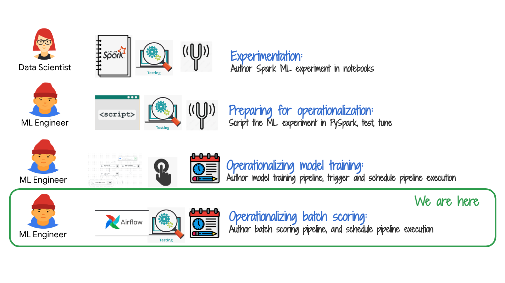   
<br><br>

## 2. The lab environment

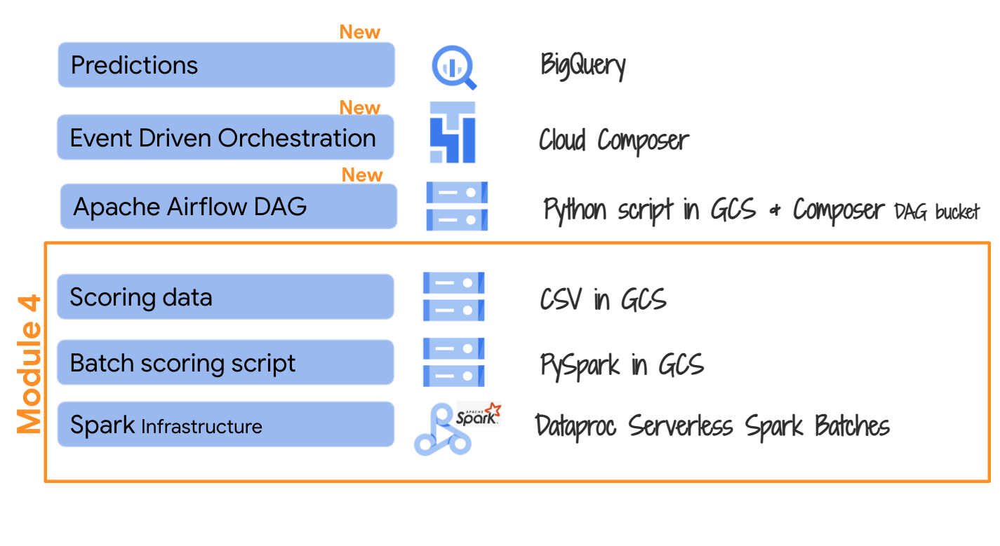   
<br><br>

## 3. The exercise

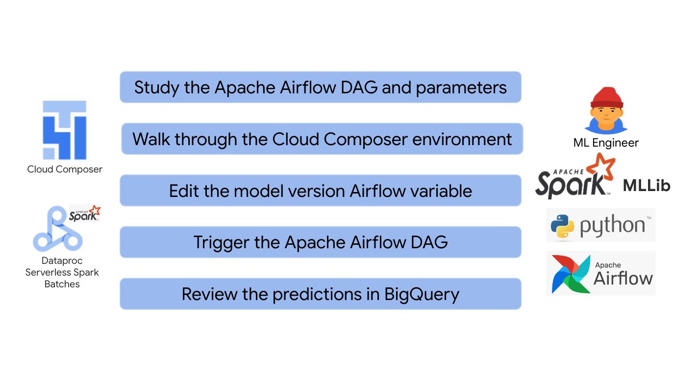   
<br><br>

## 4. Review of the Cloud Composer Environment setup

Module 1 created and configured your Cloud Composer environment, including Airflow variables import and upload of the precreated Apache Airflow DAG into the Cloud Composer DAG bucket. In this section, we will walkthrough the author's environment.

### 4a. Cloud Composer environment

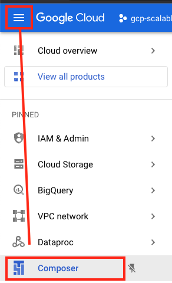   
<br><br>

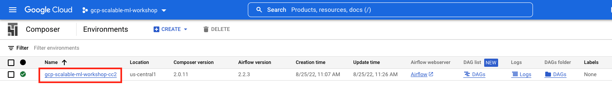   
<br><br>

### 4b. Cloud Composer - Airflow variables

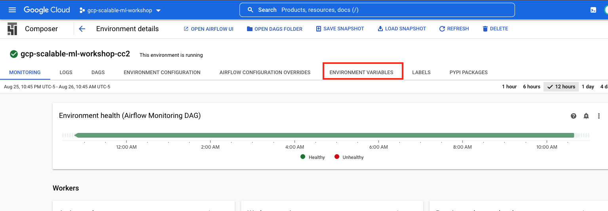   
<br><br>

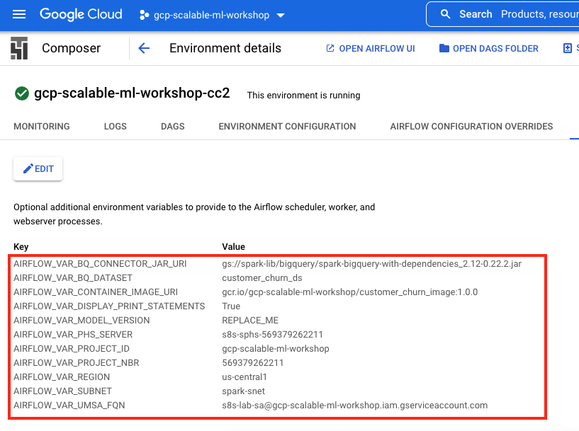   
<br><br>

### 4c. Cloud Composer - Airflow DAG

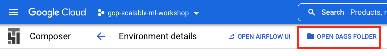   
<br><br>

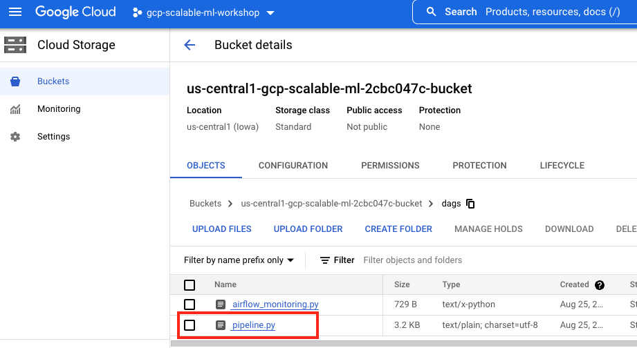   
<br><br>

### 4d. Cloud Composer - Airflow GUI

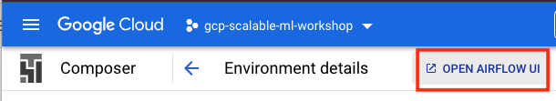   
<br><br>

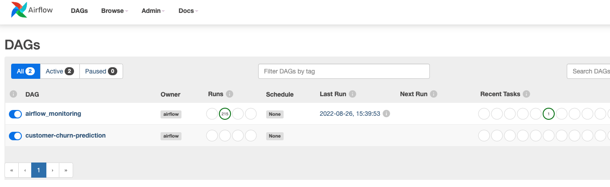   
<br><br>

## 5. Documentation on orchestrating Dataproc Serverless Spark batches with Apache Airflow

Read the documentation at the link below for clear understanding of a simple example before you delve into the next session.<br>
https://cloud.google.com/composer/docs/composer-2/run-dataproc-workloads


## 6. Review of the Apache Airflow DAG for batch scoring

The latest version of the source code is here-<br>
https://github.com/anagha-google/s8s-spark-mlops/blob/main/02-scripts/airflow/pipeline.py<br>

Review the code and understand the flow.

```
# ======================================================================================
# ABOUT
# This script orchestrates batch scoring 
# ======================================================================================

import os
from airflow.models import Variable
from datetime import datetime
from airflow import models
from airflow.providers.google.cloud.operators.dataproc import (DataprocCreateBatchOperator,DataprocGetBatchOperator)
from datetime import datetime
from airflow.utils.dates import days_ago
import string
import random 

# .......................................................
# Variables
# .......................................................

# {{
# a) General
randomizerCharLength = 10 
randomVal = ''.join(random.choices(string.digits, k = randomizerCharLength))
airflowDAGName= "customer-churn-prediction"
batchIDPrefix = f"{airflowDAGName}-edo-{randomVal}"
# +
# b) Capture from Airflow variables
region = models.Variable.get("region")
subnet=models.Variable.get("subnet")
phsServer=Variable.get("phs_server")
containerImageUri=Variable.get("container_image_uri")
bqDataset=Variable.get("bq_dataset")
umsaFQN=Variable.get("umsa_fqn")
bqConnectorJarUri=Variable.get("bq_connector_jar_uri")
# +
# c) For the Spark application
pipelineID = randomVal
projectID = models.Variable.get("project_id")
projectNbr = models.Variable.get("project_nbr")
modelVersion=Variable.get("model_version")
displayPrintStatements=Variable.get("display_print_statements")
# +
# d) Arguments array
batchScoringArguments = [f"--pipelineID={pipelineID}", \
        f"--projectID={projectID}", \
        f"--projectNbr={projectNbr}", \
        f"--modelVersion={modelVersion}", \
        f"--displayPrintStatements={displayPrintStatements}" ]
# +
# e) PySpark script to execute
scoringScript= "gs://s8s_code_bucket-"+projectNbr+"/pyspark/batch_scoring.py"
commonUtilsScript= "gs://s8s_code_bucket-"+projectNbr+"/pyspark/common_utils.py"
# }}

# .......................................................
# s8s Spark batch config
# .......................................................

s8sSparkBatchConfig = {
    "pyspark_batch": {
        "main_python_file_uri": scoringScript,
        "python_file_uris": [ commonUtilsScript ],
        "args": batchScoringArguments,
        "jar_file_uris": [ bqConnectorJarUri ]
    },
    "runtime_config": {
        "container_image": containerImageUri
    },
    "environment_config":{
        "execution_config":{
            "service_account": umsaFQN,
            "subnetwork_uri": subnet
            },
        "peripherals_config": {
            "spark_history_server_config": {
                "dataproc_cluster": f"projects/{projectID}/regions/{region}/clusters/{phsServer}"
                }
            }
        }
}


# .......................................................
# DAG
# .......................................................

with models.DAG(
    airflowDAGName,
    schedule_interval=None,
    start_date = days_ago(2),
    catchup=False,
) as scoringDAG:
    customerChurnPredictionStep = DataprocCreateBatchOperator(
        task_id="Predict-Customer-Churn",
        project_id=projectID,
        region=region,
        batch=s8sSparkBatchConfig,
        batch_id=batchIDPrefix 
    )
    customerChurnPredictionStep 
```

**Note that a runtime Airflow variable expected is "Model Version". **

<hr>

## 7. Test the Apache Airflow DAG on Cloud Composer for batch scoring

### 7.1. Identify the model version you want to use

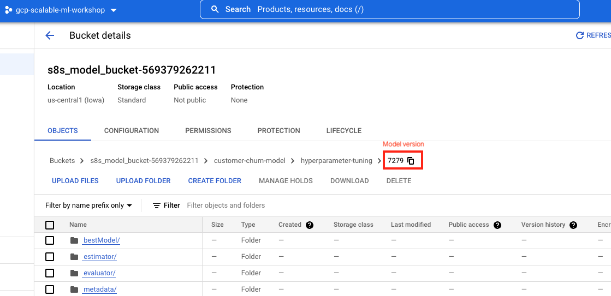   
<br><br>

### 7.2. Edit the Airflow varibale for Model Version

Takes about 10 minutes to update.

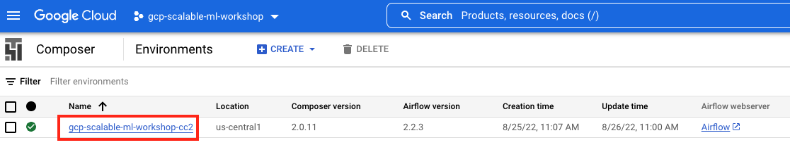   
<br><br>

   
<br><br>

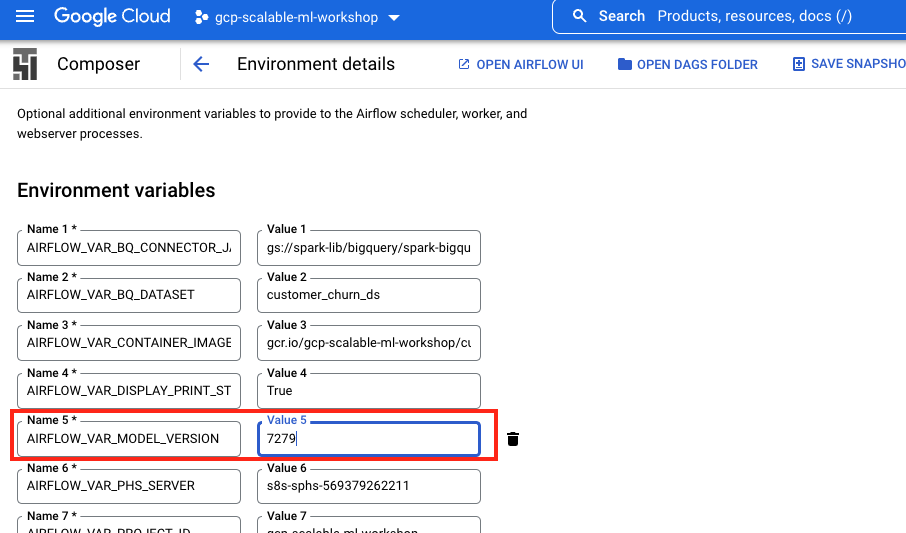   
<br><br>

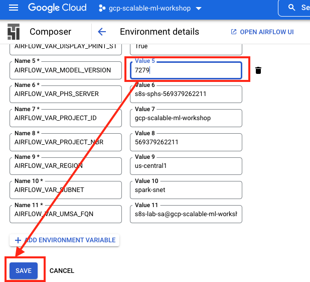   
<br><br>

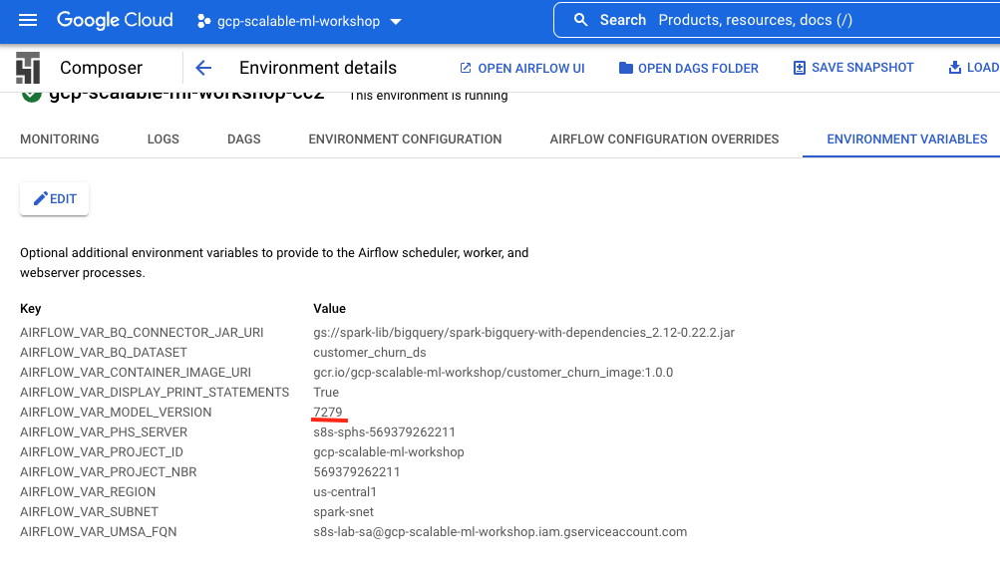   
<br><br>

### 7.3. Open the Customer Churn DAG in the Airflow UI & trigger its execution manually

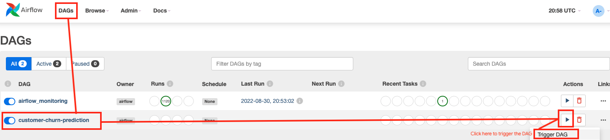   
<br><br>

### 7.4. Monitor the DAG execution

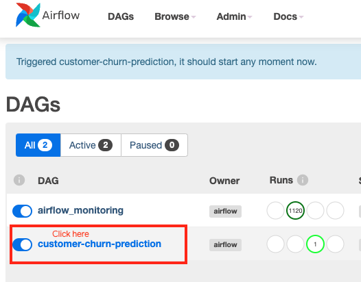   
<br><br>

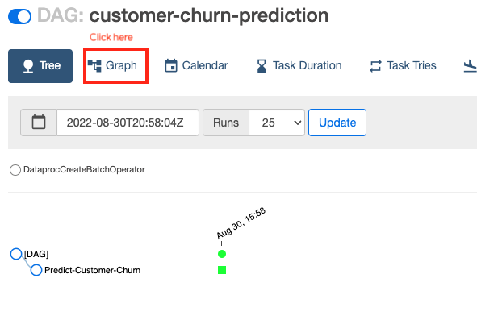   
<br><br>

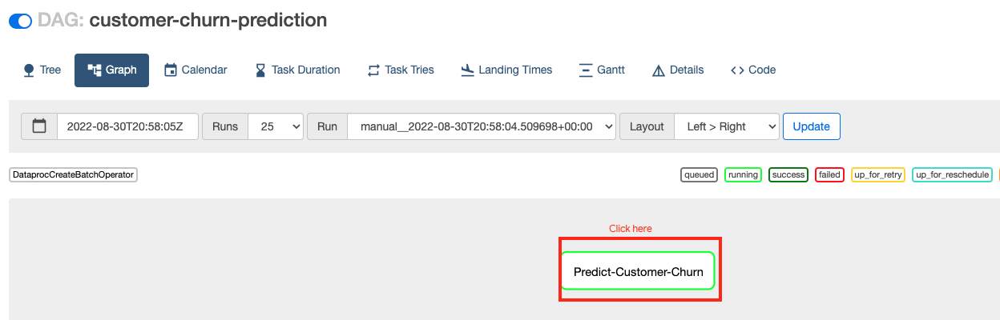   
<br><br>

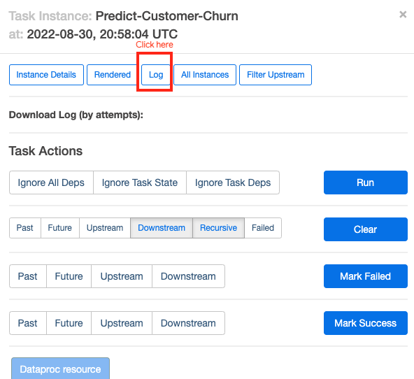   
<br><br>

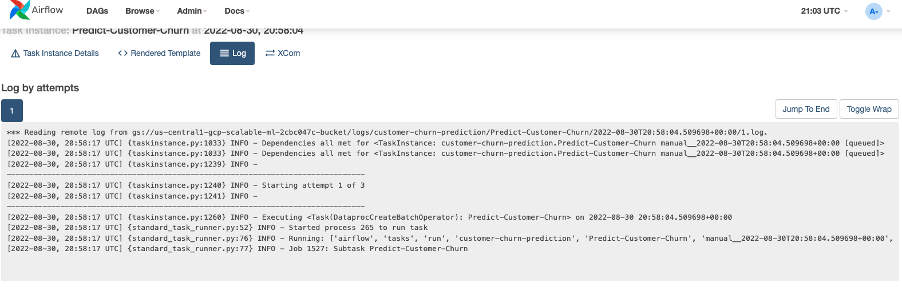   
<br><br>

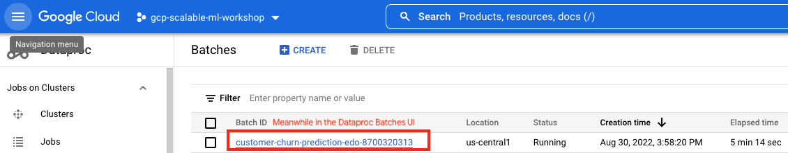   
<br><br>

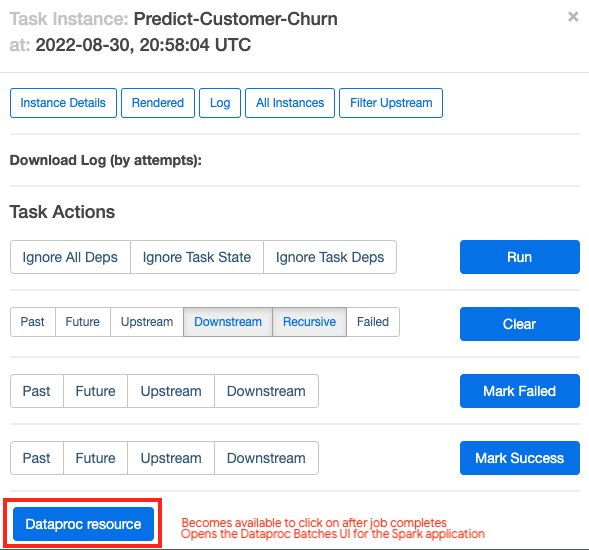   
<br><br>

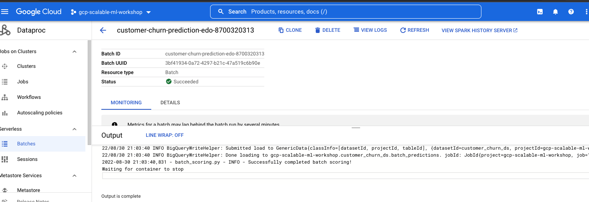   
<br><br>


### 7.5. Review the results in BigQuery
Find your pipeline_id in the Dataproc batches UI and edit the query below to reflect your pipeline_id.
```
SELECT * FROM `customer_churn_ds.batch_predictions` 
WHERE pipeline_id='YOUR_PIPELINE_ID'
```

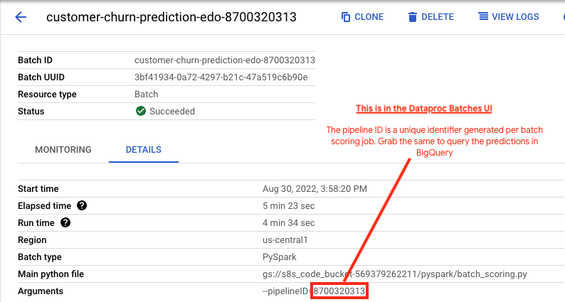   
<br><br>

The following is the author's results-

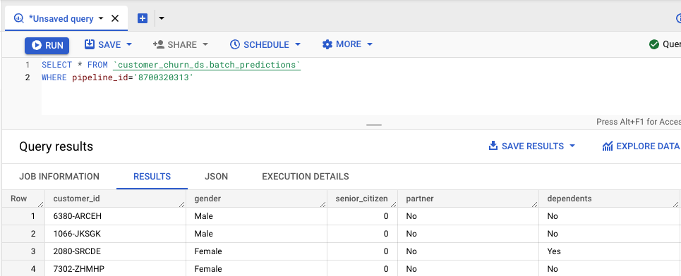   
<br><br>

<hr>

This concludes the lab. Be sure to shut down the project to avoid incurring billing charges. Return to [lab home](../../README.md).

<hr>

