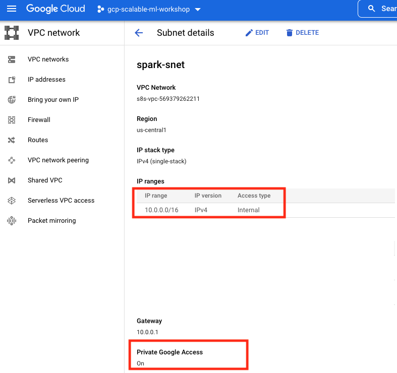
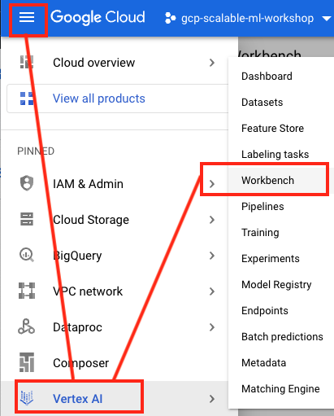
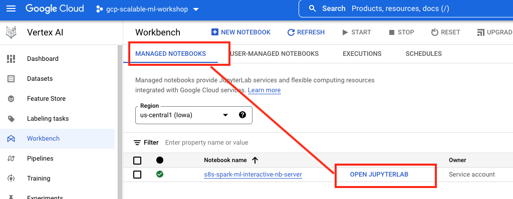
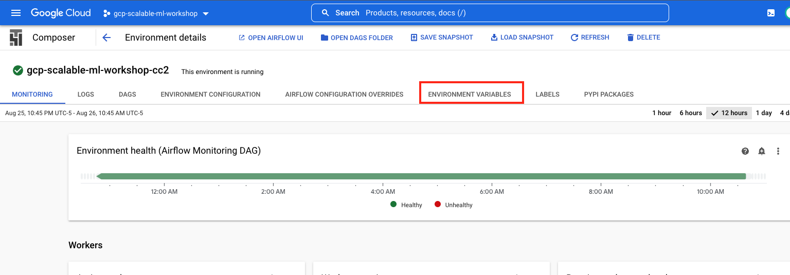
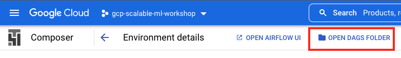
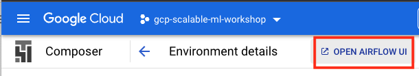

<!---->
  Copyright 2022 Google LLC
 
  Licensed under the Apache License, Version 2.0 (the "License");
  you may not use this file except in compliance with the License.
  You may obtain a copy of the License at
 
       http://www.apache.org/licenses/LICENSE-2.0
 
  Unless required by applicable law or agreed to in writing, software
  distributed under the License is distributed on an "AS IS" BASIS,
  WITHOUT WARRANTIES OR CONDITIONS OF ANY KIND, either express or implied.
  See the License for the specific language governing permissions and
  limitations under the License.
 <!---->

# About

The following are the products/services that get provisioned, and the code and configuration that gets uploaded into your environment. The screenshots present a view of the author's environment, yours should be identical.

[1. IAM](Services-Created.md#1-iam) <br>
[2. Networking](Services-Created.md#2-networking) <br>
[3. Cloud Storage](Services-Created.md#3-cloud-storage) <br>
[4. BigQuery](Services-Created.md#4-bigquery) <br>
[5. Persistent Spark History Server](Services-Created.md#5-persistent-spark-history-server) <br>
[6. Vertex AI Workbench - User Managed Notebook Server ](Services-Created.md#6a-vertex-ai-workbench---managed-notebook-server) | [Jupyter Notebook](Services-Created.md#6b-vertex-ai-workbench---managed-notebook-server---jupyter-notebook) <br>
[7. Vertex AI Workbench - Managed Notebook Server ](Services-Created.md#7a-vertex-ai-workbench---user-managed-notebook-server) | [Jupyter Notebooks](Services-Created.md#7b-vertex-ai-workbench---managed-notebook-server---jupyter-notebooks)  <br>
[8. Google Container Registry](Services-Created.md#8a-google-container-registry) | [Container image](Services-Created.md#8b-google-container-registry---container-image) <br>
[9. Cloud Composer](Services-Created.md#9a-cloud-composer) | [Airflow variables](Services-Created.md#9b-cloud-composer---airflow-variables) | [Airflow DAG](Services-Created.md#9c-cloud-composer---airflow-dag) | [Airflow UI](Services-Created.md#9d-cloud-composer---airflow-gui) <br>
[10. Google Cloud Function](Services-Created.md#10-google-cloud-function) <br>
[11. Cloud Scheduler](Services-Created.md#11-cloud-scheduler) <br>
[12. Customized Vertex AI pipeline JSON in GCS](Services-Created.md#12-customized-vertex-ai-pipeline-json-in-gcs) <br>

## 1. IAM
A User Managed Service Account (UMSA) is created and granted requisite permissions and the lab attendee is granted permissions to impersonate the UMSA. There are a few other permissions granted to the default Google Managed Service Accounts of some services as requried. The Terraform main.tf is a good read to understand the permissions.

   
<br><br>

   
<br><br>

   
<br><br>

   
<br><br>


## 2. Networking
The following networking components are created as part of Terraform deployment-

### 2.1. VPC

   
<br><br>

   
<br><br>

### 2.2. Subnet with private google access

   
<br><br>

### 2.3. Firewall rule for Data Serverless Spark

   
<br><br>


### 2.4. Reserved IP for VPC peering with Vertex AI tenant network for Vertex AI workbench, managed notebook instance for BYO network

   
<br><br>


### 2.5. VPC peering with Vertex AI tenant network for Vertex AI workbench, managed notebook instance for BYO network

   
<br><br>

   
<br><br>

   
<br><br>

## 3. Cloud Storage

### 3.1. Buckets created
A number of buckets are created by te Terraform and some buckets are created by the GCP products. The following is a listing of buckets created as part of the deployment with Terraform.

   
<br><br>

   
<br><br>

### 3.2. The Data Bucket
The following is the author's data bucket content-
```
customer_churn_score_data.csv
customer_churn_train_data.csv
```

### 3.3. The Code Bucket

The following is the author's code bucket content-
```
# Cloud Composer - Airflow DAG
airflow/pipeline.py

# Shell Script for building custom container image for Serverless Spark
bash/build-container-image.sh

# Post startup shell scripts to upload Jupyter notebooks in GCS to Vertex AI workbench notebook server instances
bash/mnbs-exec-post-startup.sh
bash/umnbs-exec-post-startup.sh

# Pyspark scripts for Spark Machine Learning
pyspark/batch_scoring.py
pyspark/common_utils.py
pyspark/hyperparameter_tuning.py
pyspark/model_training.py
pyspark/preprocessing.py

# Cloud Functions source code
cloud-functions/function-source.zip
cloud-functions/main.py
cloud-functions/requirements.txt
```

### 3.4. The Notebook Bucket

```
# PySpark development notebooks
pyspark/batch_scoring.ipynb
pyspark/hyperparameter_tuning.ipynb
pyspark/model_training.ipynb
pyspark/preprocessing.ipynb

# Vertex AI pipeline development notebook
vai-pipelines/customer_churn_training_pipeline.ipynb
```

### 3.5. The Pipeline Bucket

The customized (for your environment) JSON for scheduling a Vertex AI pipeline.
```
templates/customer_churn_vai_pipeline_template.json
```

### 3.6. The Functions Bucket

Cloud Functions source code
```
function-source.zip
```

### 3.6. The rest of the buckets
Are empty and used for peristing logs and/or MLOps artifacts


## 4. BigQuery

   
<br><br>

   
<br><br>

## 5. Persistent Spark History Server

   
<br><br>

   
<br><br>

   
<br><br>

   
<br><br>

   
<br><br>

## 6a. Vertex AI Workbench - Managed Notebook Server 


   
<br><br>


## 6b. Vertex AI Workbench - Managed Notebook Server - Jupyter Notebook

**Be sure to select the right region in the dropdown.**

   
<br><br>

   
<br><br>

## 7a. Vertex AI Workbench - User Managed Notebook Server 


   
<br><br>

## 7b. Vertex AI Workbench - Managed Notebook Server - Jupyter Notebooks


   
<br><br>

   
<br><br>

## 8a. Google Container Registry

   
<br><br>


## 8b. Google Container Registry - Container Image

   
<br><br>

   
<br><br>

## 9a. Cloud Composer

   
<br><br>

   
<br><br>

## 9b. Cloud Composer - Airflow variables

   
<br><br>

   
<br><br>

## 9c. Cloud Composer - Airflow DAG

   
<br><br>

   
<br><br>

## 9d. Cloud Composer - Airflow GUI

   
<br><br>

   
<br><br>

## 10. Google Cloud Function

   
<br><br>

   
<br><br>

   
<br><br>

   
<br><br>

   
<br><br>

   
<br><br>

## 11. 	Cloud Scheduler

   
<br><br>

   
<br><br>

   
<br><br>

   
<br><br>

   
<br><br>

## 12. Customized Vertex AI pipeline JSON in GCS

   
<br><br>

   
<br><br>

   
<br><br>

   
<br><br>

<hr>

This is a summary of services that get provisioned for the lab. [Return to Module 1](../05-lab-guide/Module-01-Environment-Provisioning.md)

<hr>

