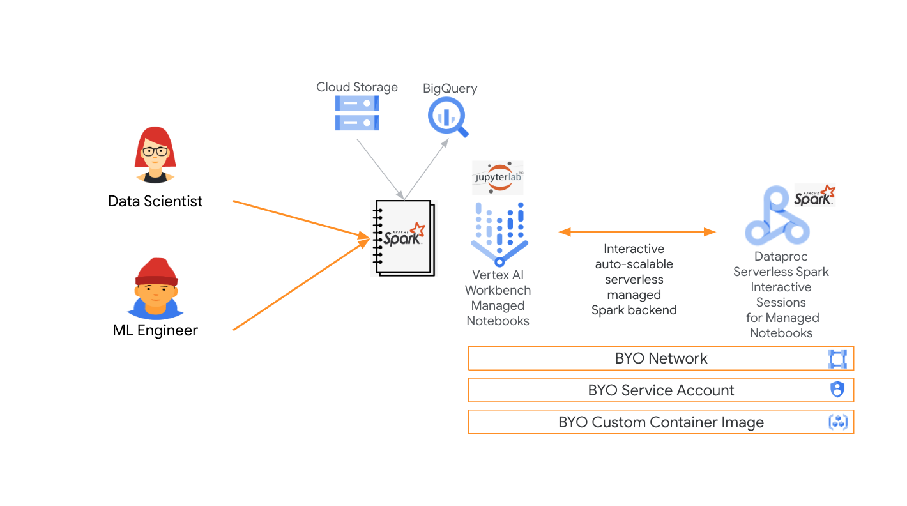
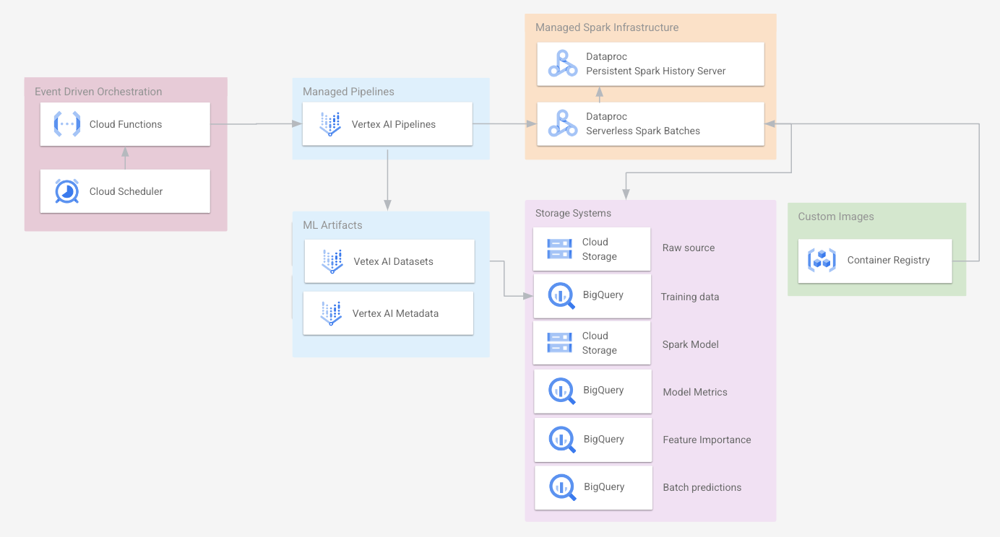
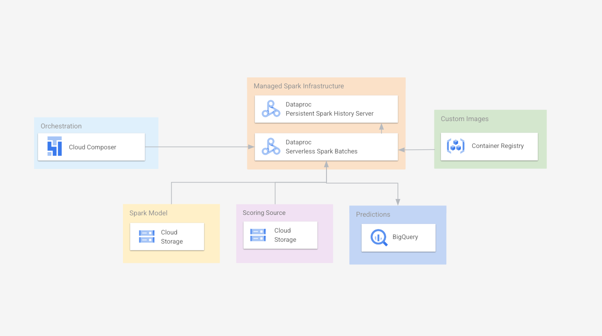
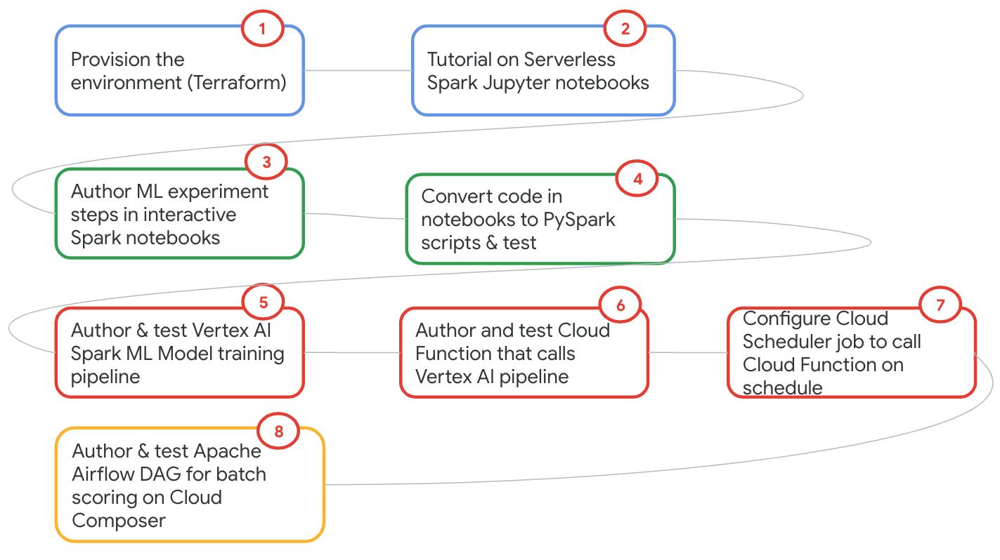

<!---->
  Copyright 2022 Google LLC
 
  Licensed under the Apache License, Version 2.0 (the "License");
  you may not use this file except in compliance with the License.
  You may obtain a copy of the License at
 
       http://www.apache.org/licenses/LICENSE-2.0
 
  Unless required by applicable law or agreed to in writing, software
  distributed under the License is distributed on an "AS IS" BASIS,
  WITHOUT WARRANTIES OR CONDITIONS OF ANY KIND, either express or implied.
  See the License for the specific language governing permissions and
  limitations under the License.
 <!---->

# Practical Machine Learning at scale with Serverless Spark on GCP and Vertex AI

## 1. About

This repo is a hands on lab for [Spark MLlib](https://spark.apache.org/docs/latest/ml-guide.html) based scalable machine learning on Google Cloud, powered by Dataproc Serverless Spark and showcases integration with Vertex AI AIML platform. The focus is on demystifying the products and integration (and not about a perfect model), and features a minimum viable end to end machine learning use case.

## 2. Format & Duration
The lab is fully scripted (no research needed), with (fully automated) environment setup, data, code, commands, notebooks, orchestration, and configuration. Clone the repo and follow the step by step instructions for an end to end MLOps experience.   

Expect to spend ~8 hours to fully understand and execute if new to GCP and the services and at least ~6 hours otherwise.

## 3. Level
L300 - framework (Spark), services/products, integration

## 4. Audience
The intended audience is anyone with (access to Google Cloud and) interest in the usecase, products and features showcased.

## 5. Prerequisites
Knowledge of Apache Spark, Machine Learning, and GCP products would be beneficial but is not entirely required, given the format of the lab. Access to Google Cloud is a must unless you want to just read the content.

## 6. Goal
Simplify your learning and adoption journey of our product stack for scalable data science with -  
1. Just enough product knowledge of Dataproc Serverless Spark & Vertex AI integration for machine learning at scale on Google Cloud 
2. Quick start code for ML at scale with Spark that can be repurposed for your data and ML experiments 
3. Terraform for provisioning a variety of Google Cloud data services in the Spark ML context, that can be repurposed for your use case 

## 7. Use case covered
Telco Customer Churn Prediction with a [Kaggle dataset](https://www.kaggle.com/datasets/blastchar/telco-customer-churn) and [Spark MLLib, Random Forest Classifer](https://spark.apache.org/docs/latest/ml-classification-regression.html#random-forest-classifier) 

## 8. Solution Architecture

### 8.1. Experimenting with Spark model training, tuning and batch scoring

   
  

### 8.2. Operationalizing Spark model development

   
  

### 8.3. Operationalizing Spark batch scoring

   
  

## 9. Flow of the lab

   
  
For your convenience, all the code is pre-authored, so you can focus on understanding product features and integration.

## 10. The lab modules
Complete the lab modules in a sequential manner. For a better lab experience, read *all* the modules and then start working on them.
| # | Module | Duration |
| -- | :--- | :--- |
| 01 |  [Terraform for environment provisioning](05-lab-guide/Module-01-Environment-Provisioning.md)| 1 hour |
| 02 |  [Terraform for resource provisioning for users](05-lab-guide/Module-01-Environment-Provisioning-Shared.md)| ~15 minutes |
OR
| 01 |  [Cloud Shell script for environment provisioning](05-lab-guide/Module-01a-Environment-Provisioning.md)| 1 hour |
| 02 |  [Cloud Shell script for resource provisioning for users](05-lab-guide/Module-01a-Environment-Provisioning-Shared.md)| ~15 minutes |
| 03 |  [Tutorial on Dataproc Serverless Spark Interactive Sessions for authoring Spark code](05-lab-guide/Module-02-Spark-IDE-on-GCP.md)| 15 minutes |
| 04 |  [Author PySpark ML experiments with Serverless Spark Interactive notebooks](05-lab-guide/Module-03-Author-ML-Experiments-With-Spark-Notebooks.md)| 1 hour |
| 05 |  [Author PySpark ML scripts in preparation for authoring a model training pipeline](05-lab-guide/Module-04-Author-ML-PySpark-Scripts.md)| 1 hour |
| 06 |  [Author a Vertex AI model training pipeline](05-lab-guide/Module-05-Author-Vertex-AI-Pipeline.md)| 1 hour |
| 07 |  [Author a Cloud Function that calls your Vertex AI model training pipeline](05-lab-guide/Module-06-Author-CloudFunction-For-Vertex-AI-Pipeline.md)| 15 minutes |
| 08 |  [Create a Cloud Scheduler job that invokes the Cloud Function you created](05-lab-guide/Module-07-Schedule-VertexAI-Pipeline.md)| 15 minutes |
| 09 |  [Author a Cloud Composer Airflow DAG for batch scoring and schedule it](05-lab-guide/Module-08-Orchestrate-Batch-Scoring.md)| 15 minutes |

Although the ML usecase in this lab does not need a custom container image, the lab includes [container image creation](05-lab-guide/Module-04-Author-ML-PySpark-Scripts.md#11-creating-a-custom-container-image) and usage for the purpose of education.

## 11. Dont forget to
Shut down/delete resources when done to avoid unnecessary billing.

## 12. Credits
| # | Google Cloud Collaborators | Contribution  |
| -- | :--- | :--- |
| 1. | Anagha Khanolkar | Creator |
| 2. | Dr. Thomas Abraham | ML consultation, testing, best practices and feedback |
| 3. |Rob Vogelbacher Proshanta Saha| ML consultation |
| 4. | Ivan Nardini Win Woo | ML consultation, inspiration through [samples](https://github.com/GoogleCloudPlatform/vertex-ai-samples/blob/main/notebooks/official/pipelines/google_cloud_pipeline_components_dataproc_tabular.ipynb) and [blogs](https://medium.com/google-cloud/sparkling-vertex-ai-pipeline-cfe6e19334f7) |

## 13. Contributions welcome
Community contribution to improve the lab is very much appreciated.  

## 14. Getting help
If you have any questions or if you found any problems with this repository, please report through GitHub issues.

