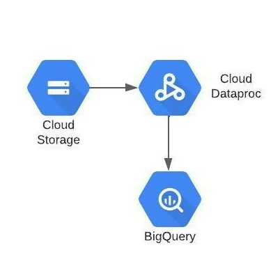

# Serverless Spark Streaming through Google Cloud Shell


Following are the lab modules:

[1. Understanding Data](05b_serverless_spark_streaming_console_execution.md#1-understanding-data)<br>
[2. Solution Architecture](05b_serverless_spark_streaming_console_execution.md#2-solution-architecture)<br>
[3. Declaring Variables](05b_serverless_spark_streaming_console_execution.md#3-declaring-variables)<br>
[4. Execution](05b_serverless_spark_streaming_console_execution.md#4-execution)<br>
[5. Logging](05b_serverless_spark_streaming_console_execution.md#5-logging)<br>

<br>

## 1. Understanding Data

## Data Files

The data used for this project are:

 - InvoiceNumber   -  a unique, sequential code that is systematically assigned to invoices.
 - CreatedTime     -  time , when invoice is created.
 - StoreID         -  ID of the store where purchase is done.
 - PosID           -  
 - CustomerType    - type of the customer, whether they are PRIME/NON PRIME member.
 - PaymentMethod   - type of payment done.
 - DeliveryType    - type of delivery done for the purchased products.
 - City            - city in which product is to be delivered.
 - State           - state in which product is to be delivered.
 - PinCode         - pincode of the city in which product is to be delivered.
 - ItemCode        - itemcode of the purchased product.
 - ItemDescription - description of the item purchased.
 - ItemPrice       - price of the purchased item.
 - ItemQty         - quantity of the item purchased.
 - TotalValue      - price to be paid for the purchased product.

<br>


## 2. Solution Architecture
 


<br>

## 3. Declaring Variables

Keep the following details handy for configuring the serverless batch jobs:

```
PROJECT_ID=$(gcloud config get-value project)       #current GCP project where we are building our use case
REGION=                                             #GCP region where all our resources will be created
SUBNET=                                             #subnet which has private google access enabled
BUCKET_CODE=                                        #GCP bucket where our code, data and model files will be stored
BUCKET_PHS=                                         #bucket where our application logs created in the history server will be stored
HISTORY_SERVER_NAME=                                #name of the history server which will store our application logs
BQ_DATASET_NAME=                                    #BigQuery dataset where all the tables will be stored
UMSA=serverless-spark                               #name of the user managed service account required for the PySpark job executions
SERVICE_ACCOUNT=$UMSA@$PROJECT_ID.iam.gserviceaccount.com
NAME=                                               #Your unique identifier
```
**Note:** The values for all the above parameters will be provided by the admin team.

<br>

## 4. Execution 

#### 4.1. Create a new batch
Navigate to Dataproc > Serverless > Batches and click on **+CREATE**

<kbd>

</kbd>

#### 4.1.1. Provide the details for the batch

Next, fill in the following values in the batch creation window as shown in the images below:

- **Batch ID**   - A unique identifier for your batch
- **Region**     - The region name provided by the Admin team
- **Batch Type**    - PySpark
- **Main Python File** - gs://<your_code_bucket_name>/serverless_spark_streaming/00-scripts/spark_streaming_invoice.py
- **JAR Files** - gs://spark-lib/bigquery/spark-bigquery-with-dependencies_2.12-0.22.2.jar
- **Arguments** - <br>
  Four Arguments needs to be provided. <br>
    * <your_project_id>
    * <your_dataset_name>
    * <your_code_bucket_name>
    * <your_name>

<br>

  **Note:** Press RETURN after each argument

- **Service Account** - <UMSA_NAME>@<PROJECT_ID>.iam.gserviceaccount.com
- **Network Configuration** - select the network and subnetwork with Private Google Access Enabled
Run PySpark Serverless Batch for Data Preparation
- **History Server Cluster** - <your_phs_cluster_name>

<kbd>

</kbd>

<hr>

<br> 

<kbd>

</kbd>

  <kbd>
  
  </kbd>

<br>


#### 4.1.2 Submit the Serverless batch
Once all the details are in, you can submit the batch. As the batch starts, you can see the execution details and logs on the console.


<br>

Once the job starts executing and the job is in running state , copy the data files one by one from serverless_spark_streaming/01-datasets/data_files  to  /serverless_spark_streaming/01-datasets/streaming_data/ for the streaming job to pick the files  and process them.

For copying the files open new cloud shell and declare the following variables and Run the following commands.

#### 4.2.1 Declare the variables

```
BUCKET_CODE=                                        #GCP bucket where our code, data and model files will be stored

```

#### 4.2.2 Command to copy Files.

```
gsutil cp gs://$BUCKET_CODE/serverless_spark_streaming/01-datasets/data_files/<<file_name>>  gs://$BUCKET_CODE/serverless_spark_streaming/01-datasets/streaming_data/

```

Note :
- **<<file_name>>**: Provide the file names one by one.

<br>


#### 4.2.3 Check the output table in BigQuery

Navigate to BigQuery Console, and check the **serverless spark streaming** dataset. <br>
As the files get processed, one new table '<your_name_here>_invoicedata' will be created and the data will be inserted into this table:

To view the data in these tables -

* Select the table from BigQuery Explorer by navigating 'project_id' **>** 'dataset' **>** 'table_name'
* Click on the **Preview** button to see the data in the table

<br>

**Note:** If the **Preview** button is not visible, run the below queries to view the data. However, these queries will be charged for the full table scan.

To query the data and view all the data, run the following query - 

```
  select * from `<GCP-PROJECT-NAME>.<BQ-DATASET-NAME>.<user_name>_invoicedata` 
```

**Note:** Edit the occurrence of <GCP-PROJECT-NAME> and <BQ-DATASET-NAME> to match the values of the variables PROJECT_ID,user_name and BQ_DATASET_NAME respectively

<kbd>

</kbd>

<br>


To find the count of data, run the following query - 

```
  select count(*) as count from `<GCP-PROJECT-NAME>.<BQ-DATASET-NAME>.<user_name>_invoicedata`
```

**Note:** Edit all occurrences of <GCP-PROJECT-NAME> and <BQ-DATASET-NAME> to match the values of the variables PROJECT_ID,user_name and BQ_DATASET_NAME respectively

<kbd>

</kbd>

<br>

<br>

<br>

## 4.3  Stop the Serverless Batch.

For stopping the serverless batch open new gcloud shell and  Declare the following variables and Run the following command.

#### 4.3.1 Declare variables

```
BATCH_ID =                                          # Batch Id of the batch running.
PROJECT_ID=$(gcloud config get-value project)       #current GCP project where we are building our use case
REGION=                                             #GCP region where all our resources will be created
```

#### 4.3.2 Command to stop the batch

Run the following command in gcloud shell-

```
gcloud dataproc batches cancel $BATCH_ID \
--project=$PROJECT_ID \
--region=$REGION
```


## 5. Logging

#### 5.1 Serverless Batch logs

Logs associated with the application can be found in the logging console under 
**Dataproc > Serverless > Batches > <batch_name>**. 
<br> You can also click on “View Logs” button on the Dataproc batches monitoring page to get to the logging page for the specific Spark job.

<kbd>

</kbd>

<kbd>

</kbd>

<br>

#### 5.2 Persistent History Server logs

To view the Persistent History server logs, click the 'View History Server' button on the Dataproc batches monitoring page, so the logs will be shown as below:

<br>

<kbd>

</kbd>

<kbd>

</kbd>

<br>
