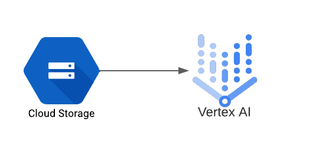
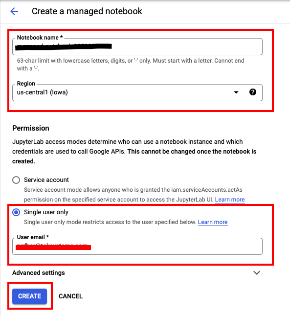

<!---->
  Copyright 2023 Google LLC

  Licensed under the Apache License, Version 2.0 (the "License");
  you may not use this file except in compliance with the License.
  You may obtain a copy of the License at

       http://www.apache.org/licenses/LICENSE-2.0

  Unless required by applicable law or agreed to in writing, software
  distributed under the License is distributed on an "AS IS" BASIS,
  WITHOUT WARRANTIES OR CONDITIONS OF ANY KIND, either express or implied.
  See the License for the specific language governing permissions and
  limitations under the License.
 <!---->

# Social Media Data Analytics using sessions in Serverless Spark through Vertex AI

Following are the lab modules:

[1. Understanding Data](05-social-media-data-analytics-vertex-ai-notebook-execution.md#1-understanding-data) 
[2. Solution Architecture](05-social-media-data-analytics-vertex-ai-notebook-execution.md#2-solution-architecture) 
[3. Execution](05-social-media-data-analytics-vertex-ai-notebook-execution.md#3-execution) 
[4. Logging](05-social-media-data-analytics-vertex-ai-notebook-execution.md#4-logging) 
 

## 1. Understanding Data

## Data Files
The datasets used for this project are:
- location_.csv's: This file contains the location details of the tweets from where they are tweeted.
- tweets_with_latitude_longitude_.csv's: This file contains the tweets and the location details

 

## 2. Solution Architecture

 

## 3. Execution

### 3.1. Run the Batch by creating session.

#### Creating Notebook in Vertex AI
Select Workbench from the left scroll bar of the Vertex AI main page.
Select the Managed Notebooks tab.
In the Managed Notebooks tab , click the New Notebook icon.

#### Next, fill in the following values in the Notebook creation window as shown in the images below:

- **Notebook Name**   - A unique identifier for your Notebook
- **Region**     - The region name provided by the Admin team
- **Permission Type**    - Single User Only (Single user only mode restricts access to the specified user)

  * Provide a name and region to the notebook and select 'Single User Only' and click 'Create'. We will let the 'Advanced Settings' remain as the default values.

 * Once the notebook is running, click the 'OPEN JUPYTERLAB' option next to the Notebook name as shown below

 

* Follow the on screen instructions to launch the JupyterLab session

#### Create Serverless Spark Session

* Click on the File and the New launcher and select Serverless Spark

 
<kbd>

</kbd>
 

 
<kbd>

</kbd>
 

##  Follow the on screen instructions to create Session

### 3.2. Provide the details for the Session

Next, fill in the following values in the session creation window as shown in the images below:

- **Session Name**   - A unique identifier for your session
- **Region**     - The region name provided by the Admin team
- **Language**    - Pyspark
- **Autoshutdown** - 24 hours
- **Network Configuration** - Select the network and subnetwork provided by the Admin team
- **History Server Cluster** - projects/<PROJECT_ID>/regions/<REGION_NAME>/clusters/<HISTORY_SERVER_NAME>
- **Custom Container** -gcr.io/<PROJECT_ID>/<CONTAINER_NAME>

* Click the **SUBMIT** button to create the session.

 
<kbd>

</kbd> 

 
<kbd>

</kbd> 

* Once the Session is created select 'No Kernel' from the kernel dropdown list and then delete the notebook

<kbd>

</kbd>

 

* Next, using the browser option from JupyterLab, navigate to the Notebook file located at:  
    <bucket_name> > 'social_media_data_analytics' > 00-scripts > social_media_data_analytics.ipynb
* From the kernel dropdown list, select the kernel for the session created in section 3.2
* Pass the values to the variable bucket_name as provided by the Admin.
* Next, hit the **Execute** button as shown below to run the code in the notebook.

 

<kbd>

</kbd>

### 3.3. Check the output table in Vertex AI

Navigate to VertexAI Console and check the output,
Once the code has successfully executed.
 

**Most popular trending #tags**
<kbd>

</kbd>

 

<kbd>

</kbd>

 
 

**The types of tweets and their followers count**
<kbd>

</kbd>

 

**The origin of the tweets**
<kbd>

</kbd>

 

## 4. Logging

### 4.1 Persistent History Server logs

To view the Persistent History server logs, click the 'View History Server' button on the Sessions monitoring page and the logs will be shown as below:

As the session is still in active state , we will be able to find the logs in show incomplete applications.

 

<kbd>

</kbd>

<kbd>

</kbd>

<kbd>

</kbd>

 
